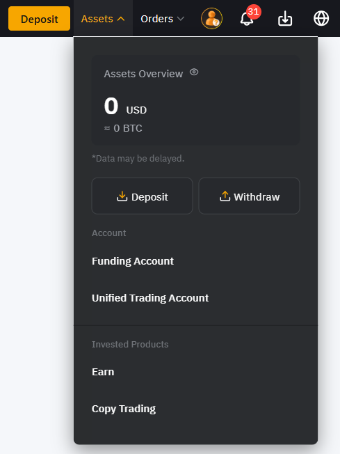

# ByBit

### BYBIT tuning for auto -worker from the exchange.

For an automatic output from the exchange, you must first enable the capitalist option for wallets that you will add.
Log in to your profile on the exchange and go to the "Account" section.

Find the section "Security" in the settings and go there.

Find the option "Withdrawal Address Whitelist". Click on the slider on the right. Take a 2FA check in the way you.

In the "assets" section, select the option with DHDRAW.

On the WithDRAW page, select the “Add” option in the Wallet Address line.

On the Wallet Address page, make sure that the Withdrawal Address Whitelist option is included. Select the “+Add”
option.

Select the currency of your wallet, enter its address, indicate the blockchain and enter the name of the wallet. Be sure
to put the checkplace "No Verification Needed for this Address Next Time". Click "Confirm" and complete the safety
check.

### Connection of the key API

Enter your account on the exchange, click on the icon of your profile and go to the "API" section.

Click "Understood"

Press the Create New Key

For simplicity of tuning, we will use the key generated by the API key. Select the System-Generated API Keys item.

Make sure the selection selector is in the API Transaction. Enter the name for your key API.
In the API Key Permissions field, set the resolution of Read-Write. For the option “Only IPS with Permissions Granted
are allowed to Access The Openapi”, enter the IP server shown to you at the stage of connecting the exchange in our
merchant.

Set the main permits, press the Submit button and go through the security check using 2FA you connected.

Save the secret and API keys. Confirm, by clicking Understood.

Insert them into the corresponding fields of the exchange connection. Click "Connect the Exchange".

