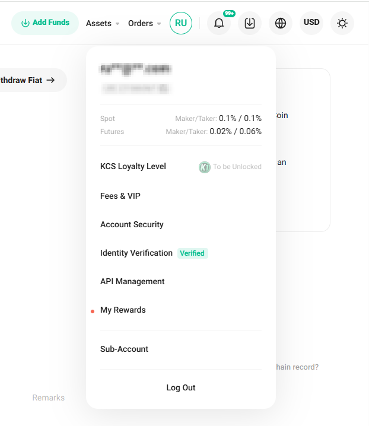

# KuCoin

### إعداد محفظة KuCoin للسحب التلقائي من البورصة

ادخل إلى ملفك الشخصي في البورصة وانتقل إلى قسم "Assets" (الأصول) في القائمة العلوية اليمنى.

في الصفحة التي تفتح، اختر "Withdraw" (السحب) من القائمة على اليسار.

اختر عملة محفظتك وانقر على زر "Saved Addresses" (العناوين المحفوظة).

انقر على زر "Add Address" (إضافة عنوان).

أدخل عنوان محفظتك، وحدد سلسلة البلوكشين، وقم بتسمية العنوان.\
انقر على زر "Save as Standard Address" (حفظ كعنوان قياسي) وأكمل التحقق الأمني.

### ربط مفتاح API

ادخل إلى حسابك في البورصة، ومرر مؤشر الفأرة فوق رمز الملف الشخصي واختر قسم "API Management" (إدارة API).

انقر على زر "Create API" (إنشاء API).

أدخل اسمًا لمفتاح API الخاص بك وقم بتعيين كلمة مرور. قم بتحديد الأذونات المطلوبة.\
تأكد من تحديد عنوان IP للخادم، الذي تم الحصول عليه من قسم "Connect the Exchange" (ربط البورصة) على منصتنا. \
في حقل "IP Restrictions"، اختر "Restrict to Trusted IPs Only" (التقييد بالعناوين IP الموثوقة فقط). \
انقر على زر "Add" (إضافة).\
انقر على "Next" (التالي) وأكمل التحقق الأمني.

احفظ قيم API Key و Secret Key التي تم الحصول عليها. انقر على زر "Confirm" (تأكيد).

أدخل المفاتيح وكلمة المرور التي تم الحصول عليها في الحقول المخصصة لربط البورصة في خدمتنا. \
انقر على زر "Connect the Exchange" (ربط البورصة).