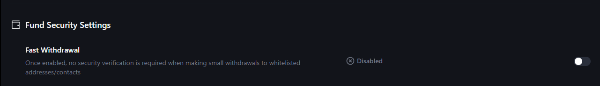
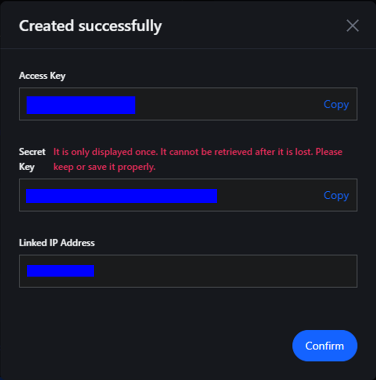

# MEXC
### Setting MexC wallet for auto -worker from the exchange.
For an automatic output from the exchange, you must first enable the option of the quick withdrawal of products for wallets that you will add.
Enter your profile on the exchange and go to the "Security" section.

Find the option "FASTHDRAWAL". Click on the slider on the right. Take a 2FA check in the way you.

Set the maximum value and pass the safety check.

To add a new wallet, in the "assets" section, select the WithDRAW option.

On the WithDRAW page, select the “Manage Addresses” option in the window for creating an application for withdrawing funds.

Select the Add Withdrawal Address option.

Select your wallet and blockchain currency, indicate its address and enter the names of the wallet. Be sure to put the "Set as a Whitelisted Address". Click "Confirm" and complete the safety check.

### Connection Key API
Enter your account on the stock exchange, enter the icon of your profile and go to the "API Management" section.

Move these permissions, give the name to your API-Slok.
Be sure to add the IP of your merchant received on our platform when setting up - in the Link IP Address (Optional) field.
Mark the Consent with the conditions with a tick and click Create, complete the safety verification.

Save API and secret keys. Send confirmation by click on confirm.

Insert them into the corresponding fields of the exchange connection. Click "Connect the Exchange".