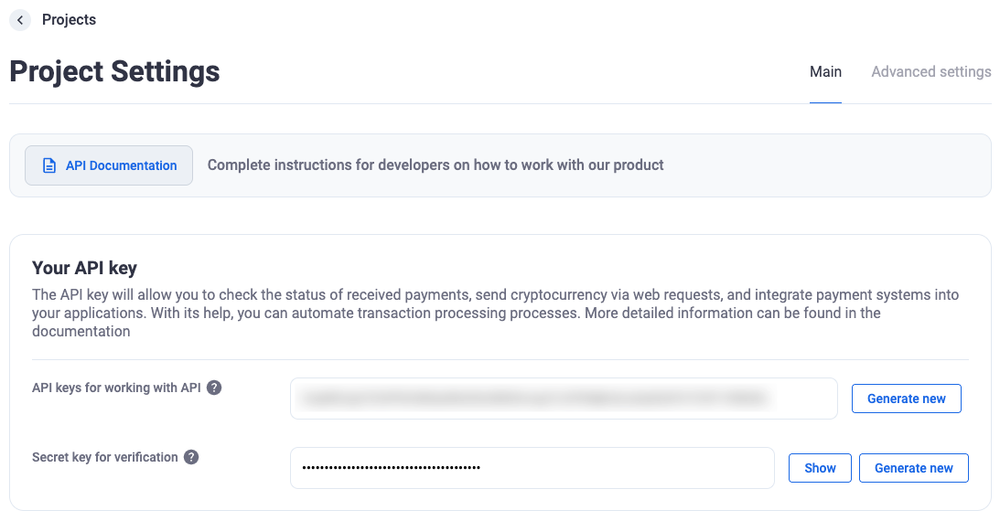

# التحقق من توقيع خطافات الويب

- ستجد في إعدادات التاجر "Secret key for verification" (مفتاح سري للتحقق). يُستخدم هذا المفتاح للتحقق من صحة خطافات الويب الواردة.




- مثال على التحقق في PHP:

  ```php
  <?php
  $secretKeyStored = 'مفتاحك السري';

  $signFromRequest = $_SERVER['HTTP_X_SIGN'];
  $json = file_get_contents('php://input');

  $signCalculated = hash('sha256', $json . $secretKeyStored);

  var_dump(hash_equals($signFromRequest, $signCalculated));
  ?>
  ```