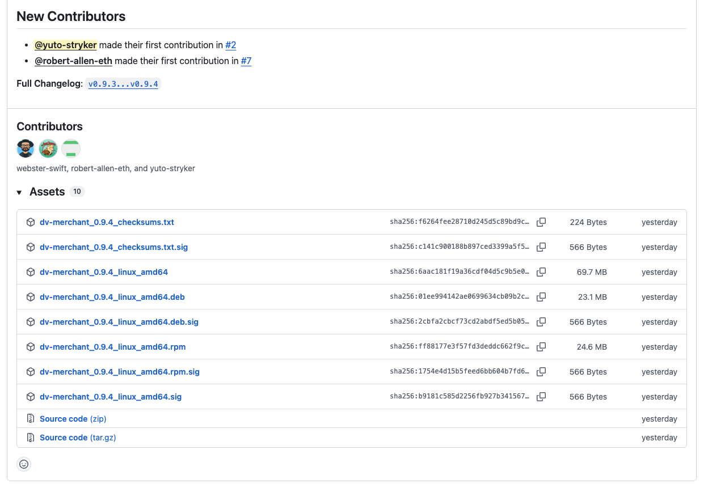

# التحقق من الحزم والبرمجيات المثبّتة

## التحقق من أصالة حِزمنا باستخدام GPG

جميع حِزمنا بصيغتي `.deb` و`.rpm` وقيم checksums الخاصة بها موقّعة تشفيرياً باستخدام مفاتيح GPG. يضمن ذلك أن الحِزم التي تقوم بتنزيلها قد أُنشئت من قبلنا ولم يتم تعديلها أو إفسادها من أطراف ثالثة. يمكنك بسهولة التحقق من أصالة أي حزمة باستخدام مفتاحنا العام.

يتم نشر جميع الشيفرات المصدرية للمشاريع، والملفات التنفيذية المترجمة المقابلة لها، وكذلك حِزم `.deb` و`.rpm` ضمن الإصدارات على github.com. وتوجد التواقيع المقابلة هناك أيضاً في ملفات `.sig`.

مثال: https://github.com/dv-net/dv-merchant/releases/tag/v0.9.4



-----

### الخطوة 1: استيراد مفتاح GPG العام الخاص بنا

أولاً، تحتاج إلى استيراد مفتاحنا العام إلى سلسلة مفاتيحك. يتم ذلك مرة واحدة فقط.
مفتاحنا منشور على [https://dv.net/gpg.pub](https://dv.net/gpg.pub)

احفظ المفتاح العام على خادمك:

```bash
curl https://dv.net/gpg.pub -o dv-net.asc
```

ثم استورده إلى سلسلة مفاتيحك:

```bash
gpg --import dv-net.asc
```

-----

### الخطوة 2: التحقق من توقيع الحزمة

بعد استيراد المفتاح، يمكنك التحقق من توقيع أي حزمة قمت بتنزيلها.

#### بالنسبة لحِزم .deb (Debian/Ubuntu)

للتحقق من حزمة `.deb`، استخدم الأمر `dpkg-sig`. إذا لم يكن مثبتاً، يمكنك تثبيته باستخدام
`sudo apt-get install dpkg-sig`.

```bash
dpkg-sig --verify package_name.deb
```

إذا كان التوقيع صالحاً، سترى حالة GOODSIG من مفتاح موثوق به في ناتج الأمر.

#### بالنسبة لحِزم .rpm (Fedora/CentOS/RHEL)

للتحقق من حزمة `.rpm`، استخدم الأمر `rpm`.

```bash
rpm --checksig package_name.rpm
```

إذا كان التوقيع صحيحاً، فسيُظهر ناتج الأمر أن جميع الفحوصات (بما فيها `gpg`) قد نجحت (`OK`).

باتباع هذه الخطوات البسيطة ستضمن سلامة وأصالة حِزمنا البرمجية.