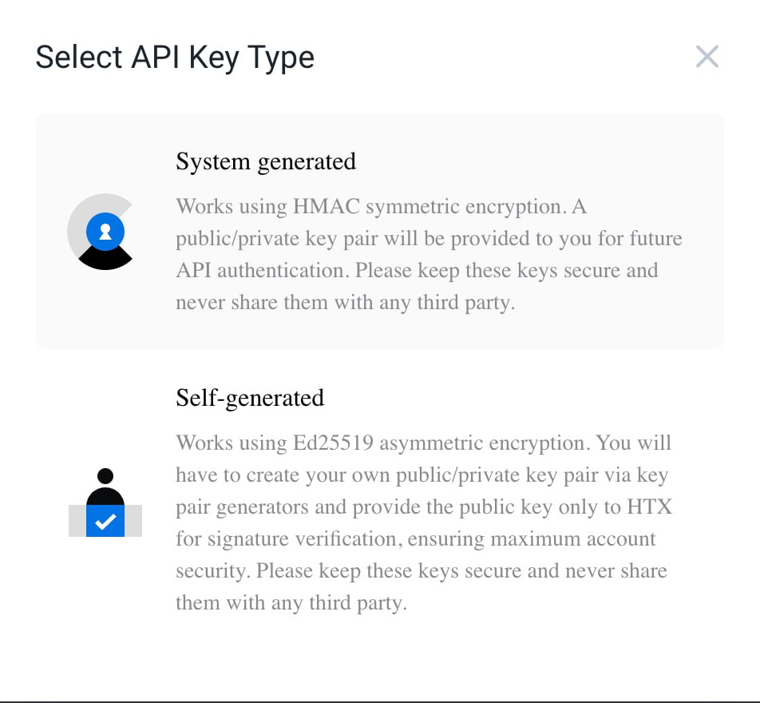

# HTX

### Setting up an HTX Wallet for Automatic Withdrawal from the Exchange

Log in to your HTX profile and go to the "Withdraw" section.

Select the network and coin you are interested in, and then click the "Withdrawal Address" button and go to the appropriate section.

You need to add an address, give it a name on the exchange, and check the boxes for "Set as verification exemption address": "Withdrawal", "API Withdrawal". You need to click "Add" and complete the security verification using your 2-factor authentication method.

### Connecting an API Key

Go to your HTX account and navigate to the API Management section.

Click the "Create API Key" button.

For ease of setup, use the first option - to create a system-generated API key.

Enter the name, IP address of the server where the connecting merchant is installed, and be sure to check the boxes for "Withdraw" and "Trade" so that you have automatic withdrawal and automatic currency exchange enabled.

You need to take the IP address of the server, which you need to specify on the exchange, from the "connect the exchange" (Connect Exchange) section - the one that is displayed when connecting the exchange.

Complete the 2-factor authentication verification and save the API and secret keys received from the exchange. Paste them into the corresponding fields and click the "connect the exchange" (Connect Exchange) button.
