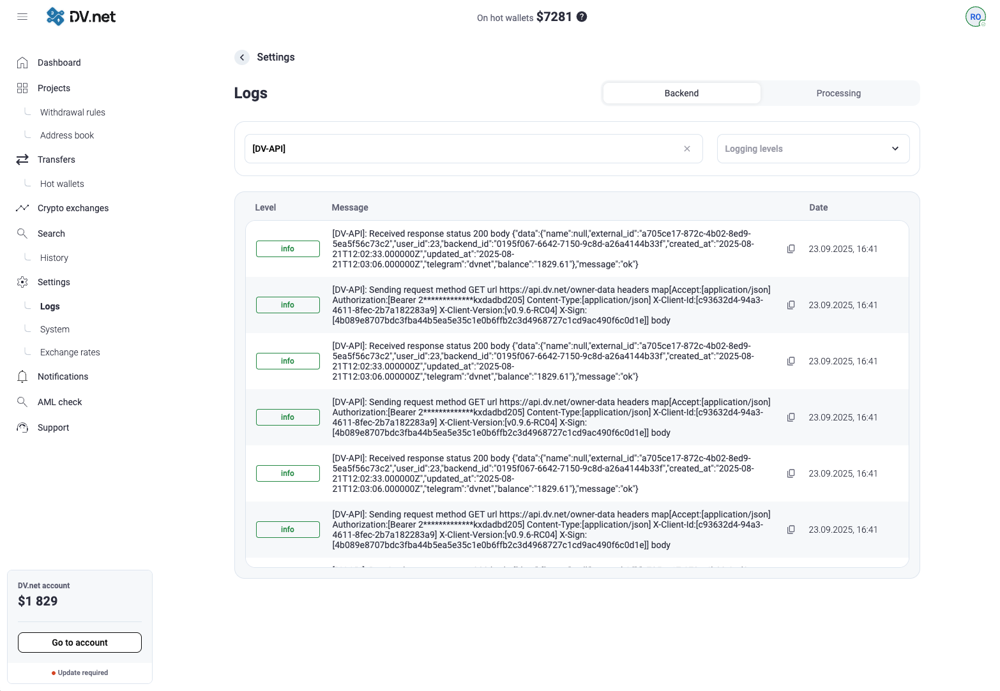

# Überwachung von Anfragen an die API dv.net

## Übersicht

Die Anwendung kommuniziert mit dem Server `api.dv.net`, um zusätzliche Funktionen bereitzustellen, darunter:

- 📧 Versand von E-Mail-Benachrichtigungen, ohne einen eigenen SMTP-Server einrichten zu müssen
- 📱 Telegram-Benachrichtigungen für Echtzeitwarnungen
- 📊 Erfassung von Statistiken und Telemetriedaten zur Analyse der Systemleistung
- 🔄 Versionsverwaltung der Software

## Sicherheit und Datenschutz

Wichtig: Wir garantieren die vollständige Sicherheit Ihrer Daten. Bei der Interaktion mit unserer API werden folgende Daten niemals übertragen:

- Seed-Phrasen
- Private Schlüssel
- Passwörter und geheime Daten
- Alle anderen Informationen, die zum Verlust der Kontrolle über Wallets oder Konten führen könnten

Sie können die Sicherheitsimplementierung selbst überprüfen, indem Sie den Quellcode des Projekts einsehen:  
[https://github.com/dv-net](https://github.com/dv-net)

## Erweitertes Logging aktivieren

### Konfiguration einrichten

Fügen Sie den Parameter `log_status: true` dem Abschnitt `admin` der Konfigurationsdatei hinzu:

```yaml
# /home/dv/merchant/configs/config.yaml

admin:
  log_status: true
  # weitere Parameter des Admin-Abschnitts...
```

### Dienst neu starten

Starten Sie nach der Änderung der Konfiguration den Dienst neu, um die Änderungen zu übernehmen:

```bash
sudo systemctl restart dv-merchant
```

## Protokolle anzeigen

### Methode 1: Befehlszeile (journalctl)

Verwenden Sie das Systemjournal, um Protokolle von API-Anfragen anzuzeigen:

```bash
# Alle API-bezogenen Einträge anzeigen
journalctl -u dv-merchant | grep 'DV-API'

# Echtzeitüberwachung
journalctl -u dv-merchant -f | grep 'DV-API'

# Einträge der letzten Stunde mit Zeitstempeln anzeigen
journalctl -u dv-merchant --since "1 hour ago" | grep 'DV-API'
```

### Methode 2: Weboberfläche

Zusätzlich können die letzten 1000 Protokolleinträge direkt in der Weboberfläche angezeigt und gefiltert werden:



## Erweiterte Protokollerfassung einrichten

### Integration mit Promtail + Loki + Grafana

```yaml
# /etc/promtail/config.yaml

scrape_configs:
  - job_name: dv-merchant
    static_configs:
      - targets:
          - localhost
        labels:
          job: dv-merchant
          __path__: /var/log/dv-merchant/*.log
```

### Logstash-Konfiguration

```ruby
input {
  file {
    path => "/var/log/dv-merchant/api.log"
    start_position => "beginning"
    sincedb_path => "/dev/null"
  }
}

filter {
  grok {
    match => { "message" => "%{TIMESTAMP_ISO8601:timestamp} %{LOGLEVEL:loglevel}.*DV-API.*" }
  }
}

output {
  elasticsearch {
    hosts => ["localhost:9200"]
    index => "dv-api-logs-%{+YYYY.MM.dd}"
  }
}
```

### Grafana Alloy Konfiguration

```yaml
logs:
  positions_directory: /var/lib/grafana-agent-positions

  configs:
    - name: dv-merchant-logs
      scrape_configs:
        - job_name: dv-merchant-api
          static_configs:
            - targets: [localhost]
              labels:
                job: dv-merchant
                __path__: /var/log/dv-merchant/*.log
```