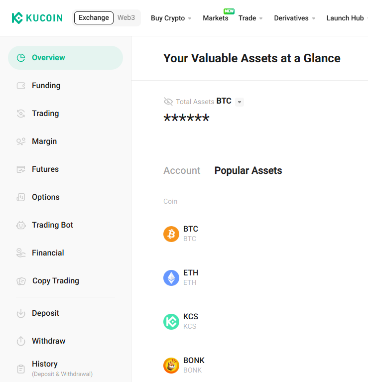
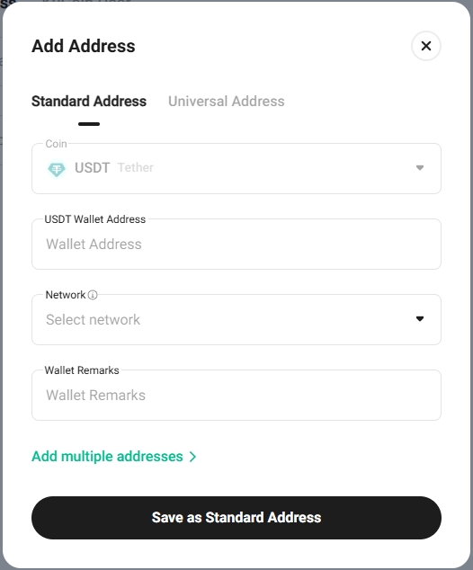

# KuCoin

### Setting up the KuCoin wallet for automatic withdrawals from the exchange

Log in to your profile on the exchange and go to the "Assets" section in the top right menu.

On the opened page, select "Withdraw" from the menu on the left.

Select the currency of your wallet and click the "Saved Addresses" button.

Click the "Add Address" button.

Enter your wallet address, specify the blockchain, and name the address.\
Click the "Save as Standard Address" button and complete the security verification.

### Connecting the API key

Log in to your account on the exchange, hover over the profile icon, and select the "API Management" section.

Click the "Create API" button.

Enter a name for your API key and set a password. Specify the required permissions.\
Be sure to specify the server IP address obtained from the "Connect the Exchange" section on our platform. \
In the "IP Restrictions" field, select "Restrict to Trusted IPs Only". \
Click the "Add" button.\
Click "Next" and complete the security verification.

Save the obtained API Key and Secret Key values. Click the "Confirm" button.

Insert the obtained keys and password into the corresponding fields for connecting the exchange in our service. \
Click the "Connect the Exchange" button.