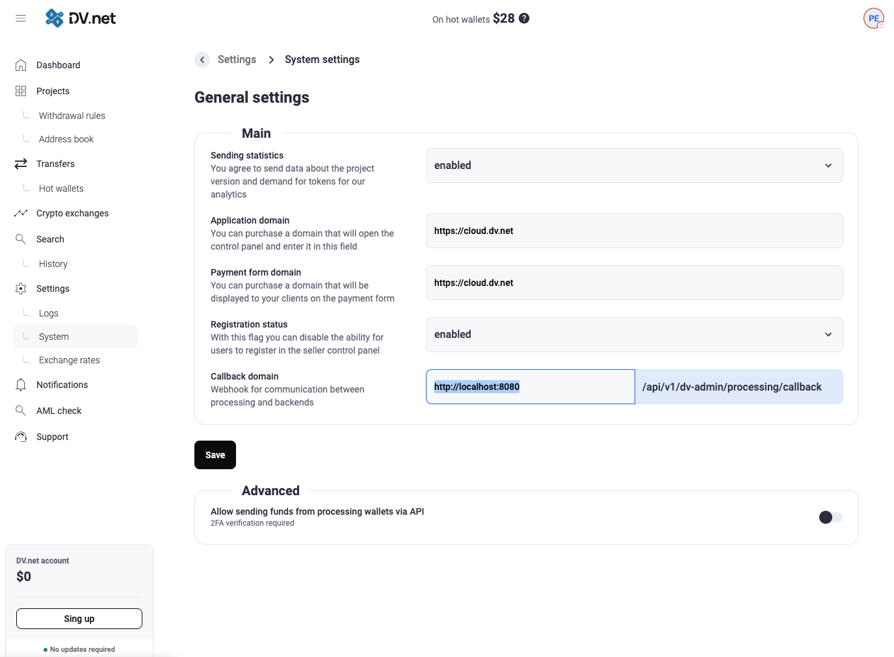

# Hiding the Merchant Server Administration Panel 

This guide describes setting up **Nginx** to segment access to the **Administration Panel** ($/dv-admin/$), the 
**Payment Form** ($/pay/$), and the **API** ($/api/v1/*$) of the **dv-merchant** application. This enhances security 
by restricting access to confidential routes and providing different domains for different functions.

## 1\. dv-merchant Route Overview

The **dv-merchant** server application serves both the frontend and API for several components, using the following 
route groups:

* **/pay/**: Loads the JS and frontend for the **Payment Form**.
* **/dv-admin/**: Loads the JS and frontend for the **Administration Panel**.
* **/api/v1/public**: **Public** API methods used by the **Payment Form**.
* **/api/v1/external**: API methods for **store integration** (e.g., creating an invoice).
* **/api/v1/dv-admin**: API methods for the **Administration Panel**.

## 2\. Preliminary Setup

### 2.1. Nginx Installation

Install **Nginx** on your server. Instructions depend on your operating system (e.g., 
`sudo apt update && sudo apt install nginx` for Debian/Ubuntu).

### 2.2. Changing the dv-merchant Port

To operate via Nginx as a reverse proxy, switch **dv-merchant** to a local port (e.g., **8080**) that won't be accessible externally.

Edit the configuration file:
`nano /home/dv/merchant/configs/config.yaml`

In the `'http'` section, set the new port:

```yaml
http:
  port: "8080"
```

### 2.3. Updating the Callback Address

You must update the **Callback URL** from the processing system to the merchant server in the system settings so it 
points to the external address configured for the Payment Form (e.g., `https://pay.some-domain.com`).

<a href="../../assets/images/security/processing-callback-setup.png" target="_blank" rel="noopener noreferrer" onclick="event.preventDefault(); const img = this.querySelector('img'); const openImage = () => { try { const canvas = document.createElement('canvas'); canvas.width = img.naturalWidth; canvas.height = img.naturalHeight; const ctx = canvas.getContext('2d'); ctx.drawImage(img, 0, 0); const dataUrl = canvas.toDataURL('image/png'); const w = window.open('', '_blank'); if (w) { w.document.write('<html><head><title>Processing Callback Setup</title><style>body{margin:0;display:flex;justify-content:center;align-items:center;height:100vh;background:#000;}img{max-width:100%;max-height:100%;object-fit:contain;}</style></head><body></body></html>'); w.document.close(); } } catch(e) { window.open(this.href, '_blank'); } }; if (img && img.complete && img.naturalWidth > 0) { openImage(); } else if (img) { img.onload = openImage; img.onerror = () => window.open(this.href, '_blank'); } else { window.open(this.href, '_blank'); } return false;">
  
</a>

## 3\. Nginx Configuration

We'll create **three separate Nginx configuration files** (virtual hosts), each responsible for its own domain/subdomain 
and having its own access rules.

**Important:** **HTTPS/SSL** is recommended for all configurations (e.g., using **Certbot**), but the examples below use 
HTTP (port 80) for simplicity.

### 3.1. Configuration for the Payment Form (`pay.some-domain.com`)

This host must provide access to the Payment Form and its public API. All routes related to administration or external 
API must be **blocked** or **redirected**.

Create the file `/etc/nginx/conf.d/pay.some-domain.com.conf`:

```nginx
server {
    listen 80;
    server_name pay.some-domain.com; # Use your domain
    client_max_body_size 128M;

    access_log /var/log/nginx/pay.some-domain.com.log main;
    error_log  /var/log/nginx/pay.some-domain.com.error.log warn;

    # 1. Access to the Payment Form and Public API
    location ~ ^/(pay|api/v1/public) {
        proxy_pass http://localhost:8080$request_uri;
        proxy_set_header Host $host;
        proxy_set_header X-Forwarded-For $proxy_add_x_forwarded_for;
        proxy_set_header X-Real-IP $remote_addr;
    }

    # 2. Block and redirect administrative and external routes
    location /dv-admin {
        return 403; # Access denied
    }

    location ~ ^/api/v1/(dv-admin|external) {
        return 403; # Access denied
    }

    # 3. Block all other routes
    location / {
        return 404;
    }
}
```

### 3.2. Configuration for the External Store API (`integration.some-domain.com`)

This host should be accessible **only** from your store's IP addresses for API interaction (e.g., creating an invoice).

Create the file `/etc/nginx/conf.d/integration.some-domain.com.conf`:

```nginx
server {
    listen 80;
    server_name integration.some-domain.com; # Use your domain
    client_max_body_size 128M;

    # Restrict access by IP
    allow 216.58.208.196; # <-- !!! Replace with your store's IP address
    # allow x.x.x.x;    # Add other IPs if necessary
    deny all;


    access_log /var/log/nginx/integration.some-domain.com.log main;
    error_log  /var/log/nginx/integration.some-domain.com.error.log warn;

    # 1. Access only to the external API
    location /api/v1/external {
        proxy_pass http://localhost:8080$request_uri;
        proxy_set_header Host $host;
        proxy_set_header X-Forwarded-For $proxy_add_x_forwarded_for;
        proxy_set_header X-Real-IP $remote_addr;
    }

    # 2. Block all other routes
    location / {
        return 403; # Access denied to everything except /api/v1/external
    }
}
```

### 3.3. Configuration for the Administration Panel (`panel.some-domain.com`)

This host must provide access to everything related to administration and be accessible **only from trusted IP addresses**.

Create the file `/etc/nginx/conf.d/panel.some-domain.com.conf`:

```nginx
server {
    listen 80;
    server_name panel.some-domain.com; # Use your domain
    client_max_body_size 128M;

    # Restrict access by IP
    allow 216.58.208.196; # <-- !!! Replace with your trusted IP (office/home)
    allow 216.58.208.197; # <-- !!! Replace with another trusted IP
    deny all;


    access_log /var/log/nginx/panel.some-domain.com.log main;
    error_log  /var/log/nginx/panel.some-domain.com.error.log warn;

    # 1. Access to all dv-merchant routes
    location / {
        proxy_pass http://localhost:8080;
        proxy_set_header Host $host;
        proxy_set_header X-Forwarded-For $proxy_add_x_forwarded_for;
        proxy_set_header X-Real-IP $remote_addr;
    }
}
```

## 4\. Finalizing the Setup

After creating all configuration files:

1.  **Test the Nginx configuration:**
    ```bash
    sudo nginx -t
    ```
    Ensure there are no syntax errors.
2.  **Restart Nginx:**
    ```bash
    sudo systemctl restart nginx
    ```
3.  **Check DNS:** Make sure all three domains (`pay.some-domain.com`, `integration.some-domain.com`, `panel.some-domain.com`) point to your server's IP address.

The Administration Panel (routes $/dv-admin/*$ and $/api/v1/dv-admin/*$) is now **hidden** and accessible only via the 
`panel.some-domain.com` domain from a limited set of IP addresses, while the Payment Form and External API have clearly 
segregated and restricted access.