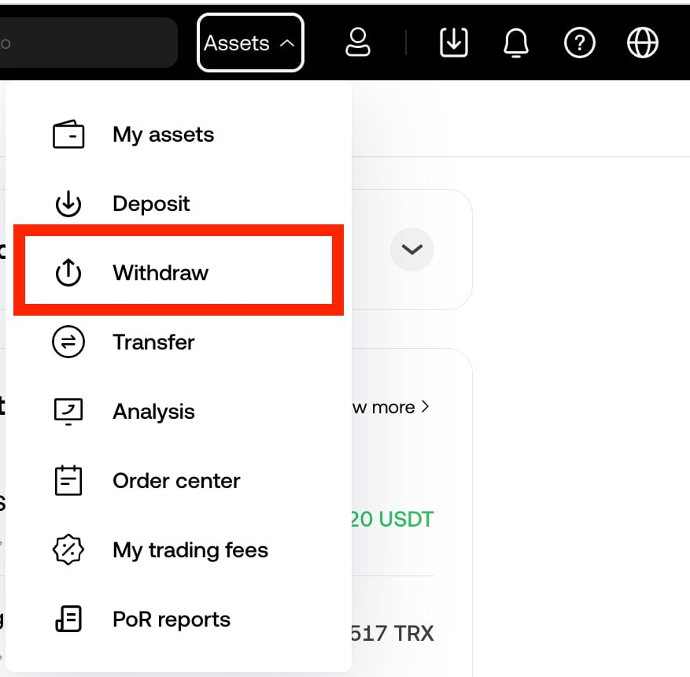
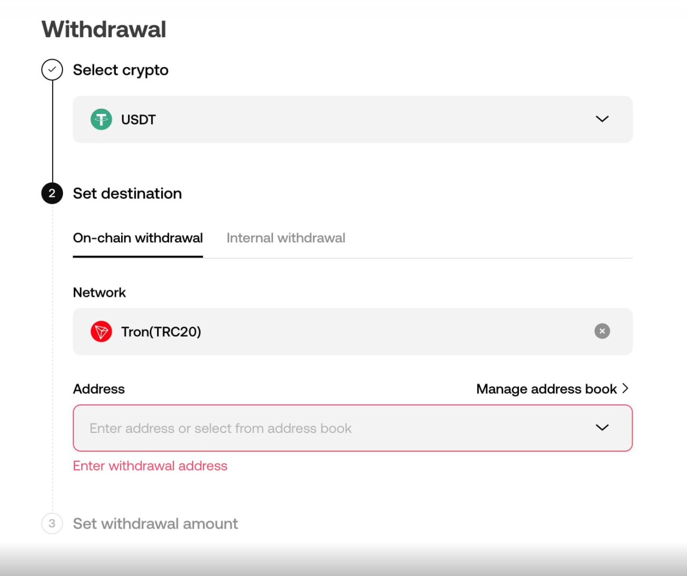
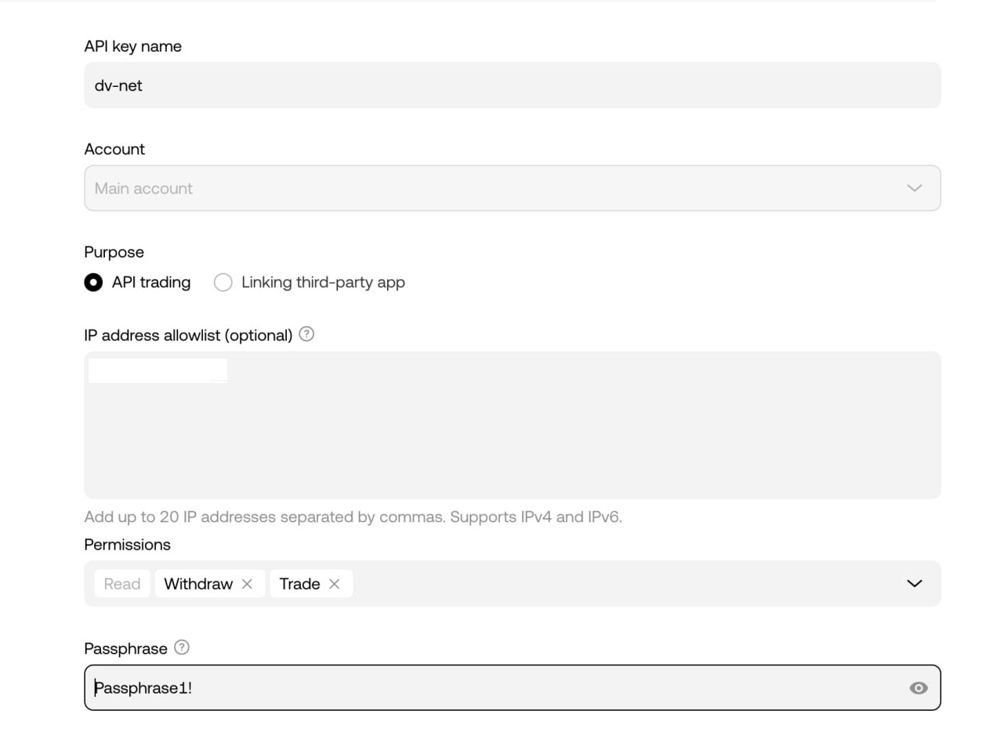

# OKX

### Setting up an OKX Wallet for Automatic Withdrawal from the Exchange

For automatic withdrawal from the exchange, you need to add your wallet address, where you want to receive the cryptocurrency, to the exchange's whitelist.

Go to the "Withdrawal" section.

In the withdrawal section, select the coin and network of the wallet where you want to receive the automatic withdrawal. Click the "Manage address book" button.

In the "Add address" submenu, select "Add single address".

Enter your wallet information. Be sure to check the "Verify address for permanently to skip future verification" box to enable automatic withdrawal via API. Click "Save" and complete the security verification, confirming the addition of the wallet via your 2FA method.

### Connecting an API Key

Log in to your account on the exchange and go to the API section.

Click the "Create API Key" button.

Enter a name for your API key, and make sure the selector is set to "API trading". Enter the server IP shown to you during the exchange connection stage in our merchant interface.

Be sure to set the "Withdraw" and "Trade" permissions in the "Permissions" field to enable automatic withdrawal and exchange. In the "Passphrase" field, enter the password you want to set for your API key.

Click the "Submit all" button, complete the security verification using your connected 2FA methods, and save the secret and API keys, as well as the password (Passphrase).

Enter the received values in the corresponding fields and click "connect the exchange" (Connect Exchange).

