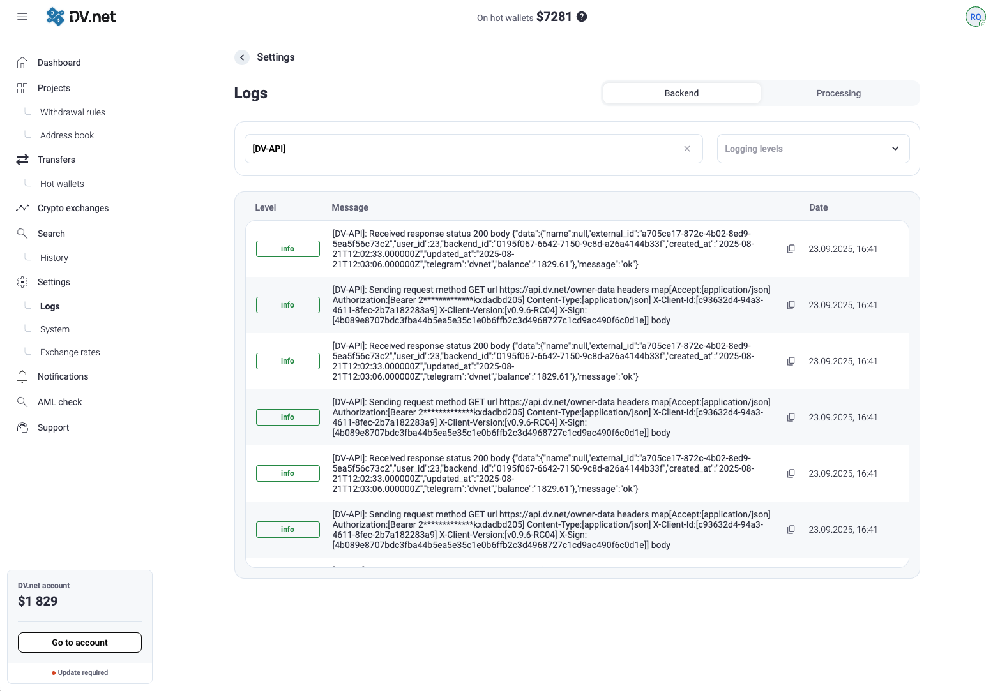

# Supervisión de solicitudes a la API dv.net

## Descripción general

La aplicación interactúa con el servidor `api.dv.net` para implementar funcionalidades adicionales, entre ellas:

- 📧 Envío de notificaciones por correo electrónico sin necesidad de configurar su propio servidor SMTP
- 📱 Notificaciones de Telegram para alertas en tiempo real
- 📊 Recopilación de estadísticas y telemetría para el análisis del rendimiento del sistema
- 🔄 Control de versiones del software

## Seguridad y privacidad

Importante: Garantizamos la total seguridad de sus datos. Al interactuar con nuestra API, nunca se transmiten los siguientes datos:

- Frases semilla
- Claves privadas
- Contraseñas y datos secretos
- Cualquier otra información que pueda provocar la pérdida de control sobre billeteras o cuentas

Puede verificar de forma independiente la implementación de la seguridad examinando el código fuente del proyecto:  
[https://github.com/dv-net](https://github.com/dv-net)

## Habilitar el registro avanzado

### Configuración

Añada el parámetro `log_status: true` en la sección `admin` del archivo de configuración:

```yaml
# /home/dv/merchant/configs/config.yaml

admin:
  log_status: true
  # other admin section parameters...
```

### Reinicio del servicio

Después de modificar la configuración, reinicie el servicio para aplicar los cambios:

```bash
sudo systemctl restart dv-merchant
```

## Visualización de registros

### Método 1: Línea de comandos (journalctl)

Use el registro del sistema para ver los registros de solicitudes a la API:

```bash
# View all API-related entries
journalctl -u dv-merchant | grep 'DV-API'

# Real-time monitoring
journalctl -u dv-merchant -f | grep 'DV-API'

# View entries from the last hour with timestamps
journalctl -u dv-merchant --since "1 hour ago" | grep 'DV-API'
```

### Método 2: Interfaz de la aplicación web

Además, las últimas 1000 entradas del registro pueden verse y filtrarse directamente en la interfaz de la aplicación web:



## Configuración avanzada de recopilación de registros

### Integración con Promtail + Loki + Grafana

```yaml
# /etc/promtail/config.yaml

scrape_configs:
  - job_name: dv-merchant
    static_configs:
      - targets:
          - localhost
        labels:
          job: dv-merchant
          __path__: /var/log/dv-merchant/*.log
```

### Configuración de Logstash

```ruby
input {
  file {
    path => "/var/log/dv-merchant/api.log"
    start_position => "beginning"
    sincedb_path => "/dev/null"
  }
}

filter {
  grok {
    match => { "message" => "%{TIMESTAMP_ISO8601:timestamp} %{LOGLEVEL:loglevel}.*DV-API.*" }
  }
}

output {
  elasticsearch {
    hosts => ["localhost:9200"]
    index => "dv-api-logs-%{+YYYY.MM.dd}"
  }
}
```

### Configuración de Grafana Alloy

```yaml
logs:
  positions_directory: /var/lib/grafana-agent-positions

  configs:
    - name: dv-merchant-logs
      scrape_configs:
        - job_name: dv-merchant-api
          static_configs:
            - targets: [localhost]
              labels:
                job: dv-merchant
                __path__: /var/log/dv-merchant/*.log
```