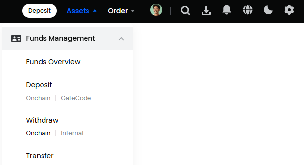
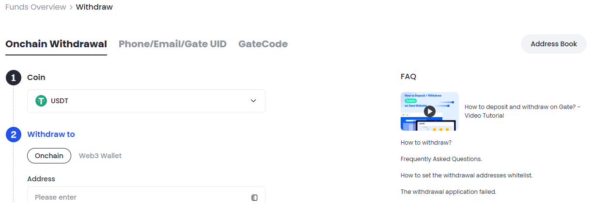
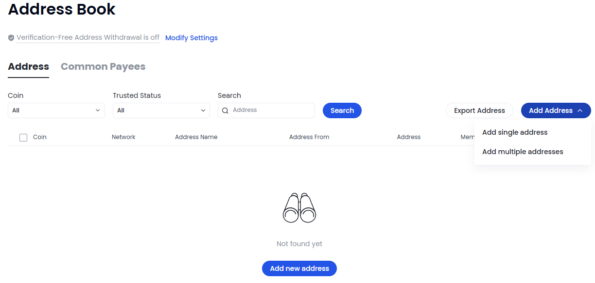
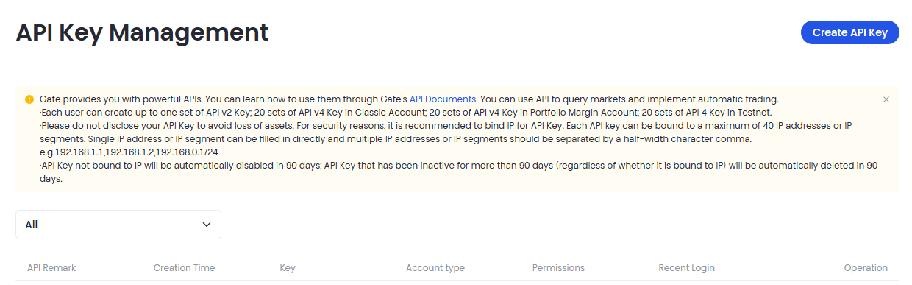
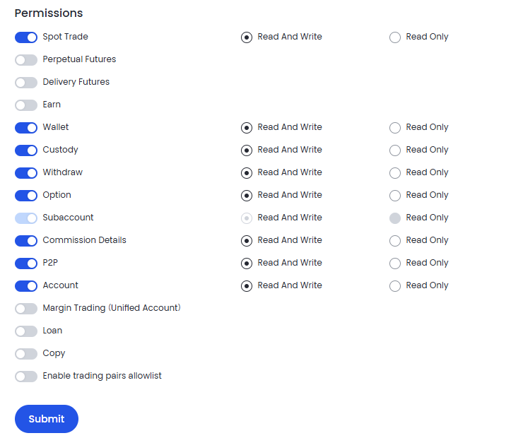

# Gate.io

### Setting the Gate.io wallet for auto -worker from the exchange.
Enter your profile on the exchange and from the assets section Expand the Funds Management option. Under the option with DHDRAW, select Onchain.

Click "Address Book".

On the page opened, select Add Address - Add Single Address.

Select the currency of your wallet, enter its address, indicate the blockchain and enter the name of the wallet. Be sure to put the checkplace "Set as a Trusted Address. No Need to Verify Again." Click "Confirm" and complete the safety check.

### Connection Key API
Enter your account on the stock exchange, enter the icon of your profile and go to the "APIS" section.

We are interested in the Create API Kay option, click on it.

Give the name to your API-Slok.
In the “IP Permissions” field, enter the IP server shown to you at the stage of connecting the exchange in our merchant.
Leave the default options for BIND IP, API V4 Key, Trading Account.

Create the API key by putting down data with “Read and Write” rights, click Submit.

Mark the Consent with ticks, click I Accept and go through the safety check.

Save the secret and API keys.

Insert them into the corresponding fields of the exchange connection. Click "Connect the Exchange".