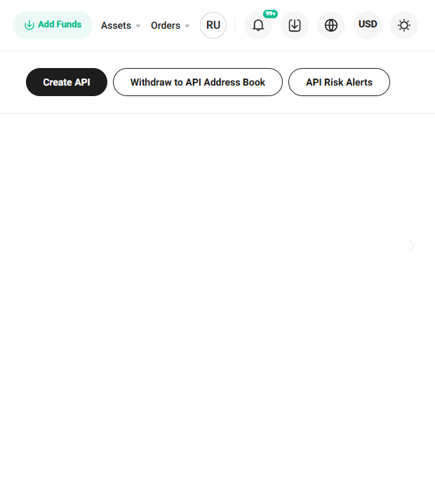

# KuCoin

### एक्सचेंज से स्वचालित निकासी के लिए KuCoin वॉलेट सेटअप

एक्सचेंज पर अपने प्रोफाइल में लॉग इन करें और ऊपरी दाएं मेनू में "Assets" (संपत्ति) अनुभाग पर जाएं।

खुले हुए पेज पर, बाईं ओर मेनू से "Withdraw" (निकासी) चुनें।

अपने वॉलेट की मुद्रा चुनें और "Saved Addresses" (सहेजे गए पते) बटन पर क्लिक करें।

"Add Address" (पता जोड़ें) बटन पर क्लिक करें।

अपने वॉलेट का पता दर्ज करें, ब्लॉकचेन निर्दिष्ट करें, और पते को नाम दें।\
"Save as Standard Address" (मानक पता के रूप में सहेजें) बटन पर क्लिक करें और सुरक्षा सत्यापन पूरा करें।

### API कुंजी को जोड़ना

एक्सचेंज पर अपने खाते में लॉग इन करें, प्रोफाइल आइकन पर होवर करें और "API Management" (API प्रबंधन) अनुभाग चुनें।

"Create API" (API बनाएं) बटन पर क्लिक करें।

अपने API कुंजी के लिए एक नाम दर्ज करें और पासवर्ड सेट करें। आवश्यक अनुमतियां निर्दिष्ट करें।\
हमारे प्लेटफॉर्म पर "Connect the Exchange" (एक्सचेंज कनेक्ट करें) अनुभाग से प्राप्त सर्वर का IP पता अवश्य निर्दिष्ट
करें। \
"IP Restrictions" फ़ील्ड में, "Restrict to Trusted IPs Only" (केवल विश्वसनीय IPs तक सीमित करें) चुनें। \
"Add" (जोड़ें) बटन पर क्लिक करें।\
"Next" (अगला) पर क्लिक करें और सुरक्षा सत्यापन पूरा करें।

प्राप्त API Key और Secret Key मानों को सहेजें। "Confirm" (पुष्टि करें) बटन पर क्लिक करें।

प्राप्त कुंजी और पासवर्ड को हमारे सेवा में एक्सचेंज कनेक्ट करने के लिए संबंधित फ़ील्ड में डालें। \
"Connect the Exchange" (एक्सचेंज कनेक्ट करें) बटन पर क्लिक करें।