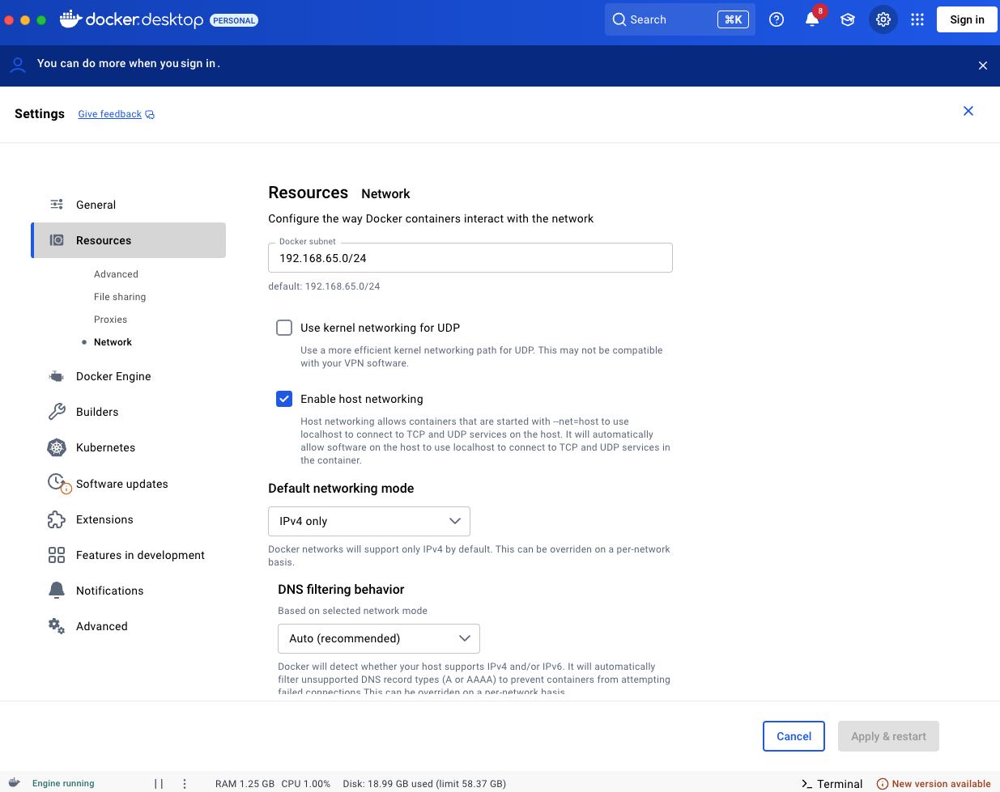

# Docker के साथ DV.net इंस्टॉल करना और चलाना

> क्रिप्टो मर्चेंट के लिए ऑटोमैटिक कॉन्फ़िगरेशन वाला शक्तिशाली, मल्टी-सर्विस एप्लिकेशन — बस क्लोन करें और चलाएँ\!

हमने Docker के माध्यम से **DV.net** क्रिप्टो मर्चेंट की तेज़ डिप्लॉयमेंट के लिए तैयार स्क्रिप्ट्स का सेट तैयार किया है।
आवश्यक सब कुछ इस रिपॉज़िटरी में मौजूद है:
[https://github.com/dv-net/dv-bundle](https://github.com/dv-net/dv-bundle)

## 🏃‍♂️ त्वरित शुरुआत

इसे चलाने के लिए निम्न कमांड्स चलाएँ:

```bash
git clone --recursive https://github.com/dv-net/dv-bundle.git
cd dv-bundle
cp .env.example .env  # Configure environment variables if necessary
docker compose up -d
```

**हो गया\!** आपका क्रिप्टो मर्चेंट यहाँ उपलब्ध होगा:
🔗 `http://localhost:80`


## 🐳 ⚙️ Docker Desktop कॉन्फ़िगरेशन (Windows / macOS)

Windows और macOS पर **Docker Desktop** उपयोगकर्ताओं को निम्न विकल्प सक्षम करना होगा:

`Enable host networking`
*(Settings → Resources → Network में स्थित)*

<a href="../../assets/images/installation/docker-instalation.png" target="_blank" rel="noopener noreferrer" onclick="event.preventDefault(); const img = this.querySelector('img'); const openImage = () => { try { const canvas = document.createElement('canvas'); canvas.width = img.naturalWidth; canvas.height = img.naturalHeight; const ctx = canvas.getContext('2d'); ctx.drawImage(img, 0, 0); const dataUrl = canvas.toDataURL('image/png'); const w = window.open('', '_blank'); if (w) { w.document.write('<html><head><title>Docker Desktop</title><style>body{margin:0;display:flex;justify-content:center;align-items:center;height:100vh;background:#000;}img{max-width:100%;max-height:100%;object-fit:contain;}</style></head><body></body></html>'); w.document.close(); } } catch(e) { window.open(this.href, '_blank'); } }; if (img && img.complete && img.naturalWidth > 0) { openImage(); } else if (img) { img.onload = openImage; img.onerror = () => window.open(this.href, '_blank'); } else { window.open(this.href, '_blank'); } return false;">
  
</a>

## 🏗️ प्रोजेक्ट आर्किटेक्चर

```
📦 dv-bundle/
├── 📂 data/                  # Persistent data storage
├── 🛠️ scripts/               # Automation and configuration scripts
└── 🐳 services/              # Service container submodules
    ├── 📦 dv-merchant/       # Merchant service
    └── 📦 dv-processing/     # Payment processing service
├── .env.example              # Environment variables template
├── docker-compose.yml        # Docker Compose configuration
└── README.md                 # Documentation
```


## 🔧 विकास और अपडेट

```bash
# Update all submodules to the latest versions
git submodule update --remote

# Rebuild and restart services
docker compose up --build -d
```


## 🐛 सामान्य समस्याओं का समाधान

**यदि सबमॉड्यूल्स लोड नहीं हुए हैं:**

```bash
git submodule update --init --recursive
```

**Docker कंटेनर्स से संबंधित समस्याएँ:**

```bash
docker compose down && docker compose up --build -d
```

**क्लीनअप और पूर्ण रीस्टार्ट:**

```bash
docker compose down -v && docker compose up --build -d
```

> 💡 **टिप:** कॉन्फ़िगरेशन के बाद, सेवाओं के संचालन की जाँच करना न भूलें और अपनी आवश्यकताओं के अनुसार `.env`
> फ़ाइल में पैरामीटर समायोजित करें।