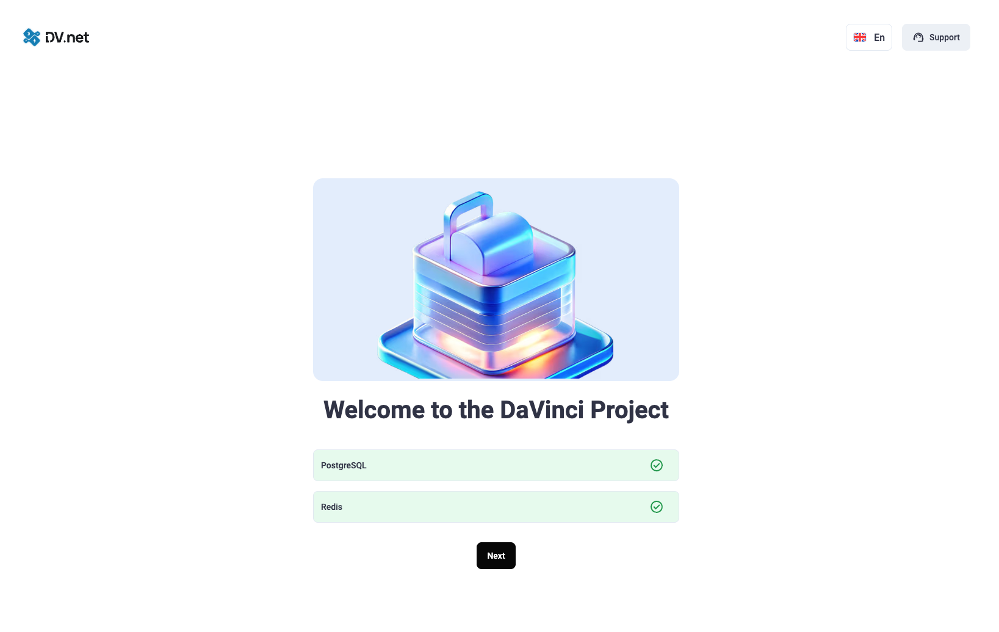
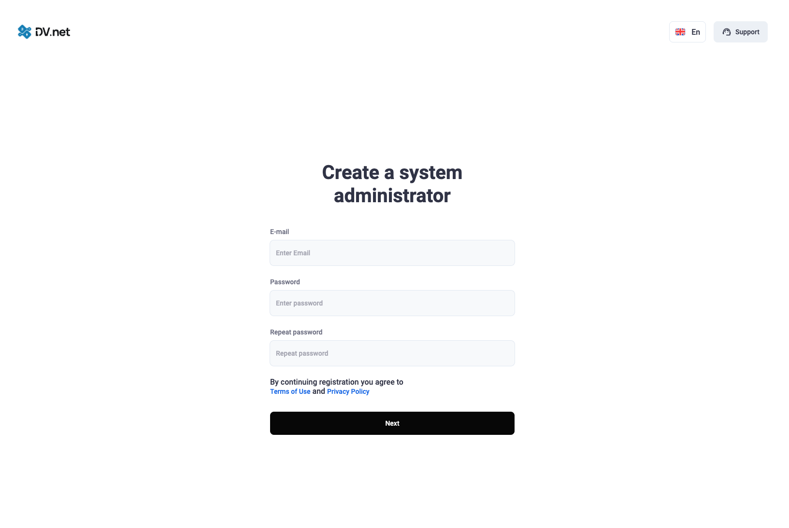
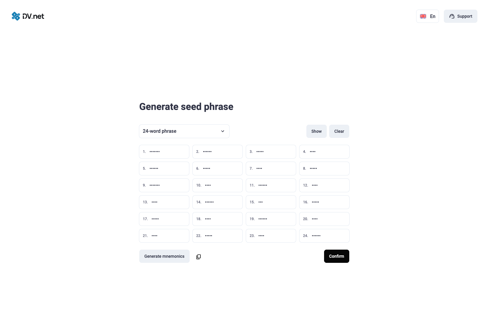
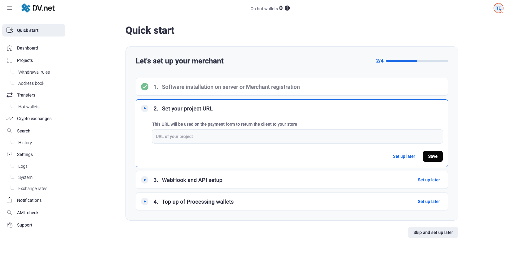
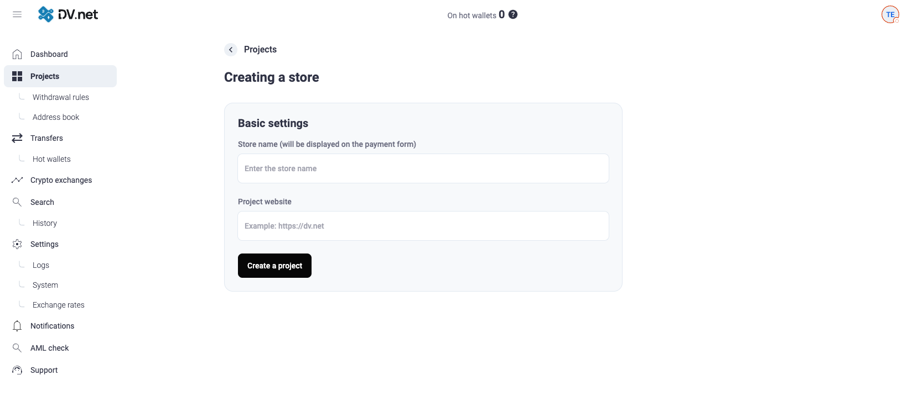
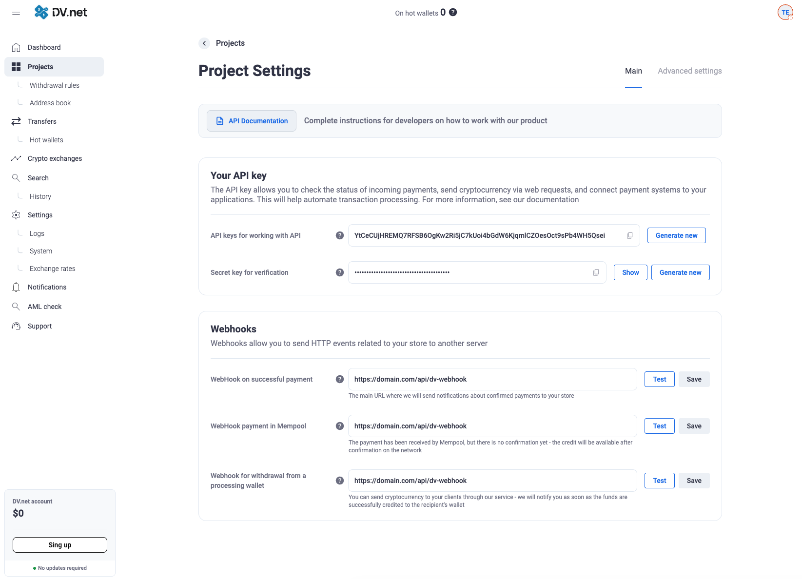
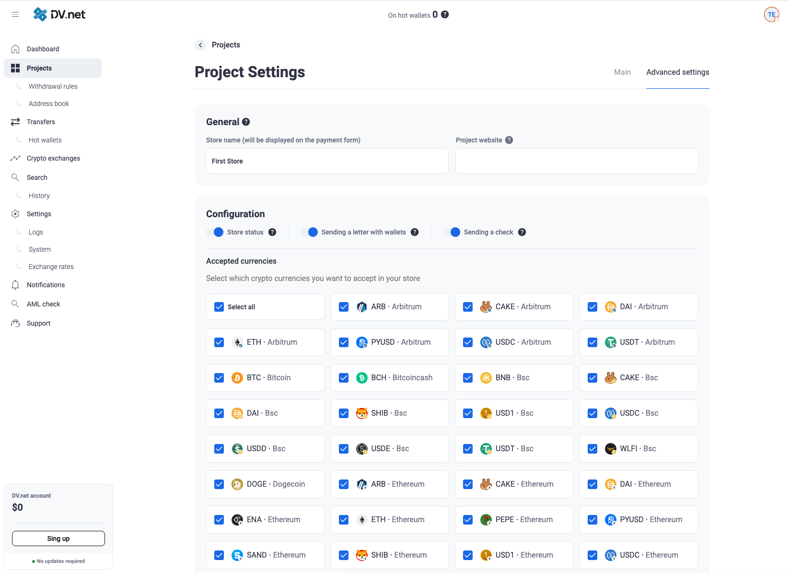
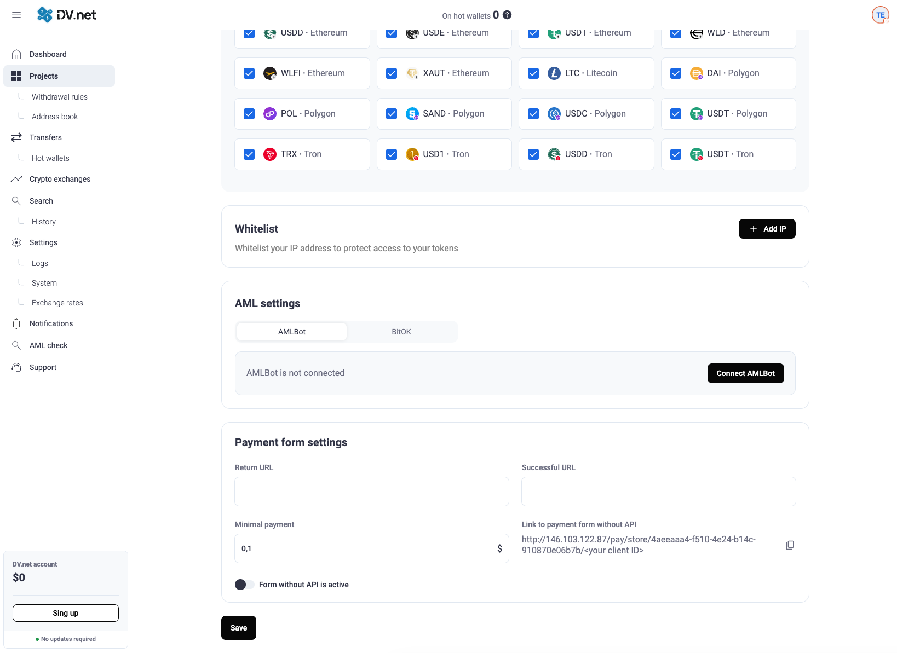
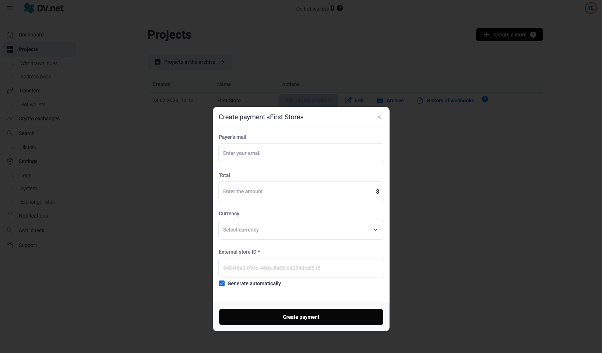
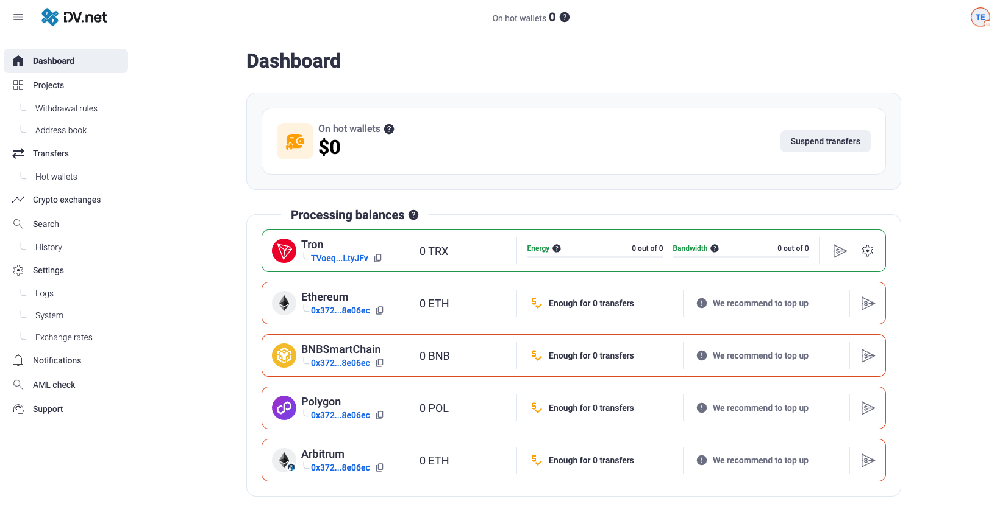

# [dv.net](http://dv.net) व्यापारी की स्थापना और कॉन्फ़िगरेशन गाइड

## स्थापना

प्रदान की गई स्क्रिप्ट का उपयोग करके व्यापारी स्थापित करें:

```bash
sudo bash -c "$(curl -fsSL https://dv.net/install.sh)"
```

ध्यान दें कि यदि आपके सर्वर पर Firewall है, तो आपको पोर्ट **80** और **443** को अपवादों में जोड़ना होगा।

### Firewall की उपस्थिति और स्थिति की जाँच

#### Ubuntu / Debian

**UFW** (सबसे अधिक उपयोग होता है):

```bash
# जांचें कि ufw इंस्टॉल है या नहीं
command -v ufw && ufw --version

# फ़ायरवॉल स्थिति
sudo ufw status verbose

# जांचें कि सेवा सक्रिय है या नहीं
systemctl is-active ufw
```

**firewalld** (कम, लेकिन संभव):

```bash
command -v firewall-cmd && firewall-cmd --version
sudo systemctl status firewalld
sudo firewall-cmd --state
```

**iptables / nftables** (यदि ufw और firewalld उपयोग नहीं होते):

```bash
command -v iptables && sudo iptables -L -n -v
command -v nft && sudo nft list ruleset
```


#### CentOS

**firewalld** (CentOS के लिए मानक):

```bash
# जांचें कि firewalld इंस्टॉल है या नहीं
command -v firewall-cmd && firewall-cmd --version

# स्थिति
sudo systemctl status firewalld
sudo firewall-cmd --state

# खुले पोर्ट की सूची
sudo firewall-cmd --list-ports
sudo firewall-cmd --list-services
```

**UFW** (यदि मैन्युअल रूप से स्थापित):

```bash
command -v ufw && ufw --version
sudo ufw status verbose
```


#### पोर्ट खोलना (यदि firewall सक्रिय है)

**UFW (Ubuntu / Debian):**

```bash
sudo ufw allow 80/tcp
sudo ufw allow 443/tcp
sudo ufw reload
```

**firewalld (CentOS / कभी-कभी Debian/Ubuntu):**

```bash
sudo firewall-cmd --permanent --add-port=80/tcp
sudo firewall-cmd --permanent --add-port=443/tcp
sudo firewall-cmd --reload
```


## डोमेन नामों का बंधन

> उदाहरणों में: साइट — `domain.com`, व्यापारी — `pay.domain.com`.

दो विकल्प:

1. **Cloudflare** — सबसे सरल: प्रॉक्सी चालू करें, HTTPS तुरंत उपलब्ध हो जाता है।
2. **Nginx + Let's Encrypt** — यदि Cloudflare नहीं है।

---


### विकल्प 1. Cloudflare (अनुशंसित)

स्थापना के बाद व्यापारी पहले से ही पोर्ट **80** पर सुन रहा होता है। Cloudflare उपयोगकर्ता के लिए स्वयं HTTPS प्रदान करता है।

#### चरण 1. पोर्ट 80 और 443 खोलें

[स्थापना → पोर्ट खोलना](#पोर्ट-खोलना-यदि-firewall-सक्रिय-है) अनुभाग देखें।

#### चरण 2. DNS रिकॉर्ड जोड़ें

Cloudflare → आपका डोमेन → **DNS** → A-रिकॉर्ड बनाएँ:


| Type | Name                        | Content             | Proxy status                   |
| ---- | --------------------------- | ------------------- | ------------------------------ |
| A    | `pay` (या आवश्यक सबडोमेन) | `आपके_सर्वर_का_IP` | **Proxied** (नारंगी बादल) |


#### चरण 3. SSL मोड

Cloudflare → **SSL/TLS** → **Flexible** मोड।

#### चरण 4. जाँच

कुछ मिनट प्रतीक्षा करें और खोलें:

```text
https://pay.domain.com
```

व्यापारी का पेज खुलना चाहिए। आगे ब्राउज़र में कॉन्फ़िगर करें।

---


### विकल्प 2. Nginx + Let's Encrypt

यदि Cloudflare उपयोग नहीं करते — SSL आप स्वयं सर्वर पर जारी करते हैं।

#### चरण 1. पोर्ट 80 और 443 खोलें

[स्थापना → पोर्ट खोलना](#पोर्ट-खोलना-यदि-firewall-सक्रिय-है) अनुभाग देखें।

#### चरण 2. DNS

डोमेन रजistrar पैनल में A-रिकॉर्ड बनाएँ:

```text
pay.domain.com    A     आपके_सर्वर_का_IP
```

DNS पहले से सर्वर की ओर इशारा कर रहा है, यह जाँचें:

```bash
dig +short pay.domain.com
```


#### चरण 3. Nginx और Certbot स्थापित करें

**Ubuntu / Debian:**

```bash
sudo apt update
sudo apt install -y nginx certbot python3-certbot-nginx
```

**CentOS:**

```bash
sudo dnf install -y nginx certbot python3-certbot-nginx
sudo systemctl enable --now nginx
```


#### चरण 4. व्यापारी को पोर्ट 8080 पर ले जाएँ

```bash
sudo nano /home/dv/merchant/configs/config.yaml
```

```yaml
http:
  port: "8080"
```

```bash
sudo systemctl restart dv-merchant
```


#### चरण 5. Nginx कॉन्फ़िग

```bash
sudo nano /etc/nginx/conf.d/pay.domain.com.conf
```

```nginx
server {
    listen 80;
    server_name pay.domain.com;

    client_max_body_size 128M;

    location / {
        proxy_pass http://127.0.0.1:8080;
        proxy_set_header Host $host;
        proxy_set_header X-Real-IP $remote_addr;
        proxy_set_header X-Forwarded-For $proxy_add_x_forwarded_for;
        proxy_set_header X-Forwarded-Proto $scheme;
    }
}
```

```bash
sudo nginx -t
sudo systemctl reload nginx
```


#### चरण 6. प्रमाणपत्र जारी करें

```bash
sudo certbot --nginx -d pay.domain.com
```


#### चरण 7. जाँच

खोलें:

```text
https://pay.domain.com
```

और व्यापारी की कॉन्फ़िगरेशन जारी रखें।

## ब्राउज़र में प्रारंभिक कॉन्फ़िगरेशन

स्थापना और डोमेन बंधन के बाद व्यापारी का पता खोलें:

```text
https://pay.domain.com/
```

सिस्टम स्वयं पैनल (`/dv-admin/`) में रीडायरेक्ट करेगा और सेटअप विज़ार्ड दिखाएगा।

---


### चरण 1. सिस्टम जाँच

स्क्रीन: **«DaVinci प्रोजेक्ट में आपका स्वागत है»**।

हरे चेकमार्क होने चाहिए:

- **PostgreSQL**
- **Redis**

**«Next»** दबाएँ।

<a href="../../assets/images/installation/instalation-welcome.png" target="_blank" rel="noopener noreferrer" onclick="event.preventDefault(); const img = this.querySelector('img'); const openImage = () => { try { const canvas = document.createElement('canvas'); canvas.width = img.naturalWidth; canvas.height = img.naturalHeight; const ctx = canvas.getContext('2d'); ctx.drawImage(img, 0, 0); const dataUrl = canvas.toDataURL('image/png'); const w = window.open('', '_blank'); if (w) { w.document.write('<html><head><title>सिस्टम जाँच</title><style>body{margin:0;display:flex;justify-content:center;align-items:center;height:100vh;background:#000;}img{max-width:100%;max-height:100%;object-fit:contain;}</style></head><body></body></html>'); w.document.close(); } } catch(e) { window.open(this.href, '_blank'); } }; if (img && img.complete && img.naturalWidth > 0) { openImage(); } else if (img) { img.onload = openImage; img.onerror = () => window.open(this.href, '_blank'); } else { window.open(this.href, '_blank'); } return false;">
  
</a>

---


### चरण 2. सिस्टम व्यवस्थापक बनाना

स्क्रीन: **«Create system administrator»**।

भरें:


| फ़ील्ड                  | आवश्यकता          |
| --------------------- | ------------------- |
| Email                 | वैध email      |
| Password              | 8 से 32 वर्ण |
| Password confirmation | पासवर्ड से मेल खाता |


**«Next»** दबाएँ।

> यह root उपयोगकर्ता है। लॉगिन और पासवर्ड सुरक्षित स्थान पर सहेजें।  
> यह केवल पहली स्थापना पर एक बार बनता है।

पंजीकरण के बाद सिस्टम स्वचालित रूप से processing प्रारंभ करता है (merchant ↔ processing बंधन)।

<a href="../../assets/images/installation/instalation-create-administrator.png" target="_blank" rel="noopener noreferrer" onclick="event.preventDefault(); const img = this.querySelector('img'); const openImage = () => { try { const canvas = document.createElement('canvas'); canvas.width = img.naturalWidth; canvas.height = img.naturalHeight; const ctx = canvas.getContext('2d'); ctx.drawImage(img, 0, 0); const dataUrl = canvas.toDataURL('image/png'); const w = window.open('', '_blank'); if (w) { w.document.write('<html><head><title>सिस्टम व्यवस्थापक बनाना</title><style>body{margin:0;display:flex;justify-content:center;align-items:center;height:100vh;background:#000;}img{max-width:100%;max-height:100%;object-fit:contain;}</style></head><body></body></html>'); w.document.close(); } } catch(e) { window.open(this.href, '_blank'); } }; if (img && img.complete && img.naturalWidth > 0) { openImage(); } else if (img) { img.onload = openImage; img.onerror = () => window.open(this.href, '_blank'); } else { window.open(this.href, '_blank'); } return false;">
  
</a>

---


### चरण 3. seed-फ़्रेज़ जनरेशन और पुष्टि

स्क्रीन: **«Generate seed phrase»** / mnemonics जनरेशन।

1. फ़्रेज़ की लंबाई चुनें: **12** या **24** शब्द (डिफ़ॉल्ट 24)।
2. पुनः जनरेट करने के लिए **«Generate mnemonics»** दबाएँ।
3. शब्द देखने के लिए **«Show»** दबाएँ।
4. **फ़्रेज़ कॉपी करें और ऑफ़लाइन सहेजें** (कागज़ / पासवर्ड मैनेजर / ऑफ़लाइन भंडार)।
5. **«Confirm»** दबाएँ।

> Seed-फ़्रेज़ व्यापारी के सभी वॉलेट का मास्टर-कुंजी है। जिसके पास यह है — वह धन पर नियंत्रण रखता है।  
> इसके बिना वॉलेट तक पहुँच पुनर्प्राप्ति संभव नहीं।

पुष्टि के बाद **Quick start** खुलेगा।

<a href="../../assets/images/installation/instalation-seed.png" target="_blank" rel="noopener noreferrer" onclick="event.preventDefault(); const img = this.querySelector('img'); const openImage = () => { try { const canvas = document.createElement('canvas'); canvas.width = img.naturalWidth; canvas.height = img.naturalHeight; const ctx = canvas.getContext('2d'); ctx.drawImage(img, 0, 0); const dataUrl = canvas.toDataURL('image/png'); const w = window.open('', '_blank'); if (w) { w.document.write('<html><head><title>seed-फ़्रेज़ जनरेशन</title><style>body{margin:0;display:flex;justify-content:center;align-items:center;height:100vh;background:#000;}img{max-width:100%;max-height:100%;object-fit:contain;}</style></head><body></body></html>'); w.document.close(); } } catch(e) { window.open(this.href, '_blank'); } }; if (img && img.complete && img.naturalWidth > 0) { openImage(); } else if (img) { img.onload = openImage; img.onerror = () => window.open(this.href, '_blank'); } else { window.open(this.href, '_blank'); } return false;">
  
</a>

---


### चरण 4. त्वरित शुरुआत :


#### 4.1. प्रोजेक्ट URL

अपनी साइट/प्रोजेक्ट का URL `https://domain.com` प्रारूप में दर्ज करें और **«Save»** दबाएँ।

#### 4.2. Webhook और API

1. webhook URL दर्ज करें (जहाँ DV.net भुगतान सूचनाएँ भेजेगा)।
2. **API key** कॉपी करें — इसे `x-api-key` हेडर में भेजना होगा।
3. webhook प्रामाणिकता जाँच के लिए उपयोग होने वाली गुप्त कुंजी कॉपी करें।


#### 4.3. processing-वॉलेट में धन जोड़ना

स्क्रीन पर नेटवर्क के अनुसार processing-वॉलेट के पते होंगे।

इन्हें बाद में भरना होगा — ग्राहकों के hot वॉलेट से ट्रांसफ़र पर नेटवर्क शुल्क इन्हीं से चुकाए जाते हैं।

**«Next»** / **«Finish»** दबाएँ, या **«Skip and set up later»** यदि बाद में सेट करेंगे।

समाप्ति के बाद व्यापारी डैशबोर्ड खुलेगा।

<a href="../../assets/images/installation/instalation-quick-start.png" target="_blank" rel="noopener noreferrer" onclick="event.preventDefault(); const img = this.querySelector('img'); const openImage = () => { try { const canvas = document.createElement('canvas'); canvas.width = img.naturalWidth; canvas.height = img.naturalHeight; const ctx = canvas.getContext('2d'); ctx.drawImage(img, 0, 0); const dataUrl = canvas.toDataURL('image/png'); const w = window.open('', '_blank'); if (w) { w.document.write('<html><head><title>त्वरित शुरुआत</title><style>body{margin:0;display:flex;justify-content:center;align-items:center;height:100vh;background:#000;}img{max-width:100%;max-height:100%;object-fit:contain;}</style></head><body></body></html>'); w.document.close(); } } catch(e) { window.open(this.href, '_blank'); } }; if (img && img.complete && img.naturalWidth > 0) { openImage(); } else if (img) { img.onload = openImage; img.onerror = () => window.open(this.href, '_blank'); } else { window.open(this.href, '_blank'); } return false;">
  
</a>

---


## प्रोजेक्ट कॉन्फ़िगरेशन — चरण दर चरण:

पहले से स्थापित व्यापारी को परीक्षण डोमेन पर कॉन्फ़िगर करना:

```text
https://pay.domain.com/
```

---


### भाग 1. पैनल में लॉगिन

1. ब्राउज़र खोलें (Chrome / Safari / Firefox)।
2. एड्रेस बार में दर्ज करें:

```text
https://pay.domain.com/
```

1. Enter दबाएँ।
2. यदि लॉगिन खुले — स्थापना के दौरान बनाए गए व्यवस्थापक का **email** और **password** दर्ज करें।
3. लॉगिन बटन दबाएँ।

आपको DV.net नियंत्रण पैनल में पहुँचना चाहिए।

---


### भाग 2. स्टोर (प्रोजेक्ट) बनाना

1. बाएँ मेनू में **«Projects»** खोजें।
2. उस पर क्लिक करें।
3. ऊपर दाएँ **«Create a store»** दबाएँ।
4. फ़ील्ड भरें:


| फ़ील्ड                | क्या लिखें                                 | उदाहरण               |
| ------------------- | ------------------------------------------ | -------------------- |
| **Name** / नाम | आपके स्टोर का नाम                 | `परीक्षण स्टोर`   |
| **Site** / साइट     | आपकी साइट का लिंक (खाली छोड़ सकते हैं) | `https://domain.com` |


1. **«Create a project»** दबाएँ।
2. स्टोर बनने का संदेश प्रतीक्षा करें।
3. आप प्रोजेक्ट सूची में वापस आएँगे — वहाँ आपका स्टोर दिखेगा।

> यदि Quick start चरण में स्टोर पहले से बन गया — नया बनाना अनिवार्य नहीं। **Edit** से मौजूदा खोलें।

<a href="../../assets/images/installation/instalation-create-store.png" target="_blank" rel="noopener noreferrer" onclick="event.preventDefault(); const img = this.querySelector('img'); const openImage = () => { try { const canvas = document.createElement('canvas'); canvas.width = img.naturalWidth; canvas.height = img.naturalHeight; const ctx = canvas.getContext('2d'); ctx.drawImage(img, 0, 0); const dataUrl = canvas.toDataURL('image/png'); const w = window.open('', '_blank'); if (w) { w.document.write('<html><head><title>स्टोर बनाना</title><style>body{margin:0;display:flex;justify-content:center;align-items:center;height:100vh;background:#000;}img{max-width:100%;max-height:100%;object-fit:contain;}</style></head><body></body></html>'); w.document.close(); } } catch(e) { window.open(this.href, '_blank'); } }; if (img && img.complete && img.naturalWidth > 0) { openImage(); } else if (img) { img.onload = openImage; img.onerror = () => window.open(this.href, '_blank'); } else { window.open(this.href, '_blank'); } return false;">
  
</a>

---


### भाग 3. स्टोर सेटिंग्स खोलना

1. **Projects** सूची में अपना स्टोर खोजें।
2. पंक्ति में दाएँ **«Edit»** दबाएँ।
3. ऊपर दो टैब वाला स्टोर पेज खुलेगा:
  - **Main** — API कुंजी और webhook
  - **Advanced settings** — मुद्राएँ, साइट, भुगतान फ़ॉर्म

पहले **Main**, फिर **Advanced settings** सेट करेंगे।

---


### भाग 4. API key और Secret key प्राप्त करना

**Main** टैब पर:

#### 4.1. API key

1. **«Your API key»** ब्लॉक खोजें।
2. यदि कुंजी नहीं — बनाने / **Generate** दबाएँ।
3. कुंजी के पास कॉपी आइकन दबाएँ।
4. कुंजी सहेजें।

यह कुंजी अनुरोध हेडर में जाएगी:

```text
x-api-key: आपकी_कुंजी
```


#### 4.2. Secret key (webhook जाँच के लिए)

1. उसी अनुभाग में **Secret key** खोजें।
2. यदि कुंजी नहीं — **«Generate new»** दबाएँ।
3. देखने के लिए **«Show»** दबाएँ।
4. API key के साथ कॉपी करके सहेजें।

> Secret key से आपकी साइट जाँचती है: «यह सूचना वास्तव में DV.net से है, धोखेबाज़ से नहीं»।

<a href="../../assets/images/installation/instalation-api-webhook.png" target="_blank" rel="noopener noreferrer" onclick="event.preventDefault(); const img = this.querySelector('img'); const openImage = () => { try { const canvas = document.createElement('canvas'); canvas.width = img.naturalWidth; canvas.height = img.naturalHeight; const ctx = canvas.getContext('2d'); ctx.drawImage(img, 0, 0); const dataUrl = canvas.toDataURL('image/png'); const w = window.open('', '_blank'); if (w) { w.document.write('<html><head><title>API key और Secret key</title><style>body{margin:0;display:flex;justify-content:center;align-items:center;height:100vh;background:#000;}img{max-width:100%;max-height:100%;object-fit:contain;}</style></head><body></body></html>'); w.document.close(); } } catch(e) { window.open(this.href, '_blank'); } }; if (img && img.complete && img.naturalWidth > 0) { openImage(); } else if (img) { img.onload = openImage; img.onerror = () => window.open(this.href, '_blank'); } else { window.open(this.href, '_blank'); } return false;">
  
</a>

---


### भाग 5. webhook कॉन्फ़िगर करना

Webhook DV.net से आपकी साइट पर «कॉल» है, जब ग्राहक भुगतान करता है।

1. **Main** टैब पर **«Webhooks»** ब्लॉक खोजें।
2. URL फ़ील्ड में हैंडलर का पता चिपकाएँ, उदाहरण:

```text
https://domain.com/api/dv-webhook
```

> अभी हैंडलर नहीं — यह चरण अस्थायी छोड़ सकते हैं और बाद में लौटें। webhook के बिना भुगतान चल सकता है, लेकिन स्टोर को पता नहीं चलेगा कि धन आया।

1. आवश्यक इवेंट चालू करें, न्यूनतम:
  - सफल भुगतान पर WebHook (**WebHook on successful payment**)
2. **«Create»** या **«Save»** दबाएँ।
3. **«Test»** दबाएँ, सर्वर जवाब दे रहा है जाँचें।

अन्य इवेंट के लिए दोहराएँ यदि चाहिए (अपुष्ट भुगतान, processing-वॉलेट से निकासी)।

<a href="../../assets/images/installation/instalation-api-webhook.png" target="_blank" rel="noopener noreferrer" onclick="event.preventDefault(); const img = this.querySelector('img'); const openImage = () => { try { const canvas = document.createElement('canvas'); canvas.width = img.naturalWidth; canvas.height = img.naturalHeight; const ctx = canvas.getContext('2d'); ctx.drawImage(img, 0, 0); const dataUrl = canvas.toDataURL('image/png'); const w = window.open('', '_blank'); if (w) { w.document.write('<html><head><title>वेबहुक कॉन्फ़िगरेशन</title><style>body{margin:0;display:flex;justify-content:center;align-items:center;height:100vh;background:#000;}img{max-width:100%;max-height:100%;object-fit:contain;}</style></head><body></body></html>'); w.document.close(); } } catch(e) { window.open(this.href, '_blank'); } }; if (img && img.complete && img.naturalWidth > 0) { openImage(); } else if (img) { img.onload = openImage; img.onerror = () => window.open(this.href, '_blank'); } else { window.open(this.href, '_blank'); } return false;">
  
</a>

---


### भाग 6. मुद्राएँ और स्टोर की बुनियादी सेटिंग्स

1. **«Advanced settings»** टैब पर जाएँ।
2. **General** ब्लॉक में:
  - स्टोर **नाम** जाँचें;
  - **Project website** (प्रोजेक्ट साइट) दर्ज करें यदि अभी नहीं।
3. **Accepted currencies** ब्लॉक में:
  - आवश्यक सिक्के चुनें (उदा. USDT Tron, BTC, ETH);
  - या **«Select all»** यदि सभी चाहिए।
4. **Payment form settings** ब्लॉक में:
  - **Minimal payment** — न्यूनतम राशि (`$0.1` से कम नहीं);
  - चाहें तो **success_url** और **return_url** (भुगतान के बाद ग्राहक कहाँ लौटे)।
5. नीचे **«Save»** दबाएँ।

<a href="../../assets/images/installation/instalation-project-setting.png" target="_blank" rel="noopener noreferrer" onclick="event.preventDefault(); const img = this.querySelector('img'); const openImage = () => { try { const canvas = document.createElement('canvas'); canvas.width = img.naturalWidth; canvas.height = img.naturalHeight; const ctx = canvas.getContext('2d'); ctx.drawImage(img, 0, 0); const dataUrl = canvas.toDataURL('image/png'); const w = window.open('', '_blank'); if (w) { w.document.write('<html><head><title>स्टोर की उन्नत सेटिंग्स</title><style>body{margin:0;display:flex;justify-content:center;align-items:center;height:100vh;background:#000;}img{max-width:100%;max-height:100%;object-fit:contain;}</style></head><body></body></html>'); w.document.close(); } } catch(e) { window.open(this.href, '_blank'); } }; if (img && img.complete && img.naturalWidth > 0) { openImage(); } else if (img) { img.onload = openImage; img.onerror = () => window.open(this.href, '_blank'); } else { window.open(this.href, '_blank'); } return false;">
  
</a>

---


### भाग 7. भुगतान लिंक (तैयार फ़ॉर्म)

**Advanced settings** में इस प्रकार का लिंक टेम्पलेट होगा:

```text
https://pay.domain.com/pay/store/स्टोर_ID/<आपका_client_ID>
```

जहाँ:

- `स्टोर_ID` — सिस्टम द्वारा पहले से भरा;
- `<आपका_client_ID>` — अपने सिस्टम में ग्राहक ID से बदलें (उदा. `user_15`)।

उदाहरण:

```text
https://pay.domain.com/pay/store/आपका_STORE_UUID/user_15
```

यह लिंक ब्राउज़र में खोल सकते हैं — DV.net भुगतान फ़ॉर्म खुलेगा।

<a href="../../assets/images/installation/instalation-payment.png" target="_blank" rel="noopener noreferrer" onclick="event.preventDefault(); const img = this.querySelector('img'); const openImage = () => { try { const canvas = document.createElement('canvas'); canvas.width = img.naturalWidth; canvas.height = img.naturalHeight; const ctx = canvas.getContext('2d'); ctx.drawImage(img, 0, 0); const dataUrl = canvas.toDataURL('image/png'); const w = window.open('', '_blank'); if (w) { w.document.write('<html><head><title>भुगतान लिंक</title><style>body{margin:0;display:flex;justify-content:center;align-items:center;height:100vh;background:#000;}img{max-width:100%;max-height:100%;object-fit:contain;}</style></head><body></body></html>'); w.document.close(); } } catch(e) { window.open(this.href, '_blank'); } }; if (img && img.complete && img.naturalWidth > 0) { openImage(); } else if (img) { img.onload = openImage; img.onerror = () => window.open(this.href, '_blank'); } else { window.open(this.href, '_blank'); } return false;">
  
</a>

---


### भाग 8. पैनल से परीक्षण भुगतान बनाना:

1. **Projects** में वापस जाएँ।
2. स्टोर पंक्ति में **«Create payment»** दबाएँ।
3. विंडो में भरें:
  - **Amount** — डॉलर में राशि, उदा. `5`;
  - **Email** — खाली छोड़ सकते हैं;
  - **External ID** — ग्राहक ID (या ऑटो-जनरेशन छोड़ें);
  - **Currency** — भुगतान मुद्रा (यदि पूछे)।
4. **«Create payment»** दबाएँ।
5. दिखने वाला **भुगतान लिंक** कॉपी करें।
6. नए टैब में खोलें — भुगतान पेज खुलना चाहिए।

इससे स्टोर सक्रिय है, यह जाँचते हैं।

<a href="../../assets/images/installation/instalation-create-payment.png" target="_blank" rel="noopener noreferrer" onclick="event.preventDefault(); const img = this.querySelector('img'); const openImage = () => { try { const canvas = document.createElement('canvas'); canvas.width = img.naturalWidth; canvas.height = img.naturalHeight; const ctx = canvas.getContext('2d'); ctx.drawImage(img, 0, 0); const dataUrl = canvas.toDataURL('image/png'); const w = window.open('', '_blank'); if (w) { w.document.write('<html><head><title>परीक्षण भुगतान बनाना</title><style>body{margin:0;display:flex;justify-content:center;align-items:center;height:100vh;background:#000;}img{max-width:100%;max-height:100%;object-fit:contain;}</style></head><body></body></html>'); w.document.close(); } } catch(e) { window.open(this.href, '_blank'); } }; if (img && img.complete && img.naturalWidth > 0) { openImage(); } else if (img) { img.onload = openImage; img.onerror = () => window.open(this.href, '_blank'); } else { window.open(this.href, '_blank'); } return false;">
  
</a>

---


### भाग 9. API के माध्यम से स्टोर कनेक्ट करना

जब कुंजी तैयार हों:

**API पता:**

```text
https://pay.domain.com
```

**भुगतान के लिए इनवॉइस / वॉलेट बनाना:**

```bash
curl -X POST \
  'https://pay.domain.com/api/v1/external/wallet' \
  -H 'Content-Type: application/json' \
  -H 'x-api-key: आपकी_API_KEY' \
  --data '{
    "amount": 20,
    "store_external_id": "user_123"
  }'
```

प्रतिक्रिया में `**pay_url**` फ़ील्ड होगा — इसे ग्राहक को भेजते हैं।

---


### भाग 10. processing-वॉलेट में धन जोड़ना

1. बाएँ मेनू में **Dashboard** खोलें।
2. processing-वॉलेट ब्लॉक खोजें (नेटवर्क के अनुसार: Tron, Ethereum आदि)।
3. आवश्यक नेटवर्क का पता कॉपी करें।
4. उसी नेटवर्क की थोड़ी क्रिप्टो भेजें (शुल्क के लिए)।

इसके बिना भुगतान स्वीकार हो सकता है, लेकिन hot वॉलेट से ट्रांसफ़र/निकासी — gas/शुल्क की कमी पर रुक सकती है।

<a href="../../assets/images/installation/instalation-processing-balance.png" target="_blank" rel="noopener noreferrer" onclick="event.preventDefault(); const img = this.querySelector('img'); const openImage = () => { try { const canvas = document.createElement('canvas'); canvas.width = img.naturalWidth; canvas.height = img.naturalHeight; const ctx = canvas.getContext('2d'); ctx.drawImage(img, 0, 0); const dataUrl = canvas.toDataURL('image/png'); const w = window.open('', '_blank'); if (w) { w.document.write('<html><head><title>processing-वॉलेट</title><style>body{margin:0;display:flex;justify-content:center;align-items:center;height:100vh;background:#000;}img{max-width:100%;max-height:100%;object-fit:contain;}</style></head><body></body></html>'); w.document.close(); } } catch(e) { window.open(this.href, '_blank'); } }; if (img && img.complete && img.naturalWidth > 0) { openImage(); } else if (img) { img.onload = openImage; img.onerror = () => window.open(this.href, '_blank'); } else { window.open(this.href, '_blank'); } return false;">
  
</a>

---


### भाग 11. «सब तैयार» चेक-लिस्ट

चेक करें:

- [ ] `https://pay.domain.com/` पर लॉगिन किया
- [ ] स्टोर (प्रोजेक्ट) बनाया
- [ ] **API key** कॉपी की
- [ ] **Secret key** कॉपी की
- [ ] व्यवस्थापक seed-फ़्रेज़ सहेजी (स्थापना चरण में)
- [ ] आवश्यक मुद्राएँ चालू कीं
- [ ] webhook कॉन्फ़िगर किया (या जानबूझकर बाद के लिए छोड़ा)
- [ ] परीक्षण भुगतान बनाया और `pay_url` खोला
- [ ] आवश्यकता हो तो processing-वॉलेट भरे

सभी पूर्ण — स्टोर परीक्षण इंटीग्रेशन के लिए तैयार।

---


### सामान्य समस्याएँ (सरल भाषा में)


| समस्या                     | क्या करें                                                                     |
| ---------------------------- | ------------------------------------------------------------------------------- |
| साइट नहीं खुलती          | जाँचें कि `pay.domain.com` सर्वर की ओर इशारा करता है, पोर्ट 80/443 खुले हैं |
| स्टोर बनाने का बटन नहीं   | व्यवस्थापक के रूप में लॉगिन नहीं — लॉगआउट करके फिर लॉगिन करें                       |
| API key नहीं                  | प्रोजेक्ट → **Edit** → **Main** → Generate                                |
| भुगतान लिंक नहीं खुलता | पूरा लिंक कॉपी किया, स्टोर मुद्राएँ चालू हैं — जाँचें                 |
| webhook नहीं आता           | URL इंटरनेट से उपलब्ध हो (localhost नहीं); पैनल में Test जाँचें   |
| व्यवस्थापक पासवर्ड भूल गए         | सर्वर पर CLI से पुनर्प्राप्ति: `dv-merchant users` (SSH पहुँच चाहिए)  |


---


## इंटीग्रेशन के उदाहरण

परिदृश्य:

1. ग्राहक `user_123` के लिए **10 USD** भुगतान बनाना
2. `pay_url` लिंक प्राप्त करके ग्राहक को देना
3. webhook स्वीकार करना, हस्ताक्षर जाँचना, `{"success": true}` जवाब देना

शुरू करने से पहले अपने मान भरें:


| क्या            | कहाँ देखें          | उदाहरण                   |
| -------------- | ---------------------- | ------------------------ |
| व्यापारी पता | आपका भुगतान डोमेन       | `https://pay.domain.com` |
| API key        | Projects → Edit → Main | `आपकी_API_KEY`            |
| Secret key     | वहीं                 | `आपकी_SECRET_KEY`         |
| स्टोर ID    | Advanced settings      | `आपका_STORE_UUID`         |
| आपकी साइट       | स्टोर साइट          | `https://domain.com`     |


### पहले पैनल में webhook सेट करें (एक बार)

1. `https://pay.domain.com` खोलें
2. जाएँ: **Projects → आपका स्टोर → Edit → Main**
3. **Webhooks** ब्लॉक खोजें
4. URL चिपकाएँ: `https://domain.com/dv/webhook`
5. पुष्ट भुगतान चालू करें
6. **Save** दबाएँ

---


### भुगतान योजना

```text
1. ग्राहक «भुगतान करें» पर क्लिक करता है
2. आपकी साइट DV.net में भुगतान बनाती है और ग्राहक को लिंक भेजती है
3. ग्राहक pay_url खोलता है और भुगतान करता है
4. DV.net आपकी साइट पर webhook भेजकर भुगतान की स्थिति सूचित करता है
5. आप हस्ताक्षर सत्यापित करके ऑर्डर जमा करते हैं
6. आप {"success": true} के साथ उत्तर देते हैं
```

---


### 1) cURL


#### चरण 1. भुगतान बनाना

```bash
curl -X POST 'https://pay.domain.com/api/v1/external/wallet' \
  -H 'Content-Type: application/json' \
  -H 'x-api-key: आपकी_API_KEY' \
  --data '{
    "amount": "10",
    "currency": "USD",
    "store_external_id": "user_123",
    "email": "user@domain.com"
  }'
```


#### चरण 2. प्रतिक्रिया से `pay_url` लें

यह लिंक ग्राहक को भेजें।

#### अतिरिक्त:

मुद्रा सूची प्राप्त करें:

```bash
curl 'https://pay.domain.com/api/v1/external/store/currencies' \
  -H 'x-api-key: आपकी_API_KEY'
```

वर्तमान दर प्राप्त करें:

```bash
curl 'https://pay.domain.com/api/v1/external/store/currencies/USDT.Tron/rate' \
  -H 'x-api-key: आपकी_API_KEY'
```

---


### 2) Python


#### चरण 1. लाइब्रेरी स्थापित करें

```bash
pip install dv-net-client
```


#### चरण 2. भुगतान बनाना

```python
from dv_net_client import MerchantClient

client = MerchantClient(
    host="https://pay.domain.com",
    x_api_key="आपकी_API_KEY",
)

wallet = client.get_external_wallet(
    store_external_id="user_123",
    amount="10",
    currency="USD",
    email="user@domain.com",
)

print(wallet.pay_url)  # ग्राहक को भेजें
```


#### चरण 3. webhook स्वीकार करना

```python
from flask import Flask, request, jsonify
from dv_net_client.utils import MerchantUtilsManager
from dv_net_client.mappers import WebhookMapper
from dv_net_client.dto.webhook import ConfirmedWebhookResponse

app = Flask(__name__)
utils = MerchantUtilsManager()
mapper = WebhookMapper()

SECRET = "आपकी_SECRET_KEY"
already_done = set() 

@app.post("/dv/webhook")
def webhook():
    raw = request.get_data(as_text=True)
    sign = request.headers.get("X-Sign", "")

    # 1. हस्ताक्षर सत्यापित करें
    if not utils.check_sign(sign, SECRET, raw):
        return "invalid signature", 403

    webhook = mapper.map_webhook(request.get_json(force=True))

    # 2. यदि भुगतान पुष्टि हो गया — जमा करें
    if isinstance(webhook, ConfirmedWebhookResponse) and webhook.status == "completed":
        user_id = webhook.wallet.store_external_id
        amount = webhook.transactions.amount_usd
        uniq = f"{webhook.transactions.tx_hash}:{webhook.transactions.bc_uniq_key}"

        # 3. दोबारा जमा न करें
        if uniq not in already_done:
            already_done.add(uniq)
            print(f"{user_id} से भुगतान: {amount} USD")
            # यहाँ ऑर्डर / बैलेंस सहेजें

    # 4. हमेशा इस तरह उत्तर दें
    return jsonify({"success": True})
```

---


### 3) PHP


#### चरण 1. लाइब्रेरी स्थापित करें

```bash
composer require dv-net/dv-net-php-client
```


#### चरण 2. भुगतान बनाना

```php
<?php
require 'vendor/autoload.php';

use DvNet\DvNetClient\MerchantClient;
use DvNet\DvNetClient\SimpleHttpClient;

$client = new MerchantClient(
    httpClient: new SimpleHttpClient(),
    host: 'https://pay.domain.com',
    xApiKey: 'आपकी_API_KEY'
);

$wallet = $client->getExternalWallet(
    storeExternalId: 'user_123',
    amount: '10',
    currency: 'USD',
    email: 'user@domain.com'
);

echo $wallet->payUrl; // ग्राहक को भेजें
```


#### चरण 3. webhook स्वीकार करना (`/dv/webhook`)

```php
<?php
$secret = 'आपकी_SECRET_KEY';
$raw = file_get_contents('php://input');
$sign = $_SERVER['HTTP_X_SIGN'] ?? '';

// 1. हस्ताक्षर सत्यापित करें
if (!hash_equals(hash('sha256', $raw . $secret), $sign)) {
    http_response_code(403);
    exit('invalid signature');
}

$data = json_decode($raw, true);

// 2. यदि भुगतान पुष्टि हो गया — जमा करें
if (($data['type'] ?? '') === 'PaymentReceived' && ($data['status'] ?? '') === 'completed') {
    $userId = $data['wallet']['store_external_id'];
    $amount = $data['amount'];
    $uniq = $data['transactions']['tx_hash'] . ':' . $data['transactions']['bc_uniq_key'];

    // 3. DB में जांचें कि $uniq पहले प्रोसेस न हुआ हो
    // उपयोगकर्ता $userId को ऑर्डर जमा करें
}

// 4. हमेशा इस तरह उत्तर दें
header('Content-Type: application/json');
echo json_encode(['success' => true]);
```

---


### 4) JavaScript (Node.js)


#### चरण 1. लाइब्रेरी स्थापित करें

```bash
npm install @dv-net/js-client express
```


#### चरण 2. भुगतान बनाना

```js
import { MerchantClient } from "@dv-net/js-client";

const client = new MerchantClient({
  host: "https://pay.domain.com",
  xApiKey: "आपकी_API_KEY",
});

const wallet = await client.getExternalWallet({
  storeExternalId: "user_123",
  amount: "10",
  currency: "USD",
  email: "user@domain.com",
});

console.log(wallet.payUrl); // ग्राहक को भेजें
```


#### चरण 3. webhook स्वीकार करना

```js
import express from "express";
import crypto from "crypto";

const app = express();
const SECRET = "आपकी_SECRET_KEY";
const alreadyDone = new Set(); 

app.post("/dv/webhook", express.raw({ type: "*/*" }), (req, res) => {
  const raw = req.body.toString("utf8");
  const sign = String(req.header("x-sign") || "");

  // 1. हस्ताक्षर सत्यापित करें
  const calc = crypto.createHash("sha256").update(raw + SECRET).digest("hex");
  if (calc !== sign) {
    return res.status(403).send("invalid signature");
  }

  const data = JSON.parse(raw);

  // 2. यदि भुगतान पुष्टि हो गया — जमा करें
  if (data.type === "PaymentReceived" && data.status === "completed") {
    const userId = data.wallet.store_external_id;
    const amount = data.amount;
    const uniq = `${data.transactions.tx_hash}:${data.transactions.bc_uniq_key}`;

    // 3. दोबारा जमा न करें
    if (!alreadyDone.has(uniq)) {
      alreadyDone.add(uniq);
      console.log(`${userId} से भुगतान: ${amount} USD`);
      // यहाँ ऑर्डर / बैलेंस सहेजें
    }
  }

  // 4. हमेशा इस तरह उत्तर दें
  res.json({ success: true });
});

app.listen(3000);
```

---


### 5) WooCommerce


#### चरण 1. प्लगइन स्थापित करें

1. [https://github.com/dv-net/dv-woocommerce](https://github.com/dv-net/dv-woocommerce) डाउनलोड करें
2. WordPress → **Plugins → Add New → Upload**
3. **Activate**


#### चरण 2. सेटिंग्स भरें

1. **WooCommerce → Settings → Payments → DV.net**
2. भुगतान चालू करें
3. दर्ज करें:
  - Merchant URL: `https://pay.domain.com`
  - API Key: `आपकी_API_KEY`
  - API Secret: `आपकी_SECRET_KEY`
4. सहेजें


#### चरण 3. [DV.net](http://DV.net) में webhook दर्ज करें

प्लगइन सेटिंग्स से callback URL दर्ज करें।

#### चरण 4. जाँच

परीक्षण ऑर्डर करें और भुगतान करें।

---


### 6) OpenCart


#### चरण 1. मॉड्यूल स्थापित करें

1. [https://github.com/dv-net/dv-opencart](https://github.com/dv-net/dv-opencart) (`dv-opencart.ocmod.zip`) डाउनलोड करें
2. **Extensions → Installer → Upload**
3. **Extensions → Payments → DV.net → Install**
4. **Extensions → Modifications → Refresh**


#### चरण 2. सेटिंग्स भरें

1. DV.net Gateway का Edit खोलें
2. दर्ज करें:
  - Merchant URL: `https://pay.domain.com`
  - API Key: `आपकी_API_KEY`
  - API Secret: `आपकी_SECRET_KEY`
3. Status: Enabled
4. सहेजें


#### चरण 3. [DV.net](http://DV.net) में webhook दर्ज करें

```text
https://domain.com/index.php?route=extension/payment/dv_gateway/callback
```


#### चरण 4. जाँच

परीक्षण ऑर्डर करें।

---


### webhook — संक्षेप में

1. हमेशा जवाब दें:

```json
{"success": true}
```

1. हस्ताक्षर:

```text
SHA256(अनुरोध_निकाय + Secret_key) = X-Sign हेडर
```

1. दो बार जमा न करें, याद रखें:

```text
tx_hash + bc_uniq_key
```

1. इवेंट प्रकार:


| प्रकार                                | क्या करें       |
| ---------------------------------- | ---------------- |
| `PaymentReceived`                  | भुगतान जमा करें |
| `PaymentNotConfirmed`              | प्रतीक्षा करें        |
| `WithdrawalFromProcessingReceived` | निकासी पूर्ण   |


---


### डेमो उदाहरण:


| क्या              | लिंक                                                                                             |
| ---------------- | -------------------------------------------------------------------------------------------------- |
| WooCommerce      | [https://woocommerce.dv-net.store/](https://woocommerce.dv-net.store/)                             |
| Express.js       | [https://express.dv-net.store/](https://express.dv-net.store/)                                     |
| Express डेमो कोड | [https://github.com/dv-net/dv-net-js-client-demo](https://github.com/dv-net/dv-net-js-client-demo) |
| API के बिना फ़ॉर्म    | [https://github.com/dv-net/simple-payment-form](https://github.com/dv-net/simple-payment-form)     |


