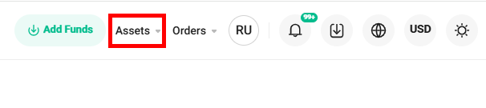
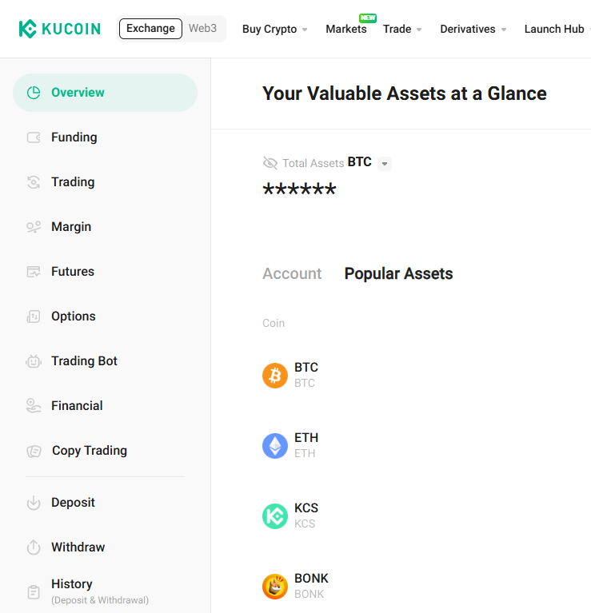
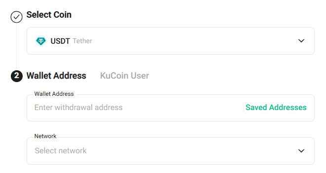
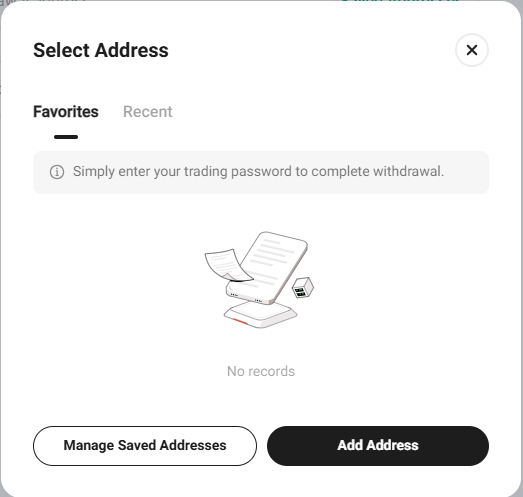
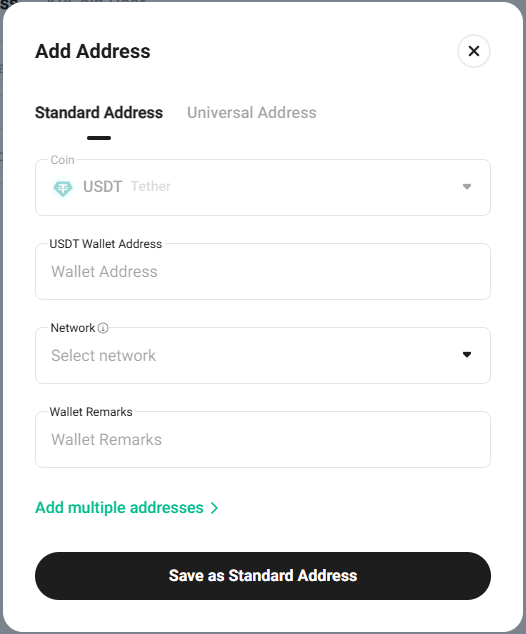
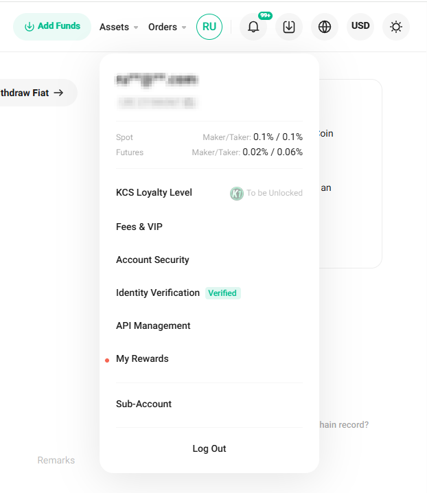
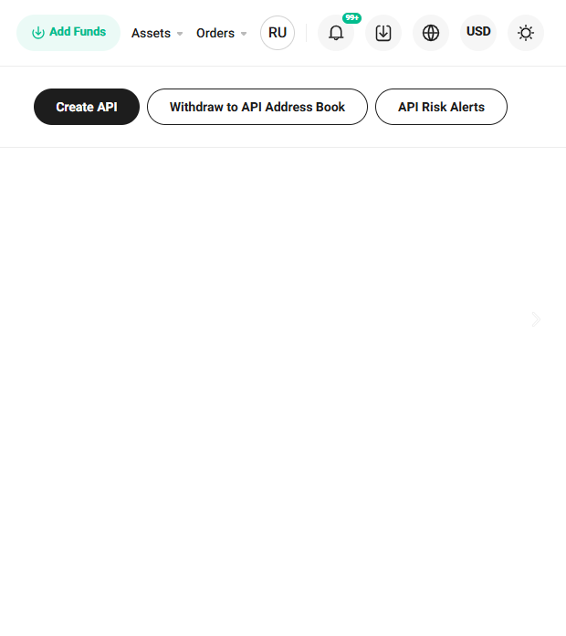
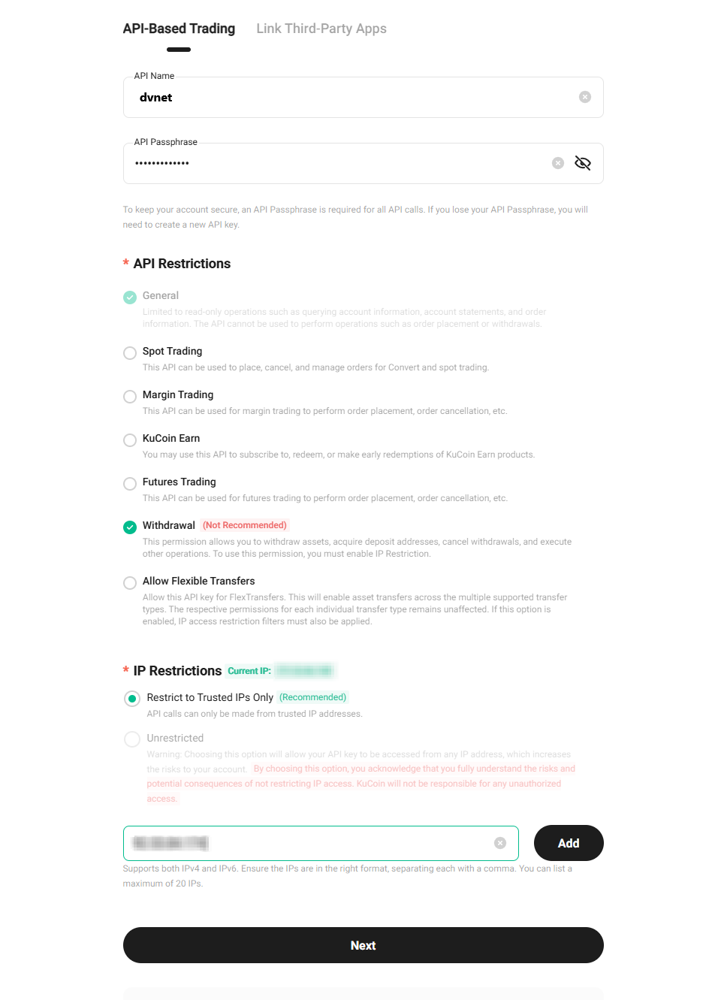
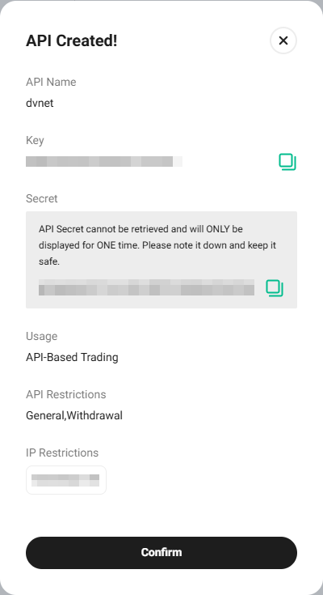

# KuCoin

### 거래소에서 자동 출금을 위한 KuCoin 지갑 설정

거래소의 프로필에 로그인하고 오른쪽 상단 메뉴에서 "Assets" (자산) 섹션으로 이동합니다.

열린 페이지에서 왼쪽 메뉴에서 "Withdraw" (출금)를 선택합니다.

지갑의 통화를 선택하고 "Saved Addresses" (저장된 주소) 버튼을 클릭합니다.

"Add Address" (주소 추가) 버튼을 클릭합니다.

지갑 주소를 입력하고 블록체인을 지정한 후 주소 이름을 지정합니다.\
"Save as Standard Address" (표준 주소로 저장) 버튼을 클릭하고 보안 인증을 완료합니다.

### API 키 연결

거래소 계정에 로그인하고 프로필 아이콘 위에 마우스를 올린 후 "API Management" (API 관리) 섹션을 선택합니다.

"Create API" (API 생성) 버튼을 클릭합니다.

API 키의 이름을 입력하고 비밀번호를 설정합니다. 필요한 권한을 지정합니다.\
우리 플랫폼의 "Connect the Exchange" (거래소 연결) 섹션에서 얻은 서버 IP 주소를 반드시 지정합니다. \
"IP Restrictions" 필드에서 "Restrict to Trusted IPs Only" (신뢰할 수 있는 IP로만 제한)를 선택합니다. \
"Add" (추가) 버튼을 클릭합니다.\
"Next" (다음) 버튼을 클릭하고 보안 인증을 완료합니다.

얻은 API Key와 Secret Key 값을 저장합니다. "Confirm" (확인) 버튼을 클릭합니다.

얻은 키와 비밀번호를 우리 서비스의 거래소 연결을 위한 해당 필드에 입력합니다. \
"Connect the Exchange" (거래소 연결) 버튼을 클릭합니다.