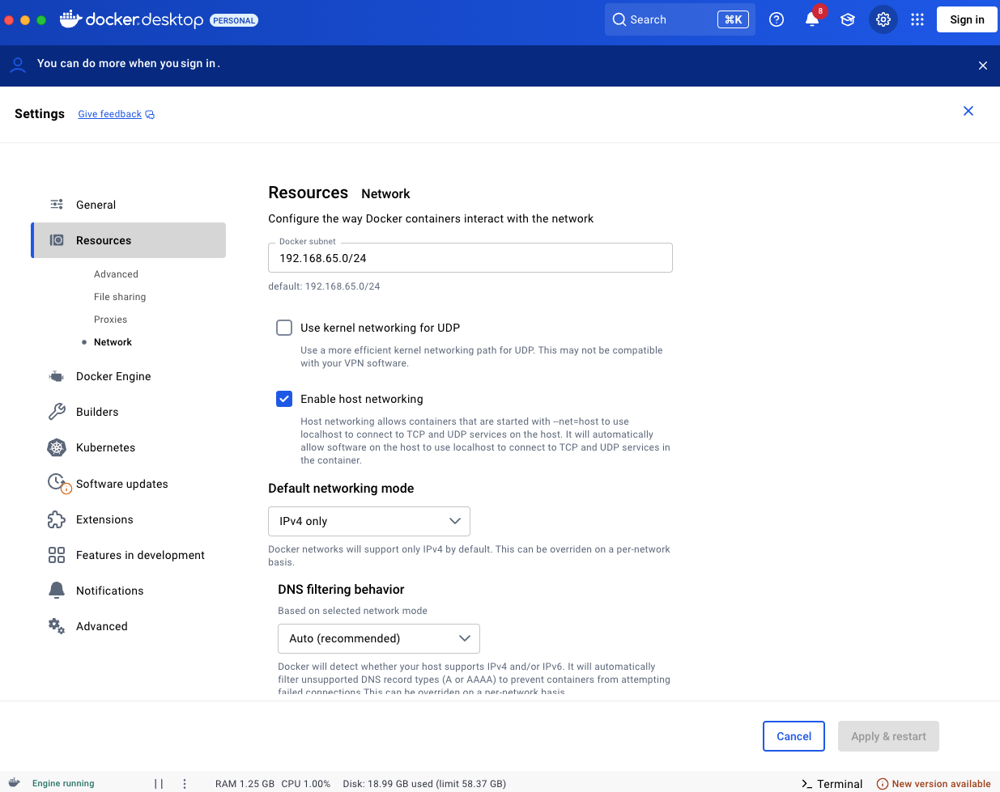

# Docker로 DV.net 설치 및 실행

> 자동 구성 기능을 갖춘 암호화폐 머천트를 위한 강력한 멀티 서비스 애플리케이션 — 클론하고 실행만 하세요\!

Docker를 통해 **DV.net** 암호화폐 머천트를 빠르게 배포할 수 있도록 미리 준비된 스크립트 모음을 제공합니다.
필요한 모든 것이 다음 저장소에 포함되어 있습니다:
[https://github.com/dv-net/dv-bundle](https://github.com/dv-net/dv-bundle)

## 🏃‍♂️ 빠른 시작

다음 명령을 실행하여 시작하세요:

```bash
git clone --recursive https://github.com/dv-net/dv-bundle.git
cd dv-bundle
cp .env.example .env  # Configure environment variables if necessary
docker compose up -d
```

**완료\!** 귀하의 암호화폐 머천트는 다음에서 이용할 수 있습니다:
🔗 `http://localhost:80`


## 🐳 ⚙️ Docker Desktop 설정(Windows / macOS)

Windows 및 macOS에서 **Docker Desktop**을 사용하는 경우, 다음 옵션을 활성화해야 합니다:

`Enable host networking`
*(Settings → Resources → Network에 위치)*



## 🏗️ 프로젝트 아키텍처

```
📦 dv-bundle/
├── 📂 data/                  # Persistent data storage
├── 🛠️ scripts/               # Automation and configuration scripts
└── 🐳 services/              # Service container submodules
    ├── 📦 dv-merchant/       # Merchant service
    └── 📦 dv-processing/     # Payment processing service
├── .env.example              # Environment variables template
├── docker-compose.yml        # Docker Compose configuration
└── README.md                 # Documentation
```


## 🔧 개발 및 업데이트

```bash
# Update all submodules to the latest versions
git submodule update --remote

# Rebuild and restart services
docker compose up --build -d
```


## 🐛 자주 발생하는 문제 해결

**서브모듈이 로드되지 않는 경우:**

```bash
git submodule update --init --recursive
```

**Docker 컨테이너 관련 문제:**

```bash
docker compose down && docker compose up --build -d
```

**정리 및 전체 재시작:**

```bash
docker compose down -v && docker compose up --build -d
```

> 💡 **팁:** 설정 후 서비스가 정상 동작하는지 확인하고, 필요에 맞게 `.env` 파일의 매개변수를 조정하는 것을 잊지 마세요.