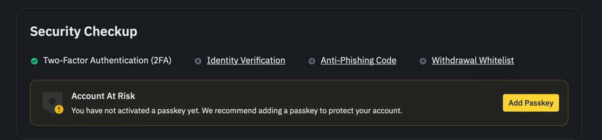
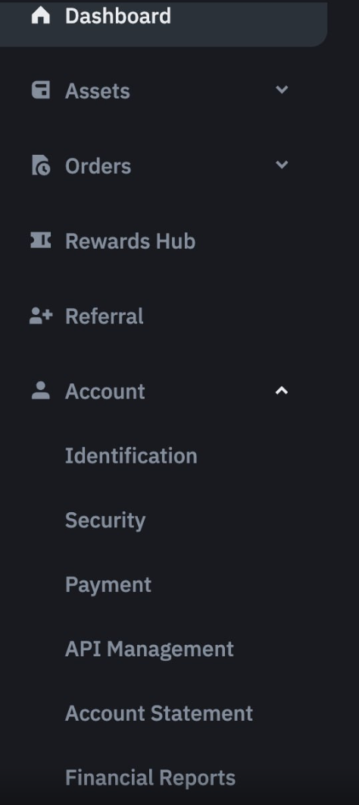
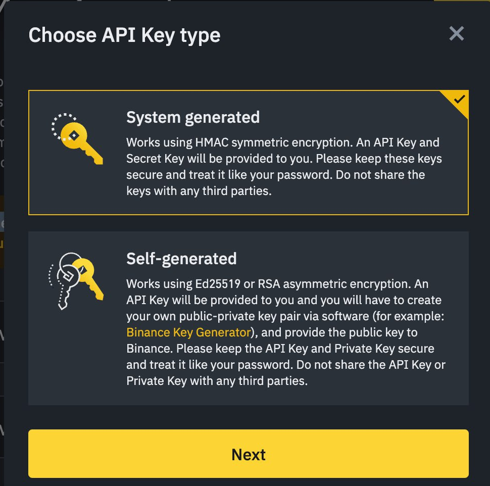
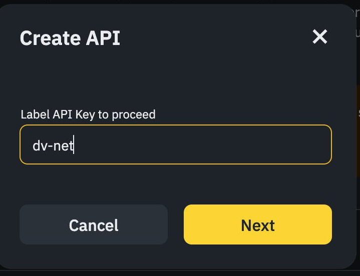
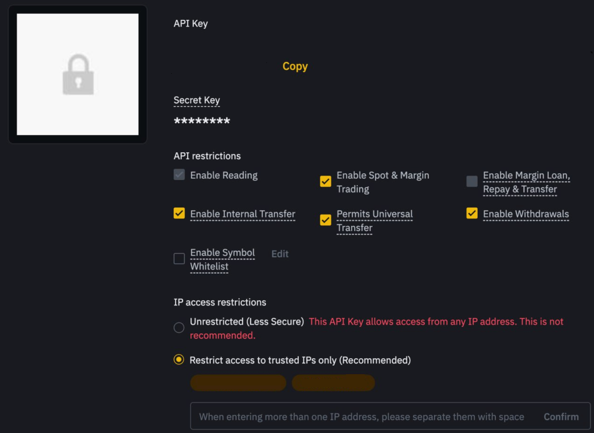

# Binance

### Настройка кошелька Binance для автоматического вывода с биржи

Войдите в свой профиль на бирже и перейдите в раздел «Settings» (Настройки).

В настройках откройте раздел «Security» (Безопасность).

Перейдите на вкладку «Withdrawal Whitelist» (Список разрешённых для вывода).

Нажмите кнопку «Add Address» (Добавить адрес).

Введите имя кошелька, выберите сеть и убедитесь, что установлен флажок «Add Adress to Whitelist» (Добавить адрес в белый список). Нажмите «Save» (Сохранить) и пройдите проверку безопасности.

### Подключение API-ключа

Войдите в свою учетную запись на бирже, нажмите на значок профиля и выберите «Settings» (Настройки).

В разделе «Settings» (Настройки) найдите и раскройте пункт «Account» (Учетная запись). Перейдите в подраздел «API Management» (Управление API).

Обязательно снимите галочку с пункта «By checking this box, all existing API Key(s) on your master account and sub-accounts will be subject to Default Security Controls» (Установив этот флажок, вы примените стандартные меры безопасности ко всем существующим API-ключам в вашей основной учётной записи и подучётных записях) перед созданием API-ключа. После этого нажмите кнопку «Create API» (Создать API).​

Для упрощения выберите вариант «System-generated API Key» (Сгенерированный ключ) и нажмите «Next» (Далее).

Присвойте вашему ключу понятное имя.

Пройдите проверку безопасности.

После создания API-ключа установите необходимые права доступа и добавьте IP-адрес вашего мерчанта (полученный на нашей платформе во время настройки) в поле:

«Restrict access to trusted IPs only (recommended)» (Ограничить доступ только доверенными IP-адресами)

Этот параметр обязателен для интеграции с Binance.

Сохраните полученные «API Key» (API-ключ) и «Secret Key» (Секретный ключ) и вставьте их в соответствующие поля для подключения биржи. Затем нажмите кнопку «Connect the Exchange» (Подключить биржу).

