# Bitget

### Настройка кошелька Bitget для автоматического вывода с биржи

Войдите в свой профиль на бирже и перейдите в раздел «Withdraw» (Вывод).

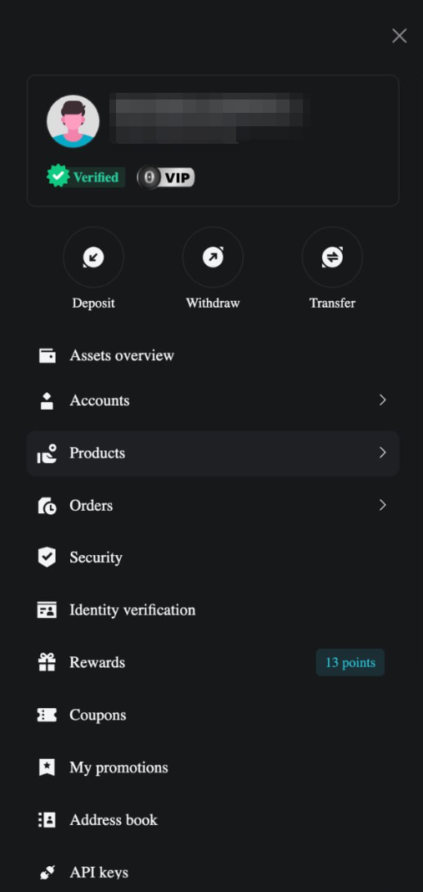

Выберите монету и сеть кошелька. Затем появится кнопка «Management address» (Управление адресами). Нажмите на неё, чтобы открыть адресную книгу.

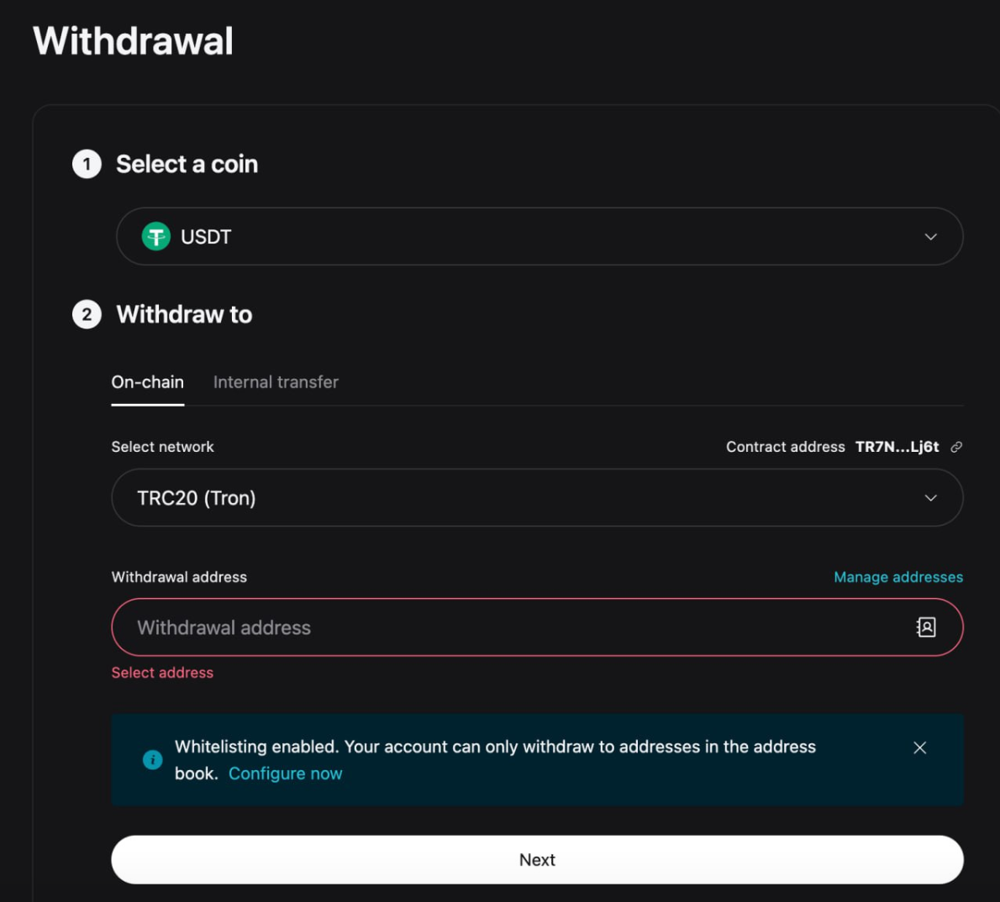

Нажмите кнопку «Add Withdrawal Address» (Добавить адрес вывода).

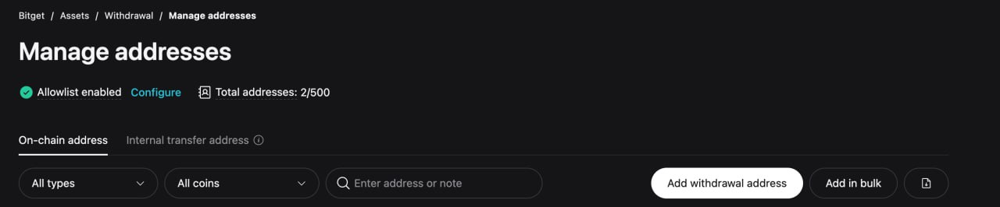

В открывшемся меню перейдите во вкладку «Regular» (Обычный), выберите сеть кошелька, введите адрес и установите флажок «Set as passwordless address» (Установить как адрес без пароля). Затем нажмите «Save» (Сохранить).

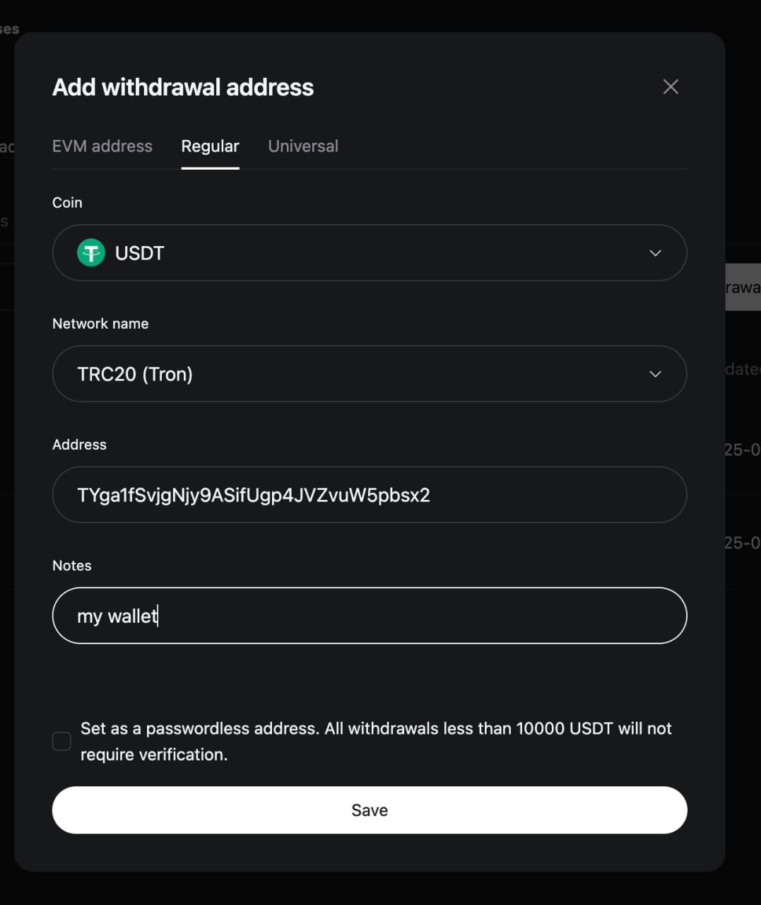

Пройдите проверку безопасности.

После выполнения этих шагов можно будет включить автоматический вывод средств на указанный адрес через API.

### Подключение API-ключа

Войдите в свой аккаунт, нажмите на иконку профиля (Avatar) и перейдите в раздел «API-Keys».

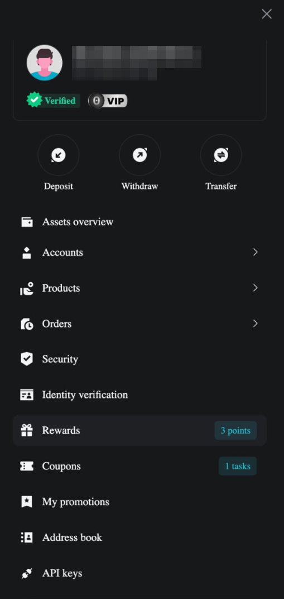

Нажмите кнопку «Create API Key» (Создать API-ключ).

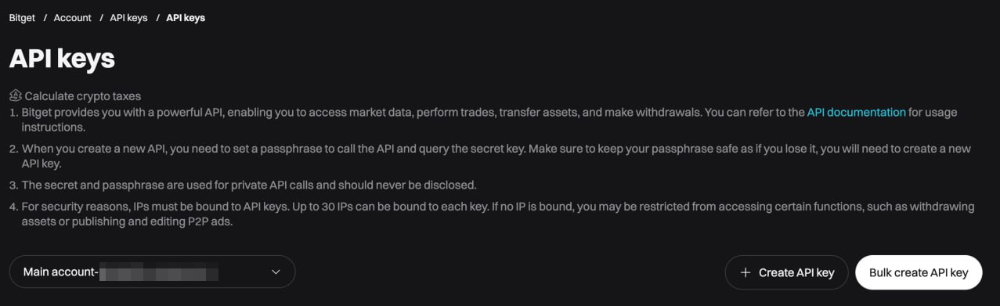

Выберите первый вариант для быстрой настройки — биржа сгенерирует ключ автоматически.

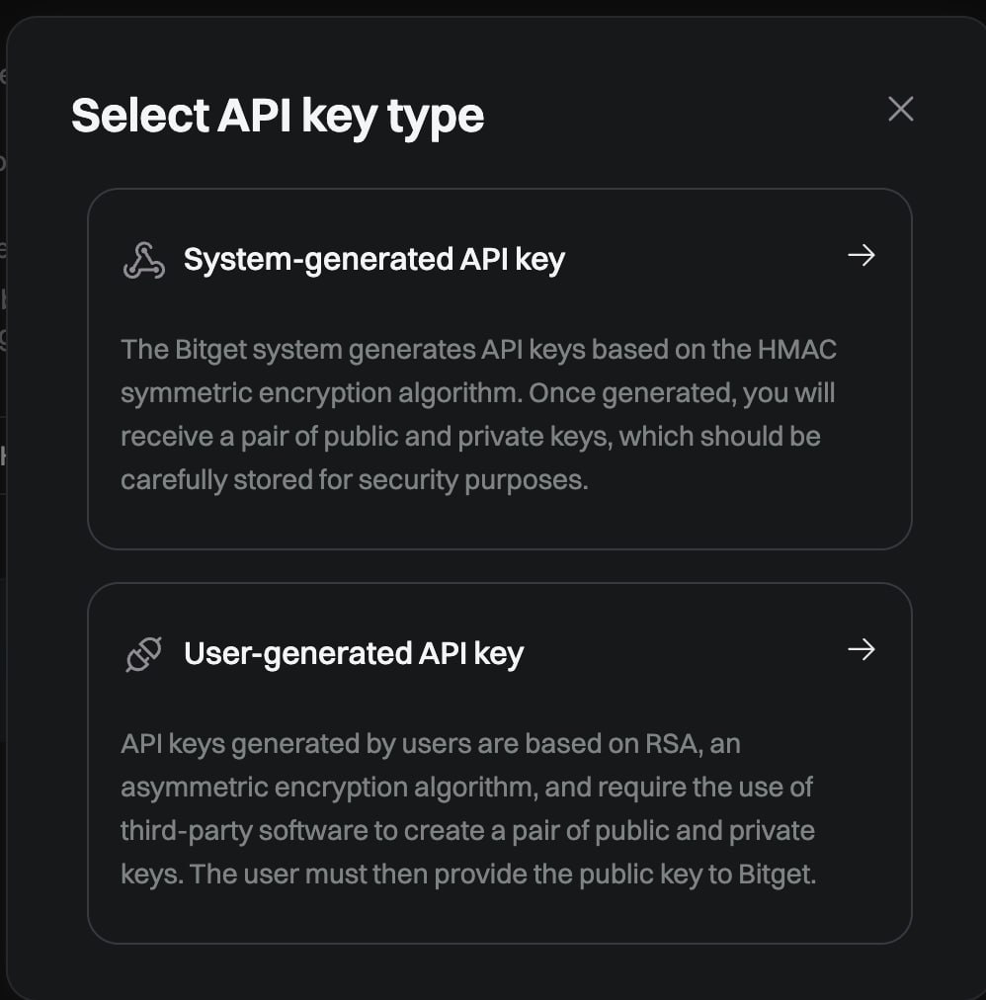

Введите имя API-ключа, задайте «Passphrase» (Кодовую фразу), и в колонке «Permissions» (Разрешения) выберите «Read-write» (Чтение-запись). Установите флажок в разделе «Permission Type» (Тип разрешения), чтобы активировать все необходимые функции. Это автоматически включит все доступные разрешения для ключа.

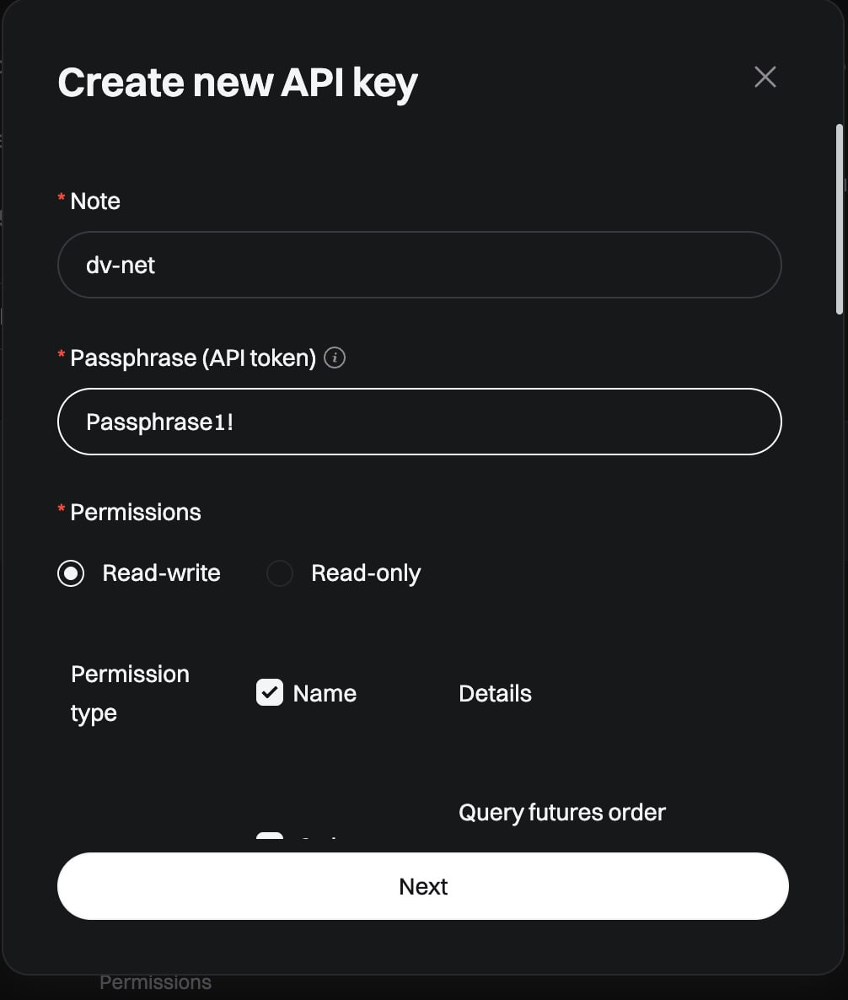

Введите IP-адрес, полученный на нашей платформе, и нажмите «Next» (Далее).

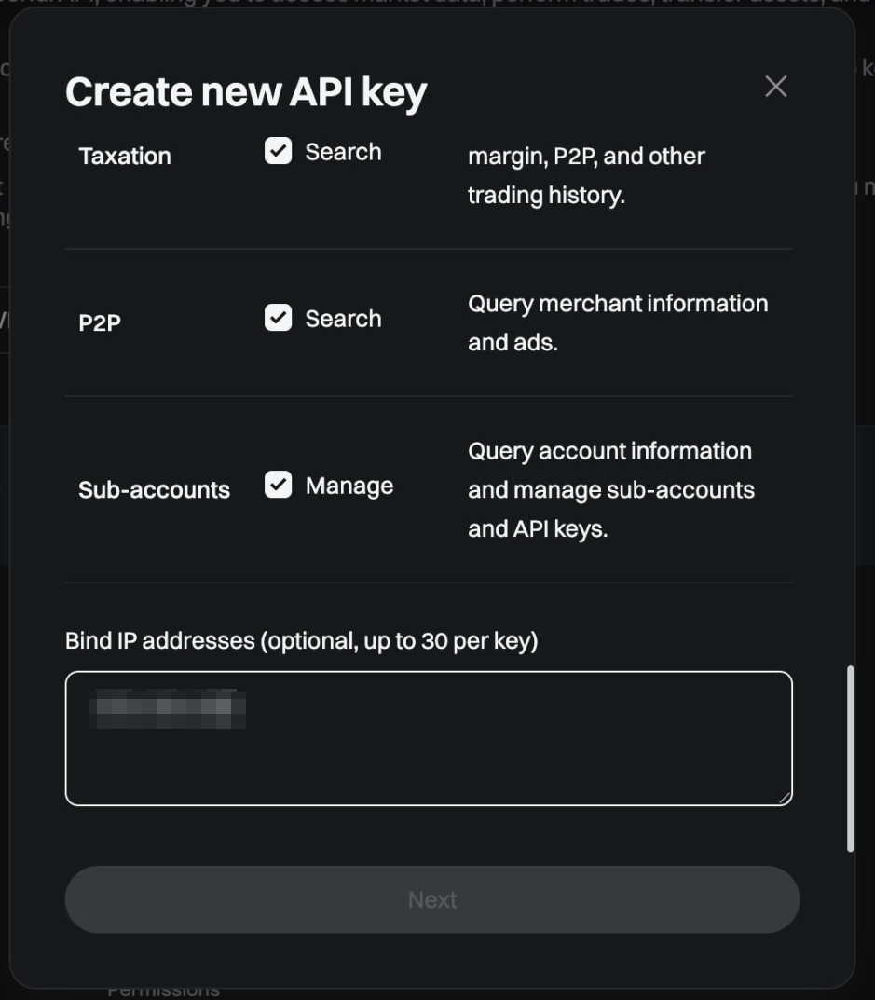

Пройдите проверку безопасности, чтобы завершить создание ключа.

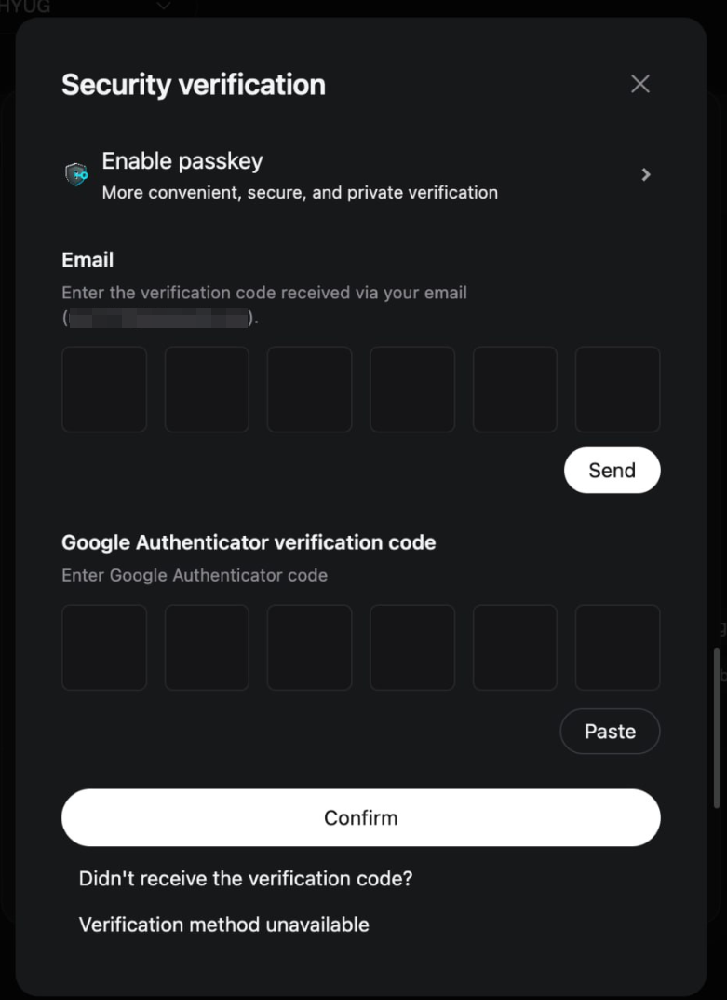

Скопируйте «API Key», «Secret Key» и «Passphrase» и вставьте их в соответствующие поля на нашей платформе. Затем нажмите кнопку «Connect the Exchange» (Подключить биржу).

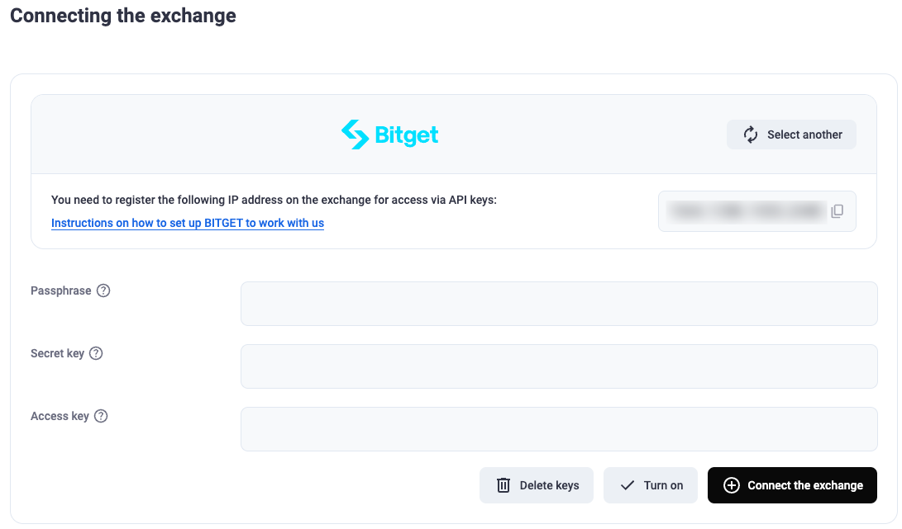
