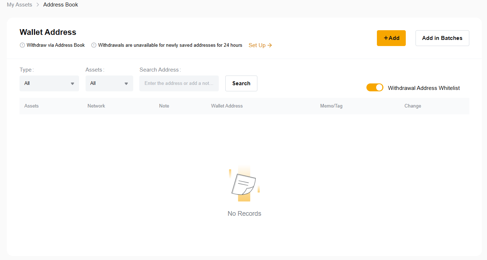
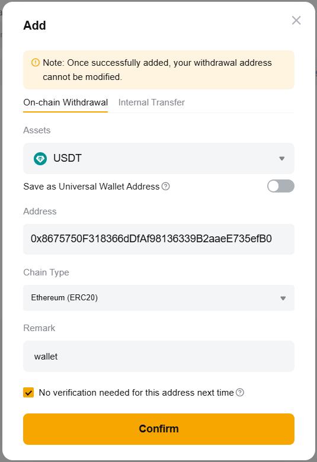
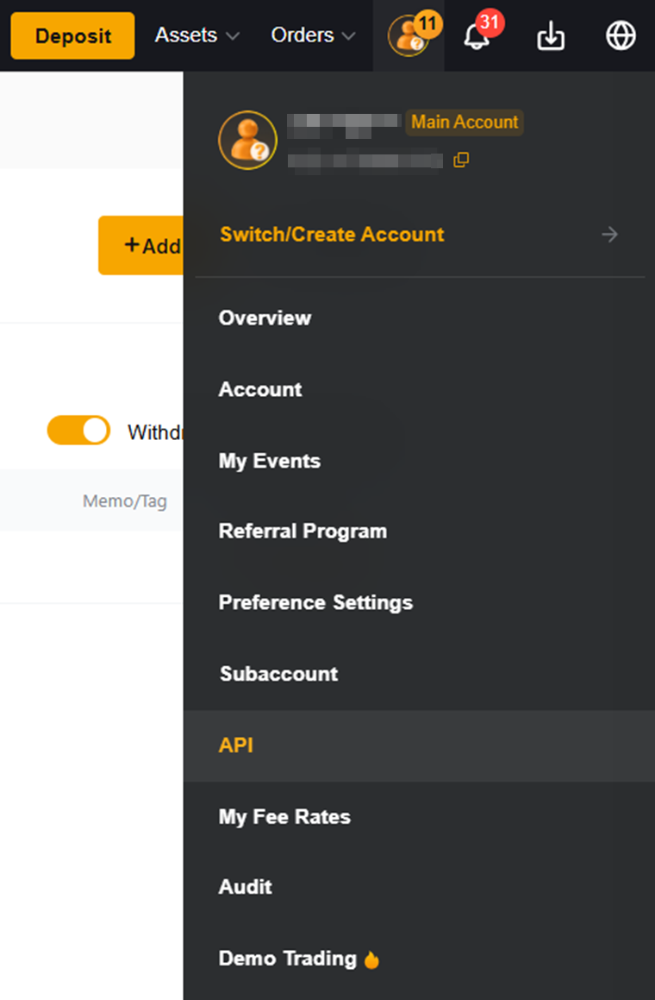
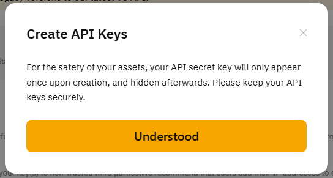
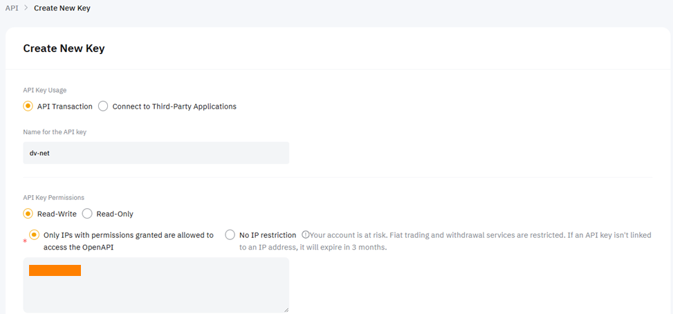
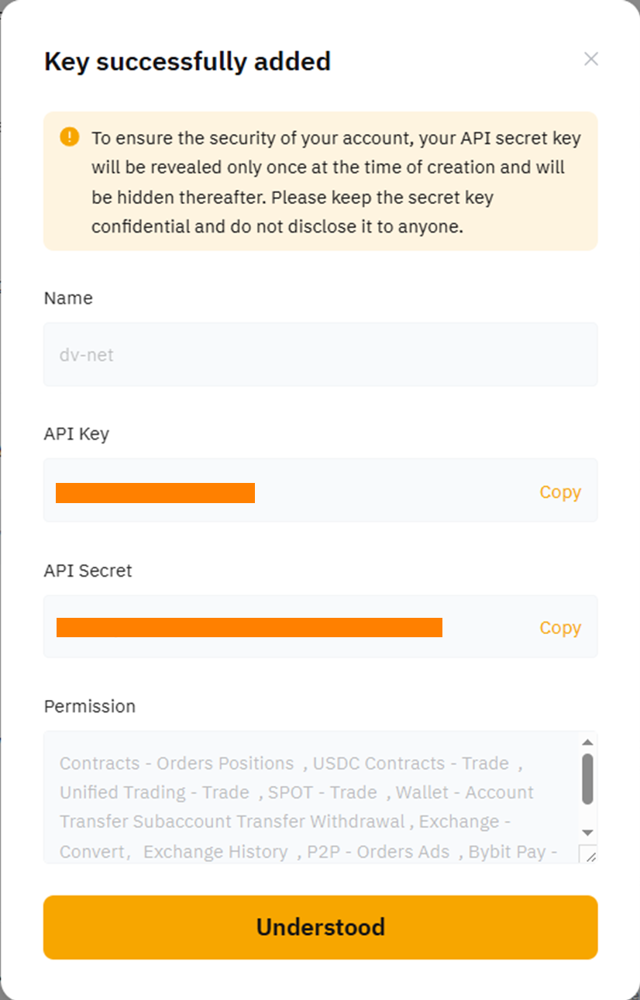

# ByBit

### Настройка кошелька ByBit для автовывода с биржи.

Для автоматического вывода необходимо сначала включить опцию белого списка для адресов кошельков, которые вы будете добавлять.

Войдите в свой профиль и перейдите в раздел «Account» (Аккаунт).

Найдите раздел «Security» (Безопасность) и перейдите туда.

Найдите опцию «Withdrawal Address Whitelist» (Белый список адресов для вывода). Нажмите на переключатель справа и пройдите проверку безопасности с помощью 2FA.

Перейдите в раздел «Assets» (Активы) и выберите опцию «Withdraw» (Вывод).

На открывшейся странице «Withdraw» (Вывод) выберите опцию «Add» (Добавить) в строке «Wallet Address» (Адрес кошелька).

На странице «Wallet Address» (Адрес кошелька) убедитесь, что опция «Withdrawal Address Whitelist» (Белый список адресов для вывода) включена. Нажмите «+Add» (Добавить).

Выберите валюту, введите адрес кошелька, укажите блокчейн и название кошелька. Обязательно установите флажок «No verification needed for this address next time» (Не требуется проверка для этого адреса в следующий раз). Нажмите «Confirm» (Подтвердить) и пройдите проверку безопасности с помощью 2FA.

### Подключение API-ключа

Войдите в свой аккаунт на бирже, нажмите на иконку профиля и выберите раздел «API».

Нажмите кнопку «Understood» (Понятно).

Нажмите кнопку «Create New Key» (Создать новый ключ).

Для упрощения настройки выберите пункт «System-generated API Keys» (Сгенерированные системой ключи).

Убедитесь, что селектор установлен в положение «API Transaction» (API-транзакции). Введите название вашего API-ключа.
В поле «API Key Permissions» (Разрешения ключа) выберите «Read-Write» (Чтение-запись). В опции «Only IPs with permissions granted are allowed to access the OpenAPI» (Только разрешённые IP-адреса могут обращаться к OpenAPI) введите IP-адрес сервера, показанный вам на этапе подключения биржи в интерфейсе нашего мерчанта.

Выставьте необходимые разрешения, нажмите кнопку «Submit» (Отправить) и пройдите проверку безопасности с помощью 2FA.

Сохраните «API Key» (API-ключ) и «Secret Key» (Секретный ключ). Подтвердите, нажав «Understood» (Понятно).

Вставьте полученные значения в соответствующие поля на нашей платформе и нажмите кнопку «Connect the Exchange» (Подключить биржу).

