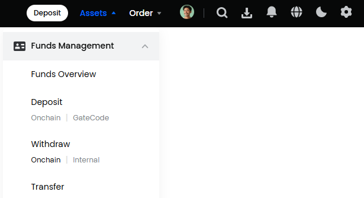
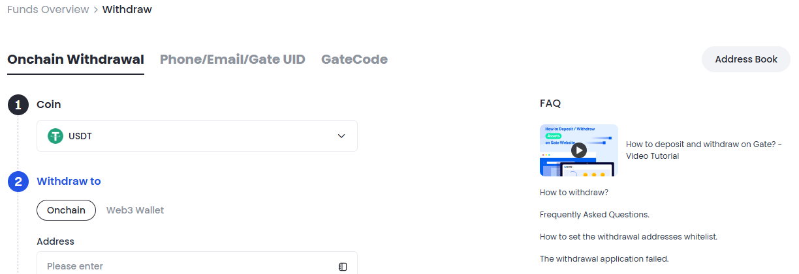
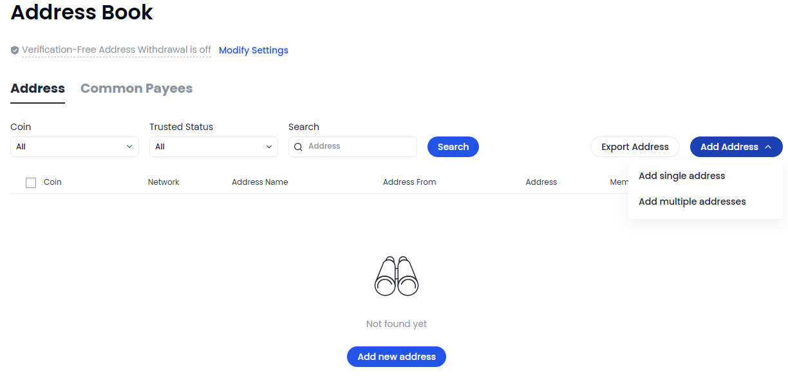
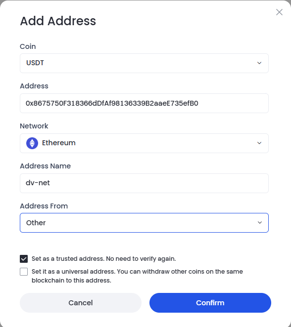
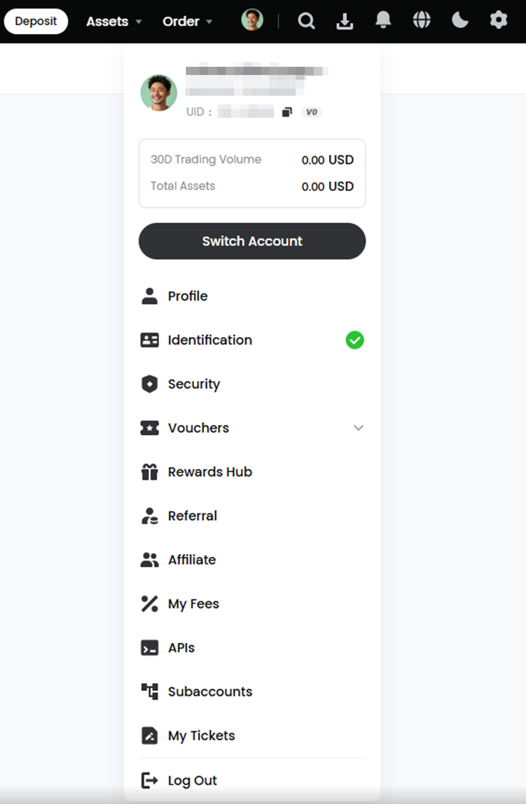
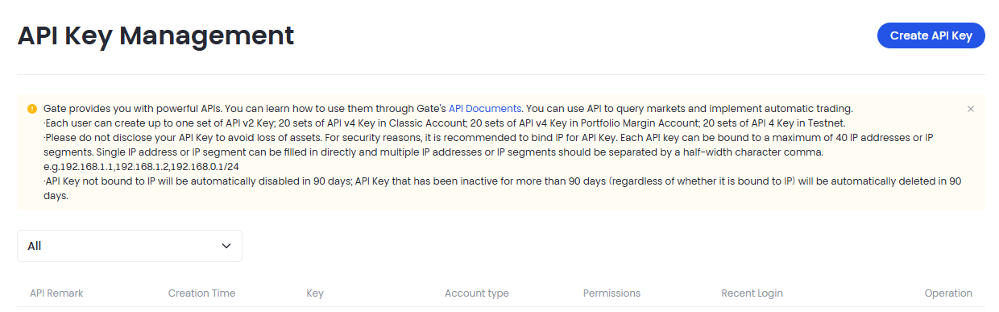
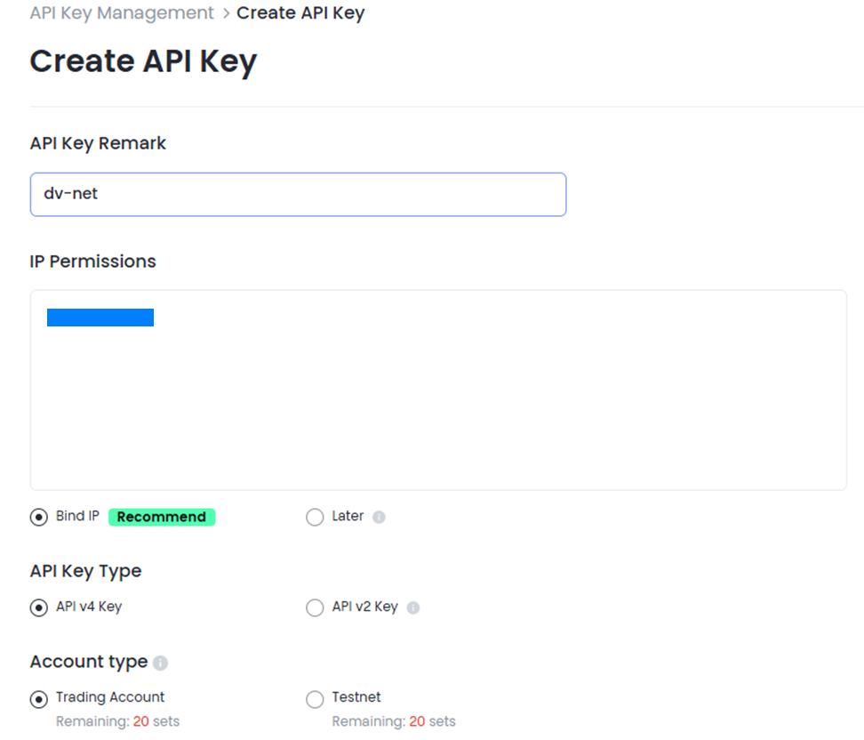
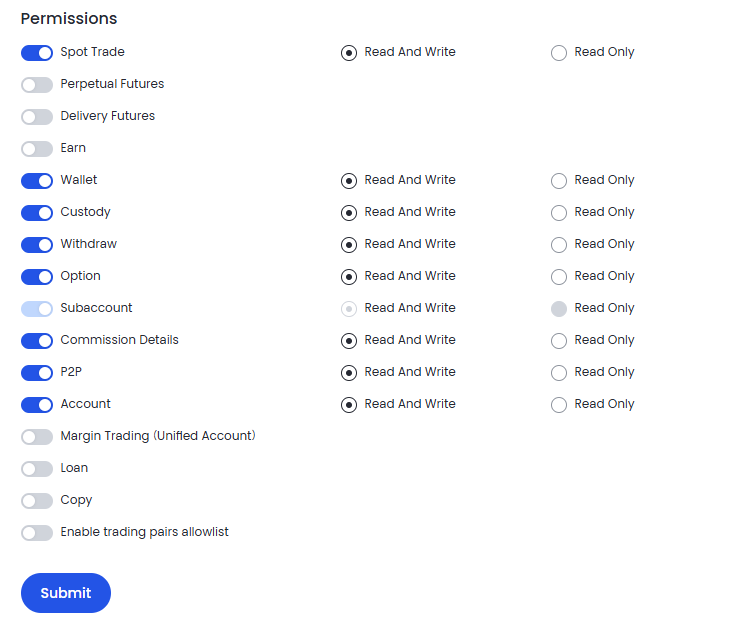
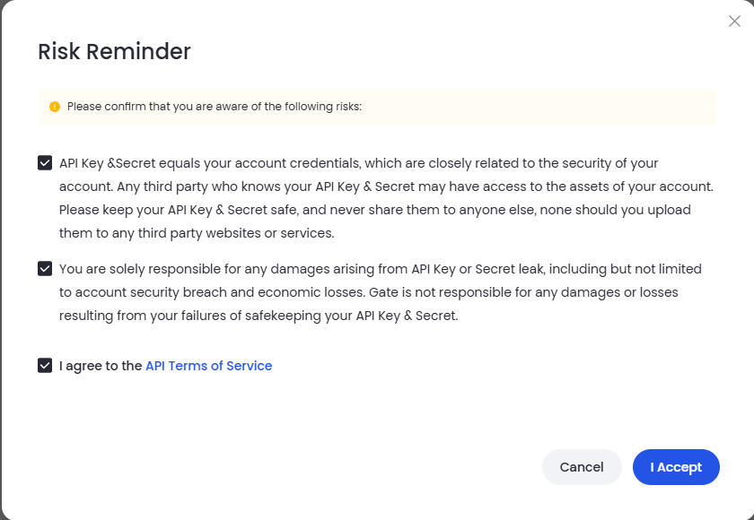
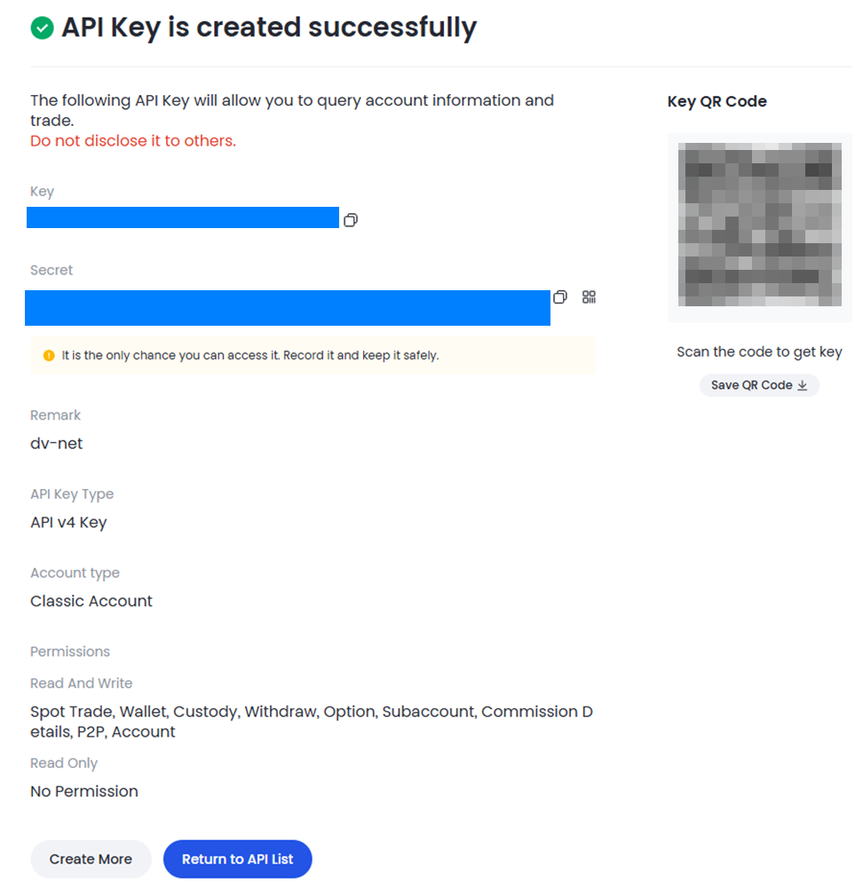

# Gate.io

### Настройка кошелька Gate.io для автовывода с биржи.

Войдите в свой профиль на бирже. В разделе «Assets» (Активы) раскройте опцию «Funds Management» (Управление средствами). Под опцией «Withdraw» (Вывод) выберите «Onchain» (Ончейн).

Нажмите кнопку «Address Book» (Адресная книга).

На открывшейся странице выберите «Add Address – Add single address» (Добавить адрес – Добавить один адрес).

Выберите валюту кошелька, введите адрес, укажите блокчейн и название кошелька. Обязательно установите флажок «Set as a trusted address. No need to verify again» (Установить как доверенный адрес. Не требует повторной проверки). Нажмите «Confirm» (Подтвердить) и пройдите проверку безопасности.

### Подключение API-ключа

Войдите в свой аккаунт на бирже, наведите курсор на значок профиля и перейдите в раздел «APIs» (API-ключи).

Нажмите «Create API Key» (Создать API-ключ).

Дайте название вашему API-ключу.
В поле «IP Permissions» (IP-разрешения) введите IP-адрес сервера, который отображается вам при подключении биржи в нашем мерчанте.
Оставьте опции по умолчанию для «Bind IP» (Привязка IP), «API v4 Key» (Ключ API v4), «Trading account» (Торговый аккаунт).

Создайте API-ключ, выбрав разрешения «Read And Write» (Чтение и запись), затем нажмите «Submit» (Отправить).

Отметьте флажки согласия, нажмите «I Accept» (Я принимаю) и пройдите проверку безопасности.

Сохраните «API Key» (API-ключ) и «Secret Key» (Секретный ключ).

Вставьте их в соответствующие поля на нашей платформе и нажмите кнопку «Connect the Exchange» (Подключить биржу).
