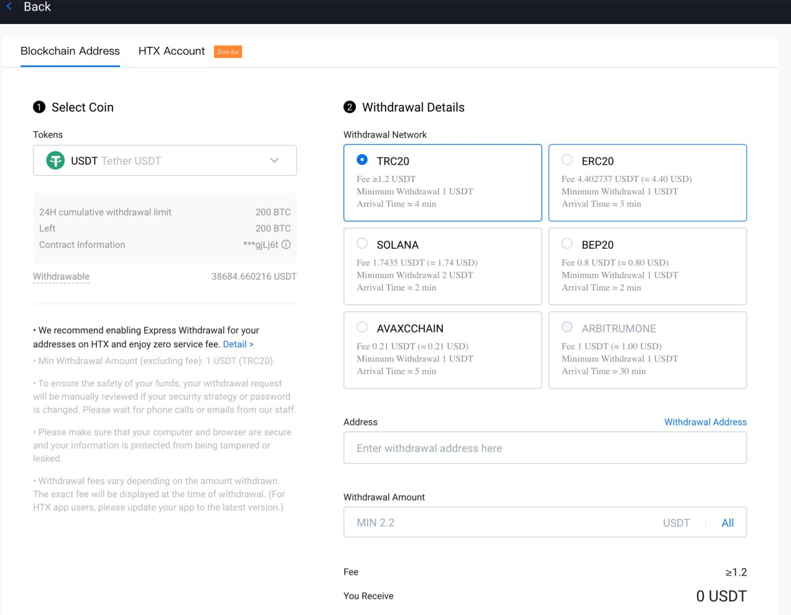
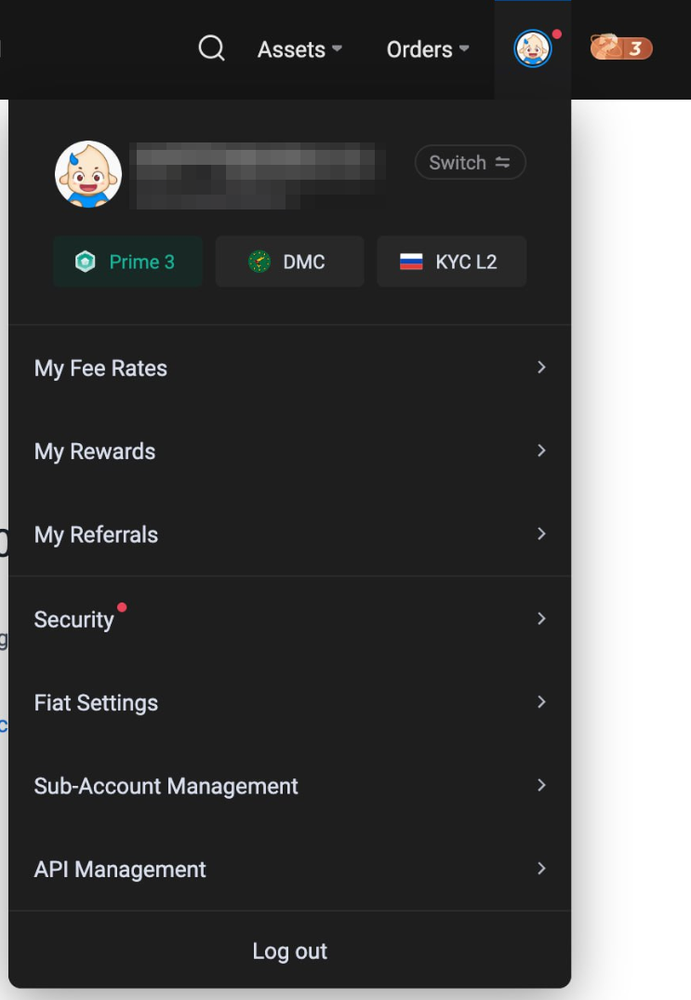
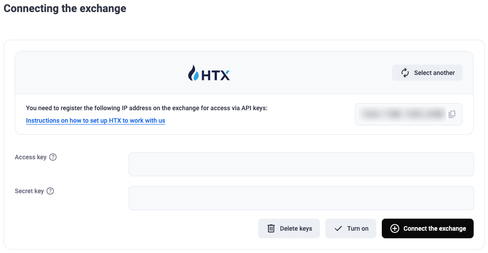

# HTX

### Настройка кошелька HTX для автоматического вывода c биржи

Войдите в свой профиль HTX и перейдите в раздел «Withdraw» (Вывод).

Выберите интересующую вас сеть и монету, затем нажмите кнопку «Withdrawal Address» (Адрес для вывода), чтобы открыть соответствующий раздел.

Добавьте новый адрес, задайте ему имя и установите флажки «Set as verification exemption address» (Установить как адрес, освобождённый от проверки) в пунктах «Withdrawal» (Вывод средств) и «API Withdrawal» (API-вывод). После этого нажмите кнопку «Add» (Добавить) и пройдите проверку безопасности с помощью 2FA.

### Подключение API-ключа

Перейдите в свой аккаунт HTX и откройте раздел «API Management» (Управление API).

Нажмите кнопку «Create API Key» (Создать API-ключ).

Для удобства настройки используйте первый вариант — создание автоматически сгенерированного системой ключа.

Введите имя ключа и «IP Address» (IP-адрес) сервера, на котором установлен подключаемый мерчант. Обязательно установите флажки «Withdrawal» (Вывод) и «Trade» (Торговля), чтобы включить автоматический вывод и обмен валют.

IP-адрес сервера нужно взять из раздела «Connect the Exchange» (Подключить биржу) — он отображается при подключении биржи в нашем интерфейсе.

Пройдите проверку 2FA и сохраните «API Key» (API-ключ) и «Secret Key» (Секретный ключ), полученные на бирже. Вставьте их в соответствующие поля на нашей платформе и нажмите кнопку «Connect the Exchange» (Подключить биржу).
