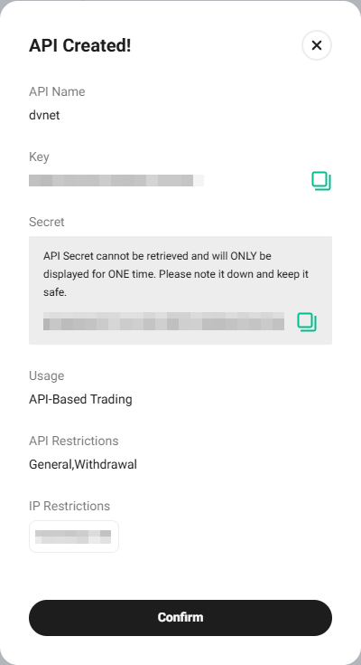

# KuCoin

### Настройка кошелька KuCoin для автоматического вывода с биржи.

Войдите в свой профиль на бирже и перейдите в раздел «Assets» (Активы) в правом верхнем меню.

На открывшейся странице выберите «Withdraw» (Вывод) в меню слева.

Выберите валюту вашего кошелька и нажмите кнопку «Saved Addresses» (Сохранённые адреса).

Нажмите кнопку «Add Address» (Добавить адрес).

Введите адрес вашего кошелька, укажите блокчейн и дайте название адресу.\
Нажмите кнопку «Save as Standard Address» (Сохранить как стандартный адрес) и завершите проверку безопасности.

### Подключение API-ключа

Войдите в свой аккаунт на бирже, наведите курсор на значок профиля и выберите раздел «API Management» (Управление API).

Нажмите кнопку «Create API» (Создать API).

Введите имя для вашего API-ключа и установите пароль. Проставьте данные разрешения.\
Обязательно укажите IP-адрес сервера, полученный из раздела «Подключить биржу» (Connect the Exchange) на нашей платформе. \
В поле «IP Restrictions» выберите «Restrict to Trusted IPs Only» (Ограничить только доверенными IP). \
Нажмите кнопку «Add» (Добавить).\
Нажмите «Next» (Далее) и пройдите проверку безопасности.

Сохраните полученные значения API Key и Secret Key. Нажмите кнопку «Confirm» (Подтвердить).

Вставьте полученные ключи и пароль в соответствующие поля подключения биржи в нашем сервисе. \
Нажмите кнопку «Подключить биржу» (Connect the Exchange).