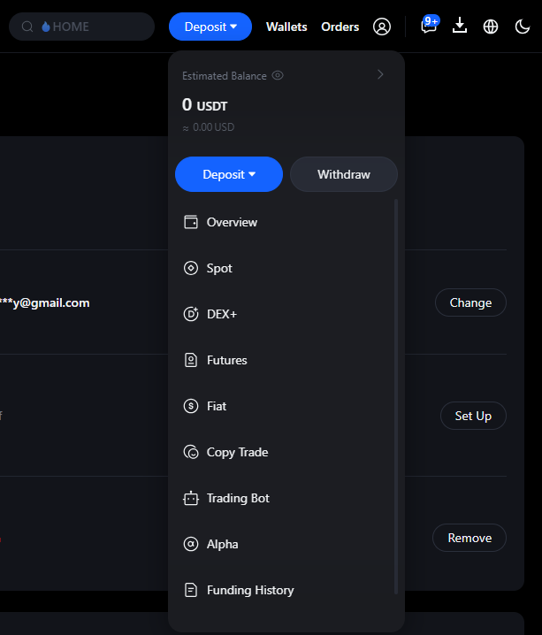

# MEXC

### Настройка кошелька MEXC для автовывода с биржи.

Для автоматического вывода средств необходимо включить опцию «Fast Withdrawal» (Быстрый вывод) для кошельков, которые вы будете добавлять.
Войдите в свой профиль на бирже и перейдите в раздел «Security» (Безопасность).

Найдите опцию «Fast Withdrawal» (Быстрый вывод). Нажмите на ползунок справа и пройдите проверку 2FA любым доступным способом.

Установите максимальное значение лимита и завершите проверку безопасности.

Чтобы добавить новый кошелёк, в разделе «Assets» (Активы) выберите опцию «Withdraw» (Вывод).

На открывшейся странице «Withdraw» (Вывод) выберите опцию «Manage Addresses» (Управление адресами) в окне создания заявки на вывод.

Нажмите кнопку «Add Withdrawal Address» (Добавить адрес вывода).

Выберите валюту и блокчейн вашего кошелька, введите его адрес и название. Обязательно установите галочку «Set as a whitelisted address» (Установить как адрес из белого списка). Нажмите «Confirm» (Подтвердить) и завершите проверку безопасности.

### Подключение API-ключа

Войдите в свой аккаунт на бирже, наведите курсор на значок профиля и перейдите в раздел «API Management» (Управление API).

Заполните все необходимые разрешения и задайте имя для вашего API-ключа.
Обязательно добавьте IP-адрес вашего мерчанта, полученный на нашей платформе, в поле «Link IP Address (optional)» (Привязка IP-адреса (необязательно)).
Отметьте согласие с условиями и нажмите «Create» (Создать), затем пройдите проверку безопасности.

Сохраните «API Key» (API-ключ) и «Secret Key» (Секретный ключ). Подтвердите создание по кнопке «Confirm» (Подтвердить).

Вставьте их в соответствующие поля на нашей платформе и нажмите кнопку «Connect the Exchange» (Подключить биржу).
