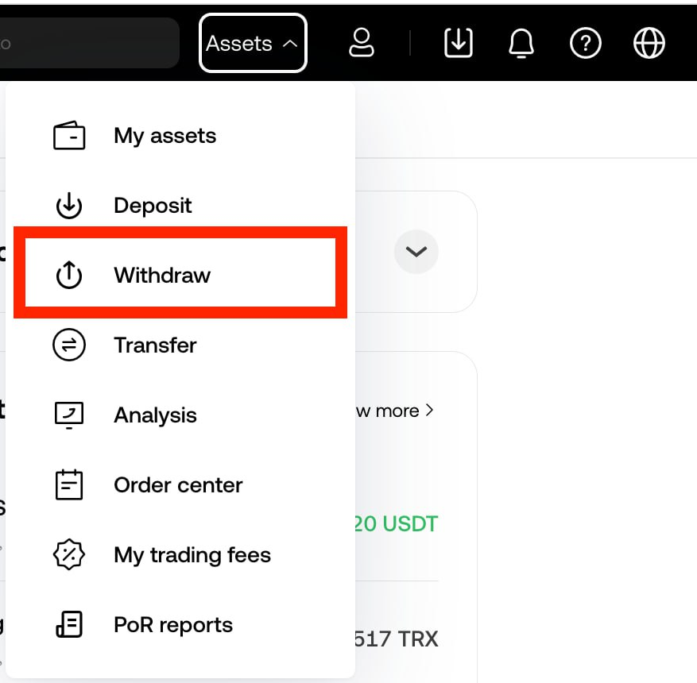
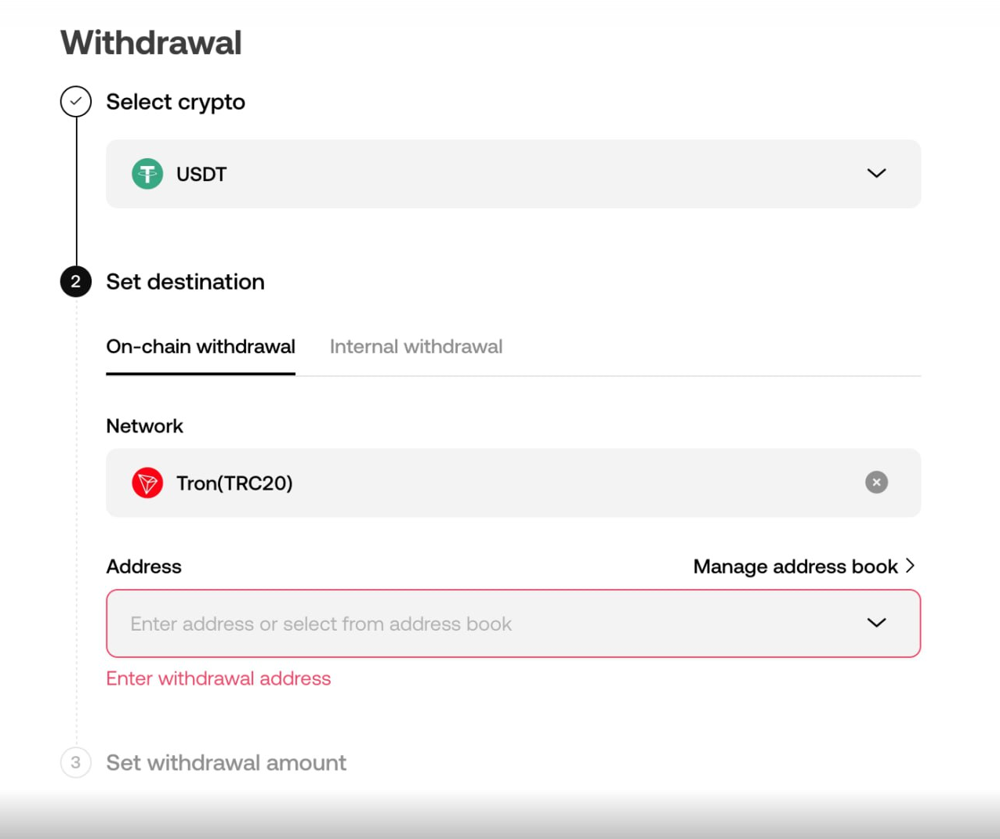
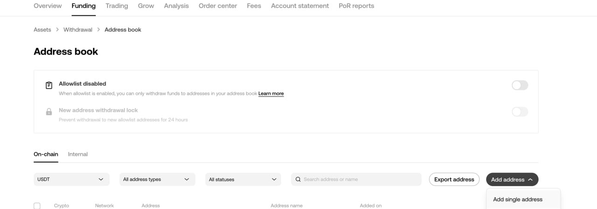
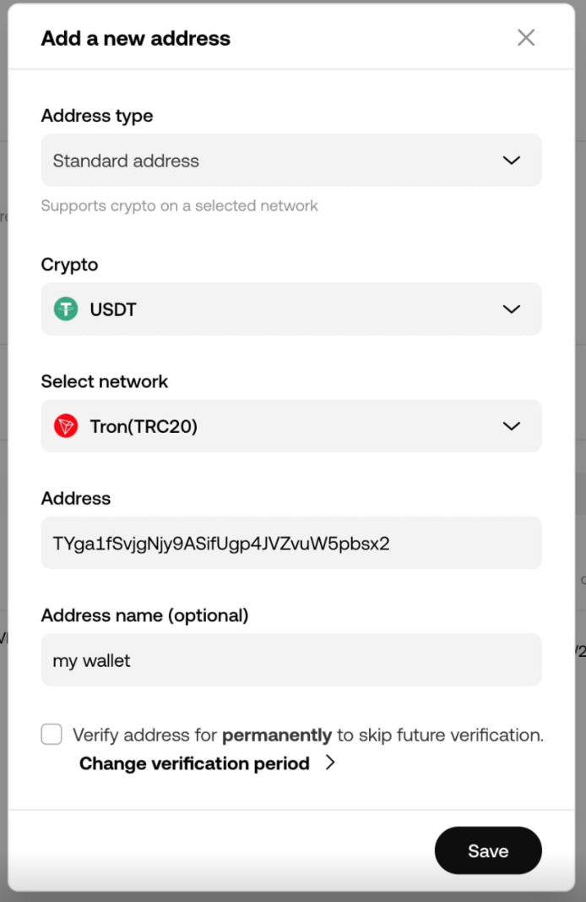
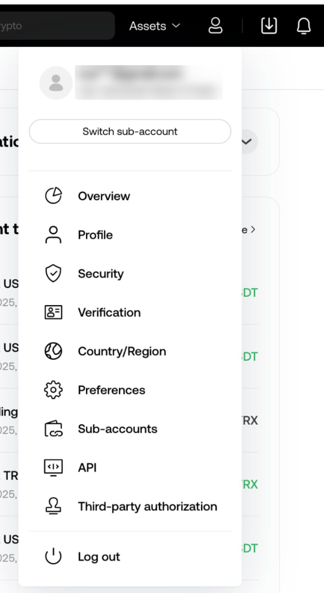
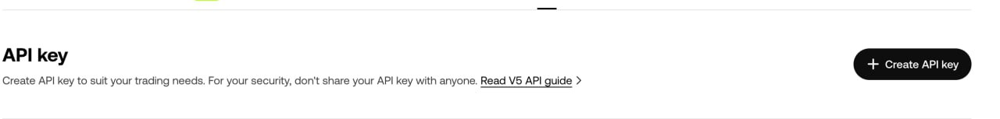
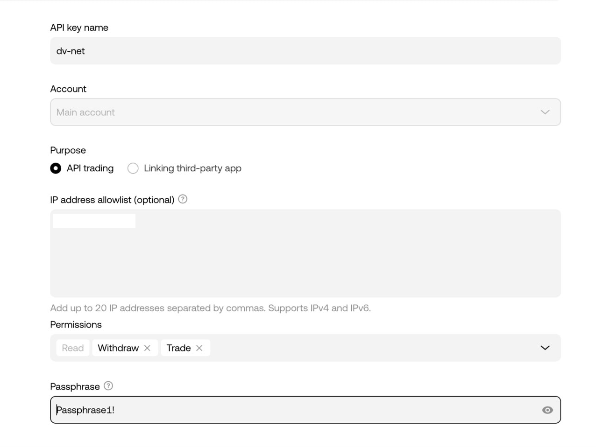
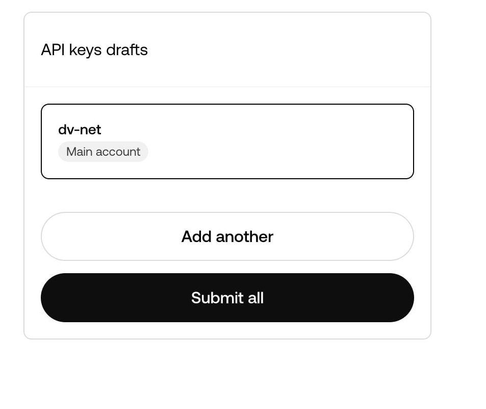
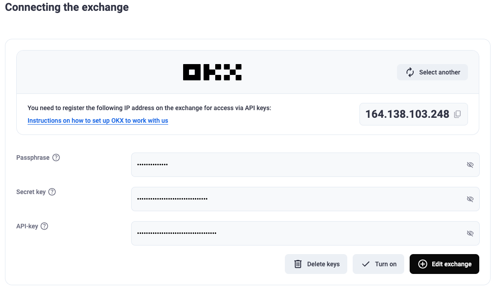

# OKX

### Настройка кошелька OKX для автоматического вывода с биржи

Чтобы включить автоматический вывод, необходимо добавить адрес вашего кошелька в белый список на бирже.

Перейдите в раздел «Withdraw» (Вывод).

В разделе «Withdraw» (Вывод) выберите монету и сеть, на которую вы хотите получать вывод. Затем нажмите кнопку «Manage Address Book» (Управление адресной книгой).

В подменю «Add Address» (Добавить адрес) выберите «Add Single Address» (Добавить один адрес).

Введите данные вашего кошелька. Обязательно установите флажок «Verify address for permanently to skip future verification» (Подтвердить адрес навсегда, чтобы пропустить будущие проверки), чтобы разрешить автоматический вывод через API. Нажмите «Save» (Сохранить) и пройдите проверку безопасности с помощью вашего метода 2FA.

### Подключение API-ключа

Войдите в свою учетную запись на бирже и откройте раздел «API».

Нажмите кнопку «Create API Key» (Создать API-ключ).

Введите имя для вашего API-ключа и убедитесь, что переключатель установлен на «API Trading» (API-торговля). В поле «IP Address» (IP-адрес) введите IP-адрес сервера, который был показан вам на этапе подключения биржи в интерфейсе нашего мерчанта.

Обязательно установите разрешения «Withdrawal» (Вывод) и «Trade» (Торговля) в поле «Permissions» (Разрешения), чтобы включить автоматический вывод и обмен. В поле «Passphrase» (Кодовая фраза) укажите пароль, который вы хотите использовать для вашего API-ключа.

Нажмите кнопку «Submit all» (Отправить все), пройдите проверку безопасности через подключённые методы 2FA и сохраните «API Key» (API-ключ), «Secret Key» (Секретный ключ) и «Passphrase» (Кодовую фразу).

Вставьте полученные значения в соответствующие поля в интерфейсе нашего сервиса и нажмите кнопку «Connect the Exchange» (Подключить биржу).

