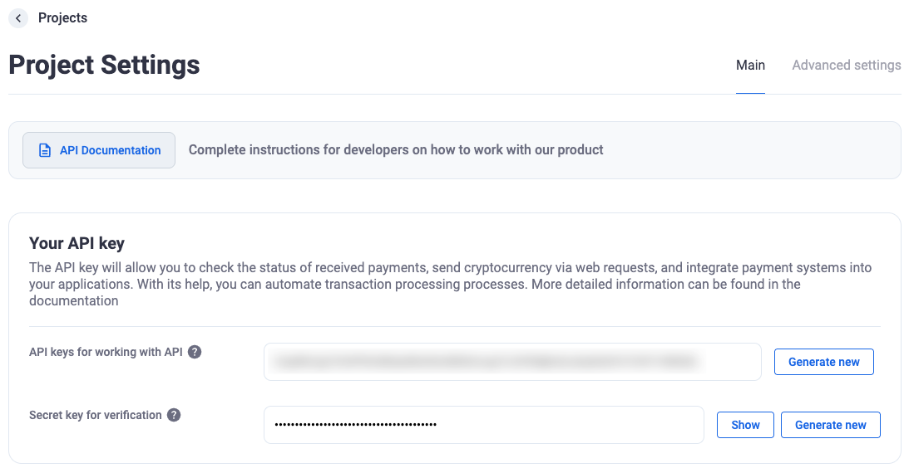

# Создание кошельков для пополнения

- Получите API-ключ (`x-api-key`) в разделе настроек мерчанта (как на скриншоте «Your API key»).



- Отправляйте запрос к API, указывая этот ключ в заголовке. Пример cURL:

  ```bash
  curl -X POST \
    'https://{ваш_домен или поддомен}/api/v1/external/wallet' \
    -H 'Content-Type: application/json' \
    -H 'x-api-key: {Ваш_API_ключ}' \
    --data '{
      "amount": 20,
      "store_external_id": "id_пользователя_в_вашем_магазине"
  }'
  ```

- После успешного ответа система вернёт JSON-данные, содержащие ссылку для оплаты (`pay_url`), по которой нужно перенаправить пользователя.
