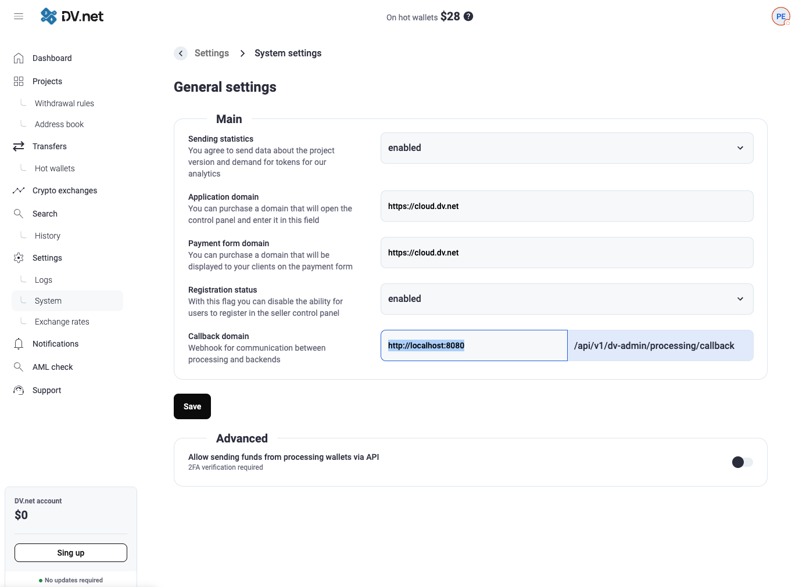

# Сокрытие Панели Управления Merchant-сервера

Эта инструкция описывает настройку **Nginx** для разделения доступа к **Панели управления** ($/dv-admin/$), 
**Платежной форме** ($/pay/$), и **API** ($/api/v1/*$) приложения **dv-merchant**. Это повышает безопасность, 
ограничивая доступ к конфиденциальным маршрутам и предоставляя разные домены для разных функций.


## 1\. Обзор Маршрутов dv-merchant

Серверное приложение **dv-merchant** обслуживает как frontend, так и API для нескольких компонентов, 
используя следующие группы маршрутов:

* **/pay/**: Загрузка JS и frontend для **Платежной формы**.
* **/dv-admin/**: Загрузка JS и frontend для **Панели управления**.
* **/api/v1/public**: **Публичные** API методы, используемые **Платежной формой**.
* **/api/v1/external**: API методы для **взаимодействия с магазинами** (например, создание счета).
* **/api/v1/dv-admin**: API методы для **Панели управления**.


## 2\. Предварительные Настройки

### 2.1. Установка Nginx

Установите **Nginx** на ваш сервер. Инструкции зависят от вашей операционной системы (например, 
`sudo apt update && sudo apt install nginx` для Debian/Ubuntu).

### 2.2. Изменение Порта dv-merchant

Для работы через Nginx как обратный прокси, переключите **dv-merchant** на локальный порт (например, **8080**), 
который не будет доступен извне.

Отредактируйте файл конфигурации:
`nano /home/dv/merchant/configs/config.yaml`

В секции `'http'`, установите новый порт:

```yaml
http:
  port: "8080"
```

### 2.3. Обновление Адреса Колбэка

Обязательно обновите **адрес колбэка** (Callback URL) от процессинга к merchant-серверу в настройках системы, чтобы он 
указывал на новый локальны порт:





## 3\. Настройка Nginx

Мы создадим **три отдельных конфигурационных файла** Nginx (виртуальных хоста), каждый из которых будет отвечать за 
свой домен/поддомен и иметь свои правила доступа.

**Важно:** Для всех конфигураций рекомендуется использовать **HTTPS/SSL** (например, с помощью **Certbot**), однако 
в примерах ниже используется HTTP (порт 80) для простоты.

### 3.1. Конфигурация для Платежной Формы (`pay.some-domain.com`)

Этот хост должен предоставлять доступ к Платежной форме и ее публичным API. Все маршруты, связанные с администрированием 
или внешним API, должны быть **заблокированы** или **перенаправлены**.

Создайте файл `/etc/nginx/conf.d/pay.some-domain.com.conf`:

```nginx
server {
    listen 80;
    server_name pay.some-domain.com; # Используйте ваш домен
    client_max_body_size 128M;

    access_log /var/log/nginx/pay.some-domain.com.log main;
    error_log  /var/log/nginx/pay.some-domain.com.error.log warn;

    # 1. Доступ к Платежной форме и Публичному API
    location ~ ^/(pay|api/v1/public) {
        proxy_pass http://localhost:8080$request_uri;
        proxy_set_header Host $host;
        proxy_set_header X-Forwarded-For $proxy_add_x_forwarded_for;
        proxy_set_header X-Real-IP $remote_addr;
    }

    # 2. Блокировка и перенаправление административных и внешних маршрутов
    location /dv-admin {
        return 403; # Запрет доступа
    }

    location ~ ^/api/v1/(dv-admin|external) {
        return 403; # Запрет доступа
    }

    # 3. Блокировка всех остальных маршрутов
    location / {
        return 404;
    }
}
```

### 3.2. Конфигурация для Внешнего API Магазина (`integration.some-domain.com`)

Этот хост должен быть доступен **только** с IP-адресов ваших магазинов для взаимодействия по API (например, создания счета).

Создайте файл `/etc/nginx/conf.d/integration.some-domain.com.conf`:

```nginx
server {
    listen 80;
    server_name integration.some-domain.com; # Используйте ваш домен
    client_max_body_size 128M;

    # Ограничение доступа по IP
    allow 216.58.208.196; # <-- !!! Замените на IP-адрес вашего магазина
    # allow x.x.x.x;    # Добавьте другие IP при необходимости
    deny all;


    access_log /var/log/nginx/integration.some-domain.com.log main;
    error_log  /var/log/nginx/integration.some-domain.com.error.log warn;

    # 1. Доступ только к внешнему API
    location /api/v1/external {
        proxy_pass http://localhost:8080$request_uri;
        proxy_set_header Host $host;
        proxy_set_header X-Forwarded-For $proxy_add_x_forwarded_for;
        proxy_set_header X-Real-IP $remote_addr;
    }

    # 2. Блокировка всех остальных маршрутов
    location / {
        return 403; # Запрет доступа ко всему, кроме /api/v1/external
    }
}
```

### 3.3. Конфигурация для Панели Управления (`panel.some-domain.com`)

Этот хост должен предоставлять доступ ко всему, что связано с администрированием, и быть доступен **только с доверенных 
IP-адресов**.

Создайте файл `/etc/nginx/conf.d/panel.some-domain.com.conf`:

```nginx
server {
    listen 80;
    server_name panel.some-domain.com; # Используйте ваш домен
    client_max_body_size 128M;

    # Ограничение доступа по IP
    allow 216.58.208.196; # <-- !!! Замените на ваш доверенный IP (офис/дом)
    allow 216.58.208.197; # <-- !!! Замените на другой доверенный IP
    deny all;


    access_log /var/log/nginx/panel.some-domain.com.log main;
    error_log  /var/log/nginx/panel.some-domain.com.error.log warn;

    # 1. Доступ ко всем маршрутам dv-merchant
    location / {
        proxy_pass http://localhost:8080;
        proxy_set_header Host $host;
        proxy_set_header X-Forwarded-For $proxy_add_x_forwarded_for;
        proxy_set_header X-Real-IP $remote_addr;
    }
}
```


## 4\. Завершение Настройки

После создания всех конфигурационных файлов:

1.  **Проверьте конфигурацию Nginx:**
    ```bash
    sudo nginx -t
    ```
    Убедитесь, что нет синтаксических ошибок.
2.  **Перезапустите Nginx:**
    ```bash
    sudo systemctl restart nginx
    ```
3.  **Проверьте DNS:** Убедитесь, что все три домена (`pay.some-domain.com`, `integration.some-domain.com`, 
4. `panel.some-domain.com`) указывают на IP-адрес вашего сервера.

Теперь Панель управления (маршруты $/dv-admin/*$ и $/api/v1/dv-admin/*$) **скрыта** и доступна только через домен 
`panel.some-domain.com` с ограниченного набора IP-адресов, а Платежная форма и Внешнее API имеют четко разграниченный 
и ограниченный доступ.