# Binance

### Setting up a Binance Wallet for Automatic Withdrawal from the Exchange

Log in to your profile on the exchange and go to the "Settings" section.

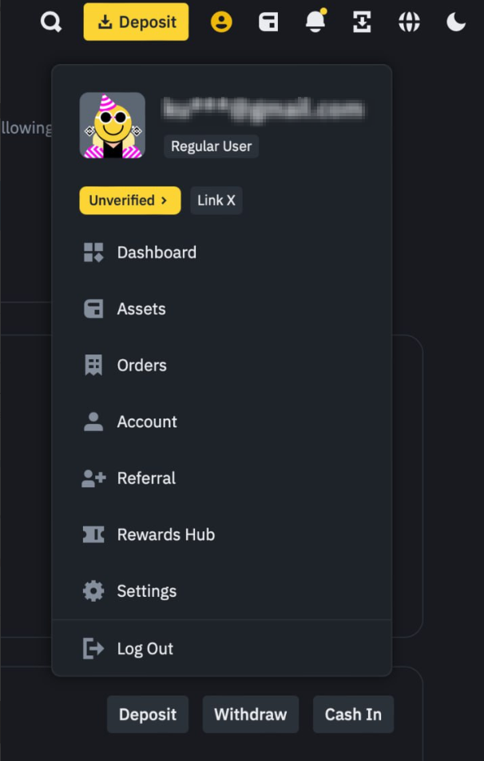

In the settings, find the "Security" section and go there.

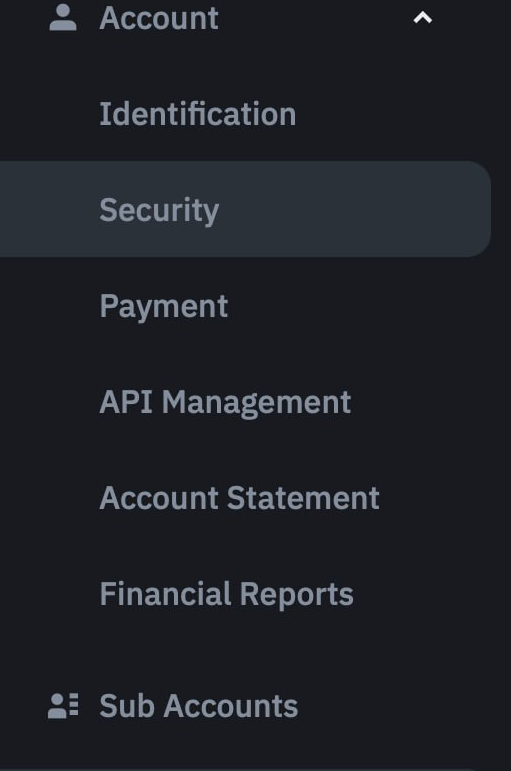

Go to the "Withdrawal Whitelist" tab.

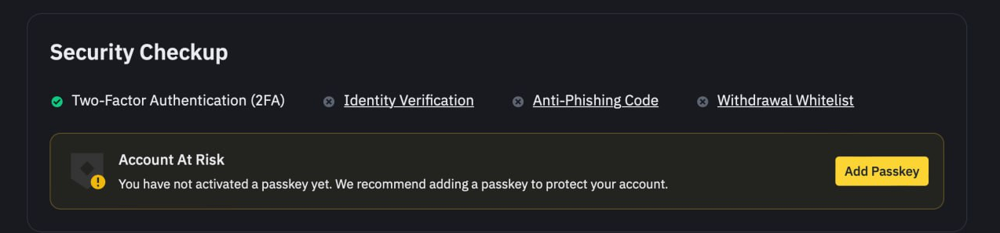

Click "Add address".

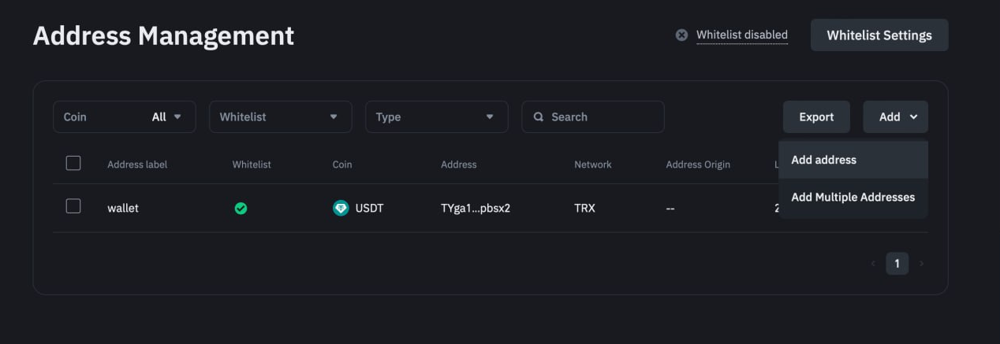

Enter your wallet's name, select your wallet's network, and be sure to check the "Add Address to Whitelist" box. Click "Save" and complete the security verification.

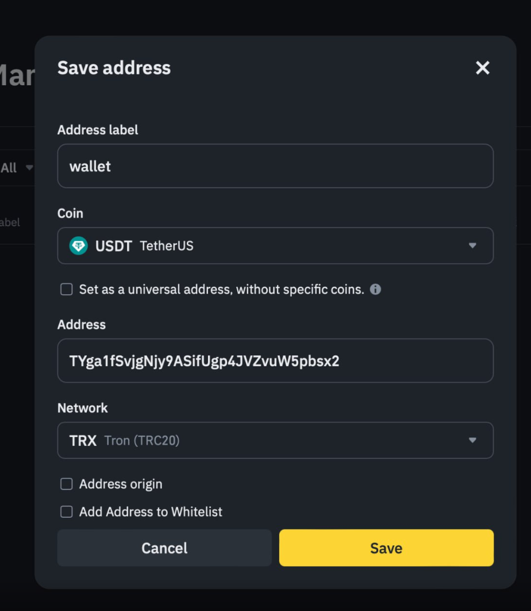

### Connecting an API Key

Log in to your account on the exchange, click on your profile icon, and go to the "Settings" section.

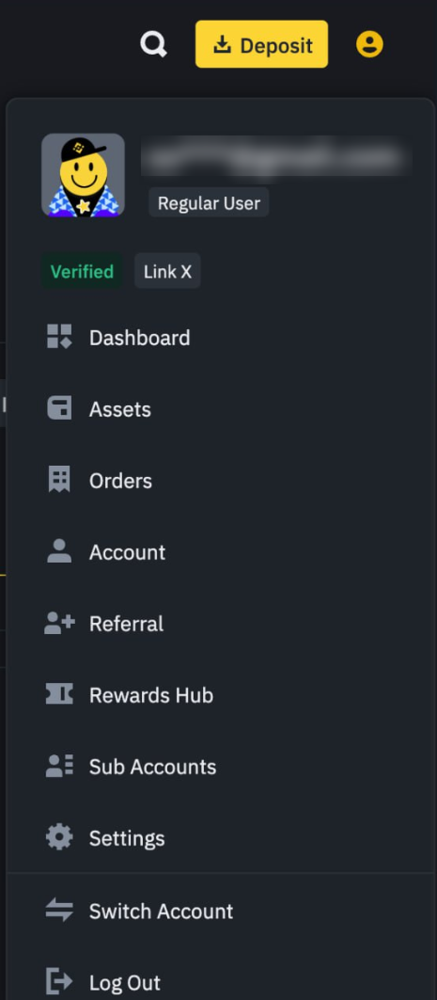

In the settings section, find "Account" and expand it. We are interested in the "API Management" subsection. Click on this section.

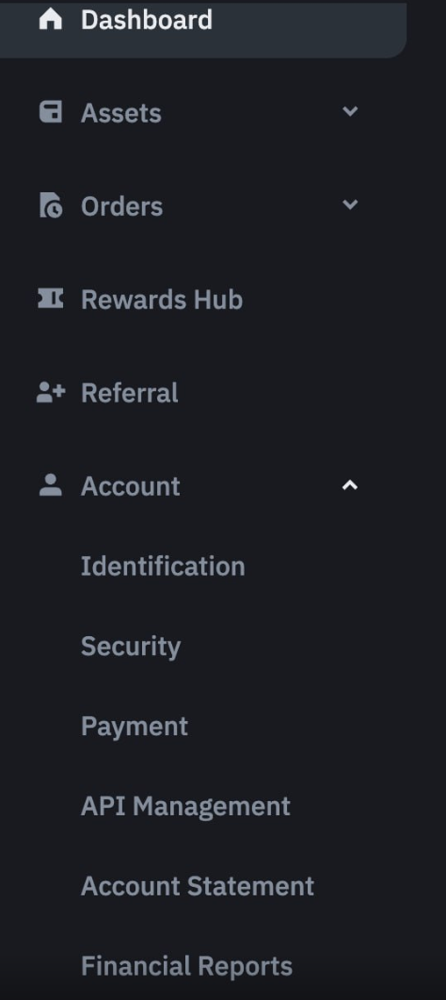

Be sure to uncheck the box for "By checking this box, all existing API Key(s) on your master account and sub-accounts will be subject to Default Security Controls." before issuing the API key. After unchecking it, click the "Create API" button.

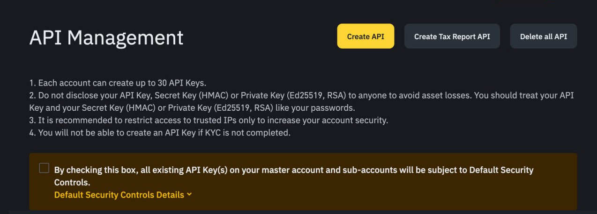

For ease of setup, we will use the system-generated API key. Select this option and click the "Next" button.

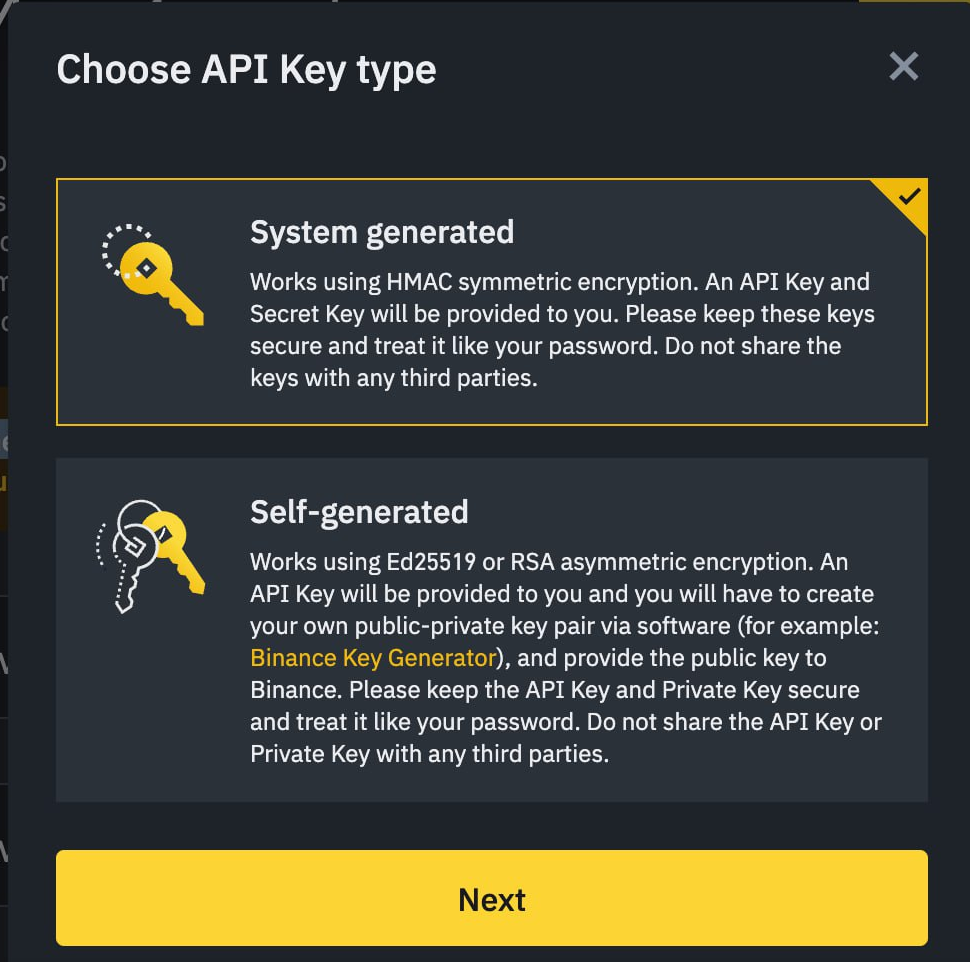

Give your API key a name.

Complete the security verification to continue the setup.

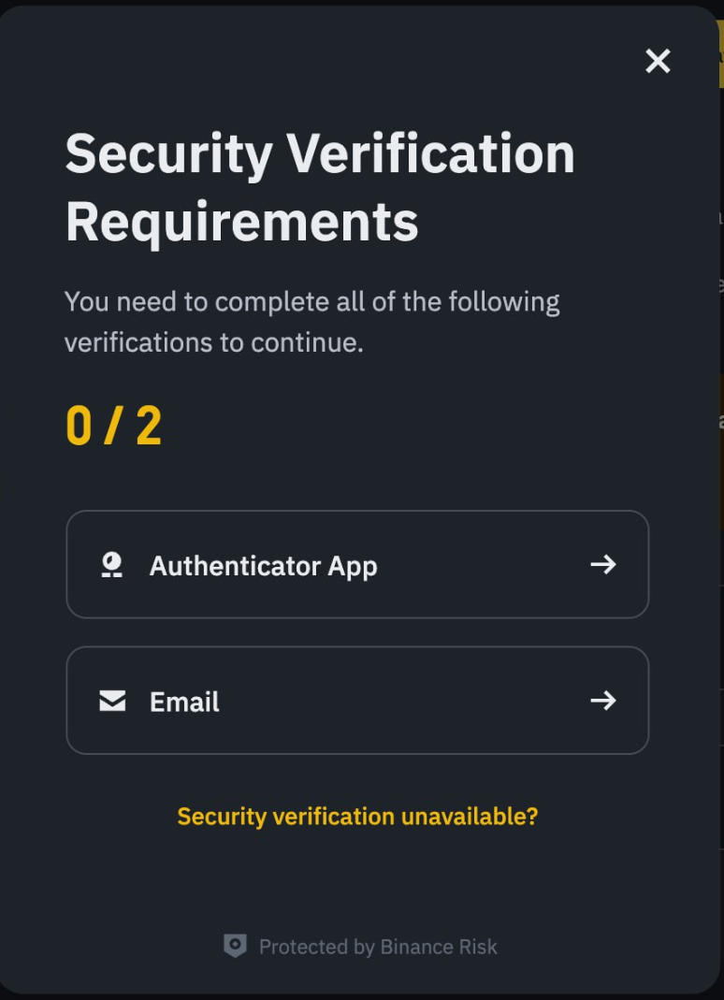

Create the API key by setting the necessary permissions, and also by adding your merchant's IP address (obtained from our platform during setup) in the field:

Restrict access to trusted IPs only (Recommended):

Please note that this parameter is mandatory for connecting the Binance exchange.

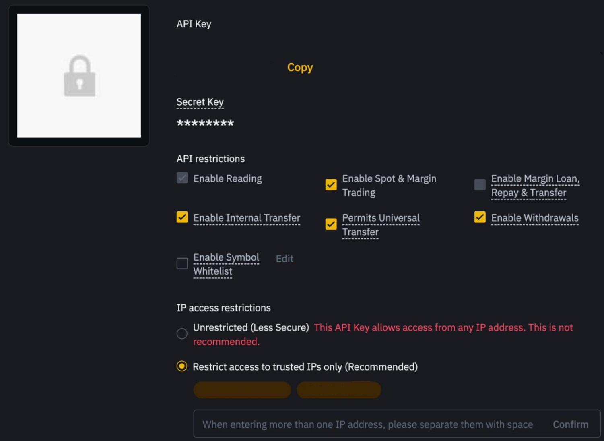

Save the received secret and API keys and paste them into the corresponding exchange connection fields. Click "connect the exchange
" (Connect Exchange).

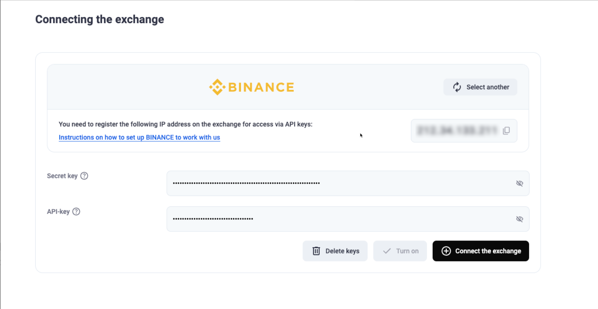
