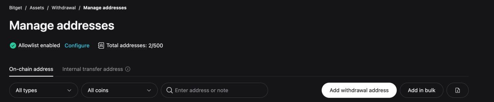
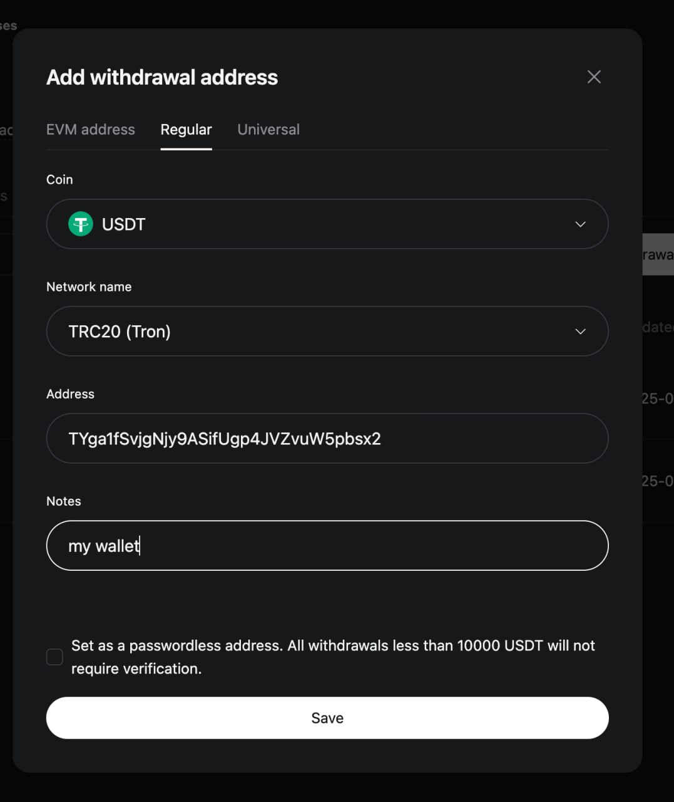
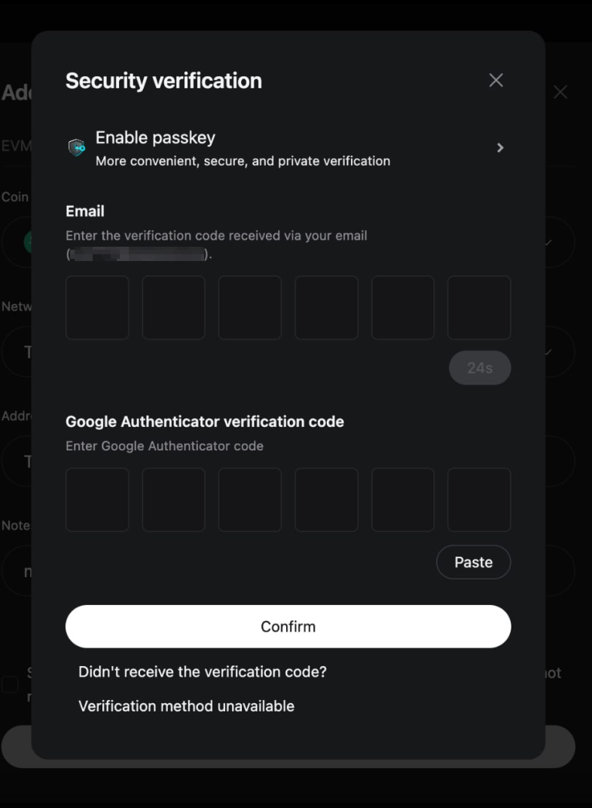
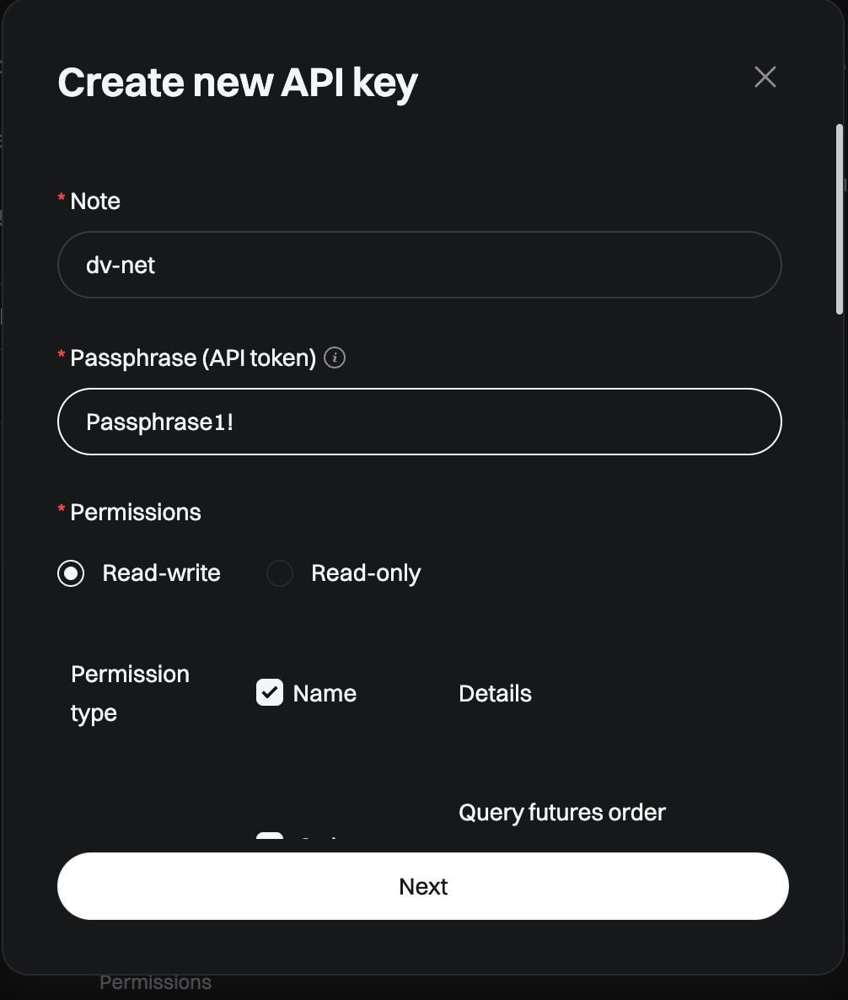

# Bitget

### Setting up a Bitget Wallet for Automatic Withdrawal from the Exchange

Log in to your profile on the exchange and go to the "Withdraw" section.

Select the coin and network of your wallet, and then the "Manage addresses" button will appear. Click on it and go to your address book.

You need to click "Add withdrawal address".

In the menu that opens, go to the "Regular" section, select your wallet's network, enter the address, and be sure to check the "Set as a passwordless address" box. Click "Save".

Complete the security verification.

After completing these steps, you will be able to enable automatic withdrawal to your chosen wallet via API.

### Connecting an API Key

Log in to your account, click on your profile avatar, and go to the "API-keys" section.

Click the "Create API key" button.

Select the first option for quick setup - the exchange will generate it for you.

Enter a name for the API key, set a password phrase, and in the "Permissions" column, you need to select "Read-write", and then check the box next to "Permission type" to grant full access to all the necessary functions. This will automatically set all permissions for this key.

Enter the IP address obtained from our system and click the "Next" button.

Complete the security verification to issue the key.

Paste the received values into the corresponding fields and click the "connect the exchange" (Connect Exchange) button.

