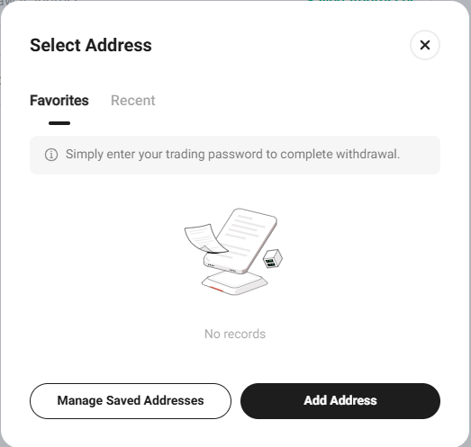

# KuCoin

### 设置KuCoin钱包以从交易所自动提款

登录交易所的个人资料，进入右上角菜单中的“Assets”（资产）部分。

在打开的页面上，从左侧菜单中选择“Withdraw”（提款）。

选择您钱包的货币，然后点击“Saved Addresses”（已保存地址）按钮。

点击“Add Address”（添加地址）按钮。

输入您的钱包地址，指定区块链，并为地址命名。\
点击“Save as Standard Address”（保存为标准地址）按钮并完成安全验证。

### 连接API密钥

登录交易所账户，将鼠标悬停在个人资料图标上，然后选择“API Management”（API管理）部分。

点击“Create API”（创建API）按钮。

为您的API密钥输入名称并设置密码。指定所需的权限。\
务必指定从我们平台的“Connect the Exchange”（连接交易所）部分获得的服务器IP地址。 \
在“IP Restrictions”字段中，选择“Restrict to Trusted IPs Only”（仅限可信IP）。 \
点击“Add”（添加）按钮。\
点击“Next”（下一步）并完成安全验证。

保存获得的API Key和Secret Key值。点击“Confirm”（确认）按钮。

将获得的密钥和密码插入我们服务中连接交易所的相应字段。 \
点击“Connect the Exchange”（连接交易所）按钮。