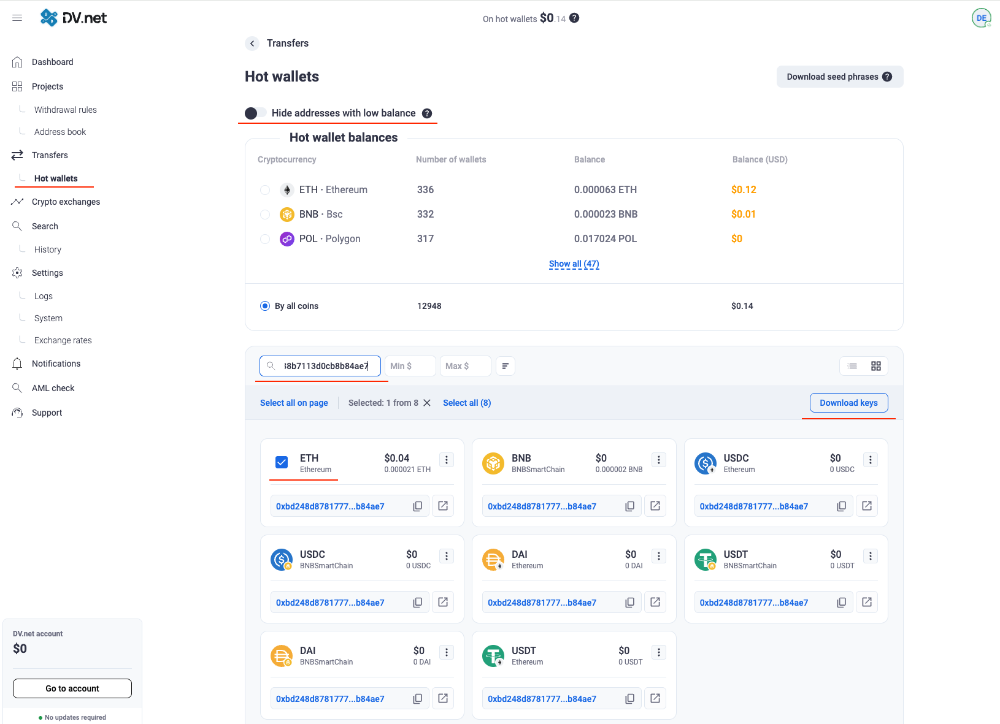
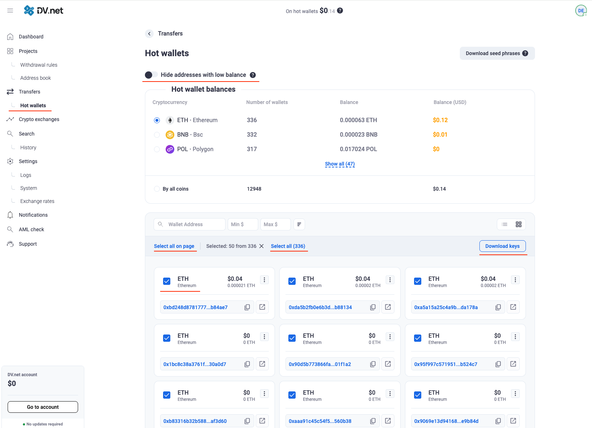

# 导出私钥

私钥可直接支配对应地址上的资金。DV.net 支持为单个或多个地址导出密钥。

> ⚠️ **私钥即完整钱包权限。** 切勿向他人发送或通过邮件、即时消息传递。用毕请从设备删除文件。

## 导出单个地址

1. 进入 **Transfers → Hot Wallets**
2. 如需，关闭 **Hide addresses with low balance**
3. 搜索目标地址
4. 在地址左侧勾选复选框
5. 点击表右上角的 **Download keys**
6. 选择 **JSON** 或 **CSV**
7. 完成双重身份验证
8. 将文件保存到安全位置

<a href="../../assets/images/onboarding/export-keys/keys.png" target="_blank" rel="noopener noreferrer" onclick="event.preventDefault(); const img = this.querySelector('img'); const openImage = () => { try { const canvas = document.createElement('canvas'); canvas.width = img.naturalWidth; canvas.height = img.naturalHeight; const ctx = canvas.getContext('2d'); ctx.drawImage(img, 0, 0); const dataUrl = canvas.toDataURL('image/png'); const w = window.open('', '_blank'); if (w) { w.document.write('<html><head><title>单个密钥导出</title><style>body{margin:0;display:flex;justify-content:center;align-items:center;height:100vh;background:#000;}img{max-width:100%;max-height:100%;object-fit:contain;}</style></head><body></body></html>'); w.document.close(); } } catch(e) { window.open(this.href, '_blank'); } }; if (img && img.complete && img.naturalWidth > 0) { openImage(); } else if (img) { img.onload = openImage; img.onerror = () => window.open(this.href, '_blank'); } else { window.open(this.href, '_blank'); } return false;">
  
</a>

## 批量导出

1. **Transfers → Hot Wallets**
2. 如需，关闭 **Hide addresses with low balance**
3. 勾选多个地址
   - **Select all on page** — 当前页全部
   - **Select all (N)** — 所有页全部
4. 点击列表上方的 **Download keys**
5. 选择 **JSON** 或 **CSV**
6. 完成双重身份验证
7. 安全保存文件

<a href="../../assets/images/onboarding/export-keys/mass-keys.png" target="_blank" rel="noopener noreferrer" onclick="event.preventDefault(); const img = this.querySelector('img'); const openImage = () => { try { const canvas = document.createElement('canvas'); canvas.width = img.naturalWidth; canvas.height = img.naturalHeight; const ctx = canvas.getContext('2d'); ctx.drawImage(img, 0, 0); const dataUrl = canvas.toDataURL('image/png'); const w = window.open('', '_blank'); if (w) { w.document.write('<html><head><title>批量导出</title><style>body{margin:0;display:flex;justify-content:center;align-items:center;height:100vh;background:#000;}img{max-width:100%;max-height:100%;object-fit:contain;}</style></head><body></body></html>'); w.document.close(); } } catch(e) { window.open(this.href, '_blank'); } }; if (img && img.complete && img.naturalWidth > 0) { openImage(); } else if (img) { img.onload = openImage; img.onerror = () => window.open(this.href, '_blank'); } else { window.open(this.href, '_blank'); } return false;">
  
</a>

## 文件格式

### JSON
适合程序处理。按网络列出；每项含公钥、私钥、地址：
```json
{
  "entries": [
    {
      "name": "BLOCKCHAIN_ETHEREUM",
      "items": [
        {
          "public_key": "04...e68",
          "private_key": "0x...fb5",
          "address": "0x...2b26"
        }
      ]
    }
  ]
}
```

### CSV
适合 Excel 等。每行：网络、公钥、私钥、地址：
```
blockchain,public_key,private_key,address
BLOCKCHAIN_ETHEREUM,04...e68,0x...fb5,0x...2b26
```

## 导出后

- 存入加密存储或离线介质
- 用毕从常用电脑删除文件
- 若曾导入第三方钱包，用完后移除导入
- 若怀疑泄露，勿再用于收款
