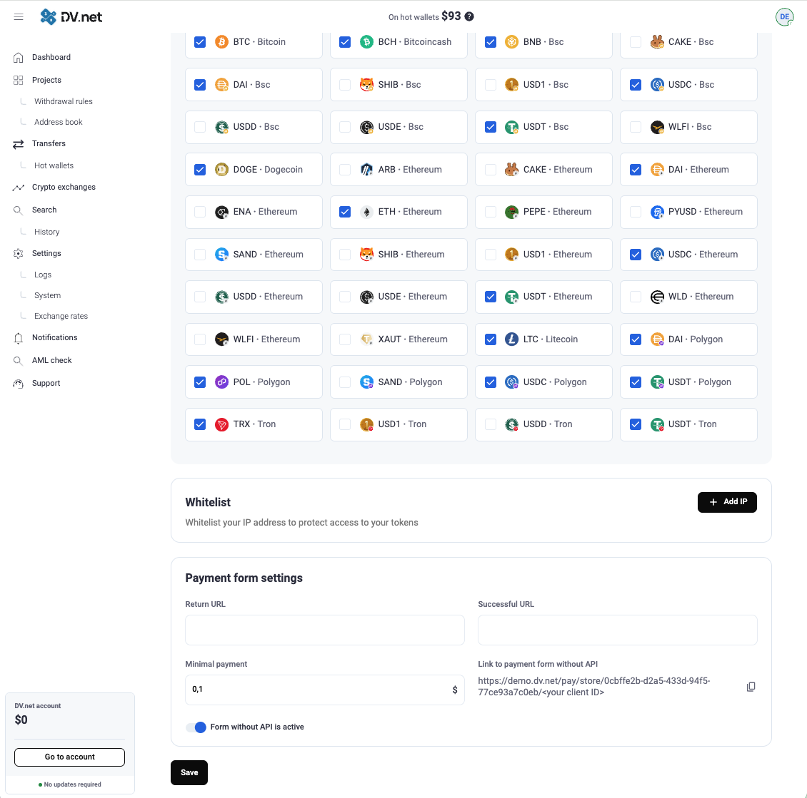

## 无需使用 API 连接支付表单

按照以下简单步骤，无需集成 API 也能接入支付表单。

你也可以在[此仓库](https://github.com/dv-net/simple-payment-form)查看集成示例

### 1. 启用你的商店支付链接

登录你的项目账户，依次进入 **Projects**、**Edit**、**Advanced settings**。

在页面最底部找到 “Form without API” 开关。

<a href="../../assets/images/integration/connecting-payment-form-without-api/enable-pay-form-without-api.png" target="_blank" rel="noopener noreferrer" onclick="event.preventDefault(); const img = this.querySelector('img'); const openImage = () => { try { const canvas = document.createElement('canvas'); canvas.width = img.naturalWidth; canvas.height = img.naturalHeight; const ctx = canvas.getContext('2d'); ctx.drawImage(img, 0, 0); const dataUrl = canvas.toDataURL('image/png'); const w = window.open('', '_blank'); if (w) { w.document.write('<html><head><title>PayForm</title></head><body></body></html>'); w.document.close(); } } catch(e) { window.open(this.href, '_blank'); } }; if (img && img.complete && img.naturalWidth > 0) { openImage(); } else if (img) { img.onload = openImage; img.onerror = () => window.open(this.href, '_blank'); } else { window.open(this.href, '_blank'); } return false;">
  
</a>

在那里你会找到**无需 API 的支付表单链接**，其中包含你商店的 **UUID**（唯一标识符）。

### 2. 修改支付链接

使用以下格式生成支付链接：

`http(s)://{your-domain-or-subdomain}/pay/store/{store-uuid}/{client-id}`

#### 其中：

* `{your-domain-or-subdomain}` — 你的已注册域名或子域名。
* `{store-uuid}` — 你商店的 UUID（在商店链接中给出）。
* `{client-id}` — 你在生成链接时分配的唯一客户端标识符。用于跟踪支付并将其关联到正确的客户钱包。

> ⚠️ **重要：** `client-id` 在每个客户端会话中都必须唯一，以确保正确的跟踪与识别。

-----

示例：

`https://demo.dv.net/pay/store/0cbffe2b-d2a5-433d-94f5-77ce93a7c0eb/<your client ID>`

生成链接后，你可以将客户重定向到该链接，或将其嵌入到你的网站按钮中。